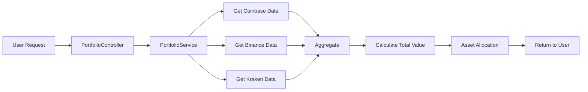
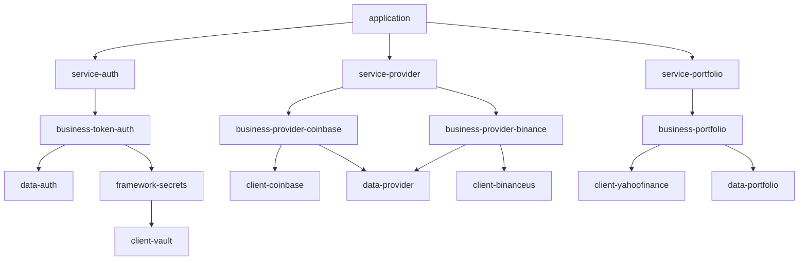
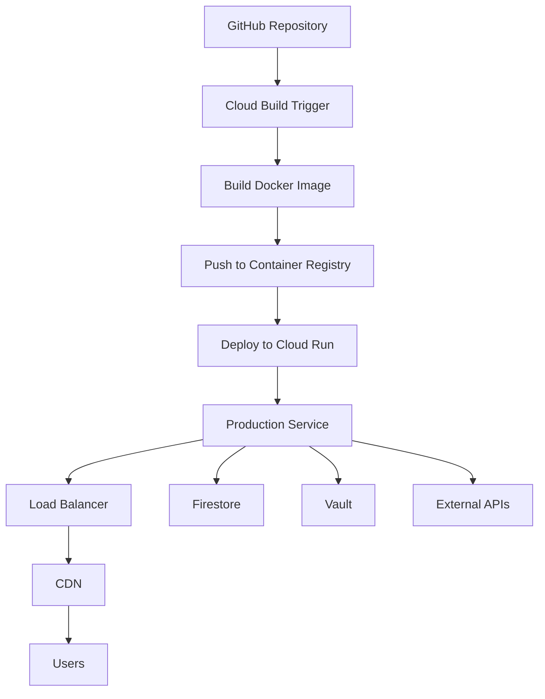

# 🏛️ Strategiz Core Architecture

Detailed architectural overview of the Strategiz backend platform, covering system design, module structure, data flow, and integration patterns.

---

## 📐 High-Level Architecture


---

## 🗂️ Layered Architecture


### Layer 1: REST API (service/*)

**Responsibility**: HTTP request handling, routing, validation

**Example**: `service-provider/CreateProviderController`
```java
@RestController
@RequestMapping("/v1/providers")
public class CreateProviderController extends BaseController {

    @PostMapping("/connect/{provider}")
    public ResponseEntity<?> initiateOAuth(@PathVariable String provider) {
        // Delegate to business layer
        String authUrl = providerConnectionService.initiateOAuth(provider);
        return ResponseEntity.ok(authUrl);
    }
}
```

**Key Characteristics**:
- Extends `BaseController` for common functionality
- Handles HTTP concerns (status codes, headers, serialization)
- Minimal business logic
- Delegates to business layer

---

### Layer 2: Business Logic (business/*)

**Responsibility**: Domain-specific logic, orchestration, workflows

**Example**: `business-provider-coinbase/CoinbaseConnectionService`
```java
@Service
public class CoinbaseConnectionService extends BaseService {

    public ProviderPortfolioResponse connectAndFetchPortfolio(String authCode) {
        // 1. Exchange authorization code for tokens
        TokenResponse tokens = coinbaseApiClient.exchangeCode(authCode);

        // 2. Store tokens in Vault
        vaultClient.storeCredentials(tokens);

        // 3. Fetch raw portfolio data
        RawPortfolio rawPortfolio = coinbaseApiClient.getAccounts();

        // 4. Enrich with market prices
        EnrichedPortfolio enriched = portfolioEnhancer.enrichWithPrices(rawPortfolio);

        // 5. Save to Firestore
        providerRepository.savePortfolio(enriched);

        return enriched;
    }
}
```

**Key Characteristics**:
- Extends `BaseService` for logging and utilities
- Orchestrates multiple operations
- Calls external APIs via clients
- Persists data via repositories

---

### Layer 3: External Clients (client/*)

**Responsibility**: Third-party API communication, request/response mapping

**Example**: `client-coinbase/CoinbaseApiClient`
```java
@Component
public class CoinbaseApiClient {

    private final RestTemplate restTemplate;
    private final String baseUrl = "https://api.coinbase.com/v2";

    public AccountsResponse getAccounts(String accessToken) {
        HttpHeaders headers = new HttpHeaders();
        headers.setBearerAuth(accessToken);

        ResponseEntity<AccountsResponse> response = restTemplate.exchange(
            baseUrl + "/accounts",
            HttpMethod.GET,
            new HttpEntity<>(headers),
            AccountsResponse.class
        );

        return response.getBody();
    }
}
```

**Key Characteristics**:
- Wraps external API calls
- Handles authentication headers
- Maps API responses to domain objects
- No business logic

---

### Layer 4: Data Repositories (data/*)

**Responsibility**: Database access, CRUD operations, queries

**Example**: `data-provider/ProviderDataRepository`
```java
@Repository
public class ProviderDataRepository extends BaseRepository {

    private final Firestore firestore;

    public void saveProviderData(String userId, ProviderData data) {
        DocumentReference docRef = firestore
            .collection("users")
            .document(userId)
            .collection("provider_data")
            .document(data.getProviderId());

        docRef.set(data);
    }

    public ProviderData getProviderData(String userId, String providerId) {
        DocumentSnapshot doc = firestore
            .collection("users")
            .document(userId)
            .collection("provider_data")
            .document(providerId)
            .get()
            .get();

        return doc.toObject(ProviderData.class);
    }
}
```

**Key Characteristics**:
- Extends `BaseRepository` for common operations
- Abstracts database technology (Firestore)
- Returns domain objects, not database entities
- Handles queries and transactions

---

## 🔄 Data Flow Patterns

### Pattern 1: Provider Connection Flow


---

### Pattern 2: Portfolio Aggregation



**Code Flow**:
```java
// 1. Controller receives request
@GetMapping("/portfolio")
public ResponseEntity<AggregatedPortfolio> getPortfolio() {
    return ResponseEntity.ok(portfolioService.getAggregatedPortfolio());
}

// 2. Service aggregates from all providers
public AggregatedPortfolio getAggregatedPortfolio() {
    List<ProviderPortfolio> allPortfolios = new ArrayList<>();

    // Fetch from each connected provider
    for (Provider provider : getConnectedProviders()) {
        ProviderPortfolio portfolio = getProviderPortfolio(provider);
        allPortfolios.add(portfolio);
    }

    // Aggregate and calculate totals
    return aggregatePortfolios(allPortfolios);
}
```

---

## 🔐 Security Architecture

### Authentication Flow


### Token Management

**Access Token Structure**:
```json
{
  "sub": "user_123",
  "iat": 1699123456,
  "exp": 1699124356,
  "roles": ["USER"],
  "deviceId": "device_abc"
}
```

**Refresh Token Flow**:
```java
// When access token expires
@PostMapping("/auth/refresh")
public ResponseEntity<?> refreshToken(@RequestBody RefreshRequest request) {
    // Validate refresh token
    if (!tokenService.isRefreshTokenValid(request.getRefreshToken())) {
        throw new UnauthorizedException("Invalid refresh token");
    }

    // Generate new access token
    String newAccessToken = tokenService.generateAccessToken(userId);

    // Optionally rotate refresh token
    String newRefreshToken = tokenService.rotateRefreshToken(request.getRefreshToken());

    return ResponseEntity.ok(new TokenResponse(newAccessToken, newRefreshToken));
}
```

---

## 🗄️ Data Storage Architecture

### Firestore Collections

```
users/
├── {userId}/
    ├── email: string
    ├── displayName: string
    ├── emailVerified: boolean
    ├── createdAt: timestamp
    └── auth_credentials/
        ├── totp/
        │   └── secret: string (encrypted)
        └── passkey/
            └── credentials: array
    └── provider_data/
        ├── coinbase/
        │   ├── providerId: string
        │   ├── accountType: string
        │   ├── connectedAt: timestamp
        │   └── portfolio:
        │       ├── totalValue: number
        │       └── assets: array
        └── binance/
            └── ...
    └── strategies/
        ├── {strategyId}/
            ├── name: string
            ├── language: string
            ├── code: string
            ├── status: string
            └── backtestResults: object
```

### Vault Secrets Structure

```
secret/
└── strategiz/
    └── users/
        └── {userId}/
            └── providers/
                ├── coinbase/
                │   ├── access_token: string
                │   ├── refresh_token: string
                │   └── expires_at: timestamp
                ├── binance/
                │   ├── api_key: string
                │   └── api_secret: string
                └── kraken/
                    ├── api_key: string
                    └── api_secret: string
```

---

## 🔌 Integration Patterns

### OAuth 2.0 Pattern

All exchange integrations follow the OAuth 2.0 authorization code flow:

1. **Authorization Request**
   ```
   GET https://coinbase.com/oauth/authorize
     ?client_id={CLIENT_ID}
     &redirect_uri={CALLBACK_URL}
     &scope=wallet:accounts:read,wallet:transactions:read
     &state={CSRF_TOKEN}
   ```

2. **Authorization Code Exchange**
   ```
   POST https://coinbase.com/oauth/token
   {
     "grant_type": "authorization_code",
     "code": "{AUTH_CODE}",
     "client_id": "{CLIENT_ID}",
     "client_secret": "{CLIENT_SECRET}",
     "redirect_uri": "{CALLBACK_URL}"
   }
   ```

3. **Token Storage**
   - Store in HashiCorp Vault
   - Encrypt at rest
   - Set expiration metadata

4. **Token Refresh**
   ```
   POST https://coinbase.com/oauth/token
   {
     "grant_type": "refresh_token",
     "refresh_token": "{REFRESH_TOKEN}",
     "client_id": "{CLIENT_ID}",
     "client_secret": "{CLIENT_SECRET}"
   }
   ```

---

## 📊 Module Dependency Graph



---

## 🚀 Deployment Architecture

### Google Cloud Run



**Key Features**:
- **Auto-scaling**: 0 to N instances based on traffic
- **Zero-downtime deployments**: Gradual rollout
- **HTTPS by default**: Managed SSL certificates
- **Private networking**: VPC connector for Vault access

---

## 📚 Related Documentation

- [Strategiz Core Overview](overview.mdx)
- [Service Provider](service/service-provider.mdx)
- [API Documentation](../api/endpoints.md)
- [Deployment Guide](../deployment/overview.md)

---

**Last Updated**: 2025-10-26
**Version**: 1.0.0
