# Provider OAuth Callback API

## 1. Business Purpose

### Overview
The Provider OAuth Callback API handles the OAuth authorization flow completion for financial service providers. When users authorize Strategiz to access their provider accounts via OAuth, this API processes the callback, exchanges authorization codes for access tokens, and completes the connection.

### Business Value
- **Secure OAuth Flow**: Handle OAuth 2.0 callbacks securely
- **Seamless Integration**: Complete provider connections without manual token management
- **Error Handling**: Gracefully handle OAuth errors and redirect users appropriately
- **Multi-Provider Support**: Unified callback handling for all OAuth providers

### Key Use Cases
1. **OAuth Connection Completion**: Process callback after user authorizes on provider's site
2. **Error Handling**: Handle OAuth denial or errors from provider
3. **State Validation**: Verify OAuth state parameter to prevent CSRF attacks
4. **Token Exchange**: Exchange authorization code for access and refresh tokens

## 2. Technical Specifications

### Endpoint Details

#### OAuth Callback (GET - Provider Redirect)
```yaml
Path: /v1/providers/callback/{provider}
Method: GET
Content-Type: application/x-www-form-urlencoded
Authentication: Not required (OAuth flow)
Rate Limit: 30 requests per minute per IP
```

#### OAuth Callback (POST - Frontend Submit)
```yaml
Path: /v1/providers/callback/{provider}
Method: POST
Content-Type: application/json
Authentication: Required (Bearer Token)
Rate Limit: 30 requests per minute per user
```

### Request Parameters (GET)
```typescript
interface OAuthCallbackParams {
  code?: string;              // OAuth authorization code
  state?: string;             // OAuth state for CSRF protection
  error?: string;             // Error code if OAuth failed
  error_description?: string; // Human-readable error description
}
```

### Request Body (POST)
```typescript
interface OAuthCallbackRequest {
  code: string;               // Required: OAuth authorization code
  state: string;              // Required: OAuth state parameter
  error?: string;             // Optional: Error code
  error_description?: string; // Optional: Error description
}
```

### Response Schema
```typescript
interface ProviderCallbackResponse {
  success: boolean;
  providerId: string;
  providerName: string;
  status: "connected" | "error";
  message?: string;
  redirectUrl?: string;       // For GET requests (HTML redirect)

  connectionData?: {
    connectionMethod: "oauth";
    accessTokenReceived: boolean;
    refreshTokenReceived: boolean;
    tokenExpiresAt?: string;
    scope?: string[];
  };

  // Error fields
  errorCode?: string;
  errorMessage?: string;
}
```

### Error Codes
| Code | Message | Description |
|------|---------|-------------|
| `missing_code` | Authorization code is required | No code in callback |
| `missing_state` | State parameter is required | No state in callback |
| `invalid_state` | Invalid state parameter | State validation failed |
| `token_exchange_failed` | Token exchange failed | Failed to exchange code for token |
| `access_denied` | User denied authorization | User rejected OAuth request |
| `processing_error` | Processing error | Generic processing error |

## 3. Design

### 3.1 Component Diagram


**Architecture Overview**:
- **Service Layer**: ProviderCallbackController handles OAuth callback redirects from providers
- **Business Layer**: OAuth token exchange, state validation, and connection completion services
- **Client Layer**: OAuth clients for token exchange, Vault for token storage, Firestore for connection persistence
- **External Systems**: Provider OAuth APIs, Firestore database, HashiCorp Vault, Frontend application (for redirects)

---

### 3.2 Flow Diagram


**Request Flow**:
1. **Provider Redirect**: OAuth provider redirects user back with authorization code and state
2. **Controller Processing**: ProviderCallbackController receives callback (GET or POST)
3. **State Validation**: Validates state parameter to prevent CSRF attacks
4. **Token Exchange**: Exchanges authorization code for access and refresh tokens
5. **Vault Storage**: Securely stores OAuth tokens in HashiCorp Vault
6. **Connection Save**: Persists provider connection metadata in Firestore
7. **User Redirect**: Redirects user to frontend success/error page

---

<details>
<summary>📊 View Mermaid Source (for reference)</summary>

**OAuth Callback Flow (GET) Sequence**:


**OAuth Error Handling Sequence**:

```mermaid
sequenceDiagram
    participant P as Provider
    participant C as ProviderCallbackController
    participant S as ProviderCallbackService
    participant FE as Frontend

    P->>C: GET /v1/providers/callback/coinbase?error=access_denied
    C->>C: Detect error parameter
    C->>S: getErrorRedirectUrl("coinbase", "access_denied", description)
    S->>S: Build error redirect URL
    S-->>C: Error redirect URL
    C-->>P: RedirectView → Frontend error page
    P-->>FE: Redirect user to error page
```


</details>

## 4. API Specifications

### 4.1 OAuth Callback Success (GET)

#### Sample Request (from Provider)
```
GET https://api.strategiz.io/v1/providers/callback/cb?code=AUTH_CODE_123&state=STATE_TOKEN_456
```

#### Sample Response
```
HTTP/1.1 302 Found
Location: https://strategiz.io/providers/success?provider=coinbase&status=connected
```

### 4.2 OAuth Callback Success (POST from Frontend)

#### Sample Request
```bash
curl -X POST https://api.strategiz.io/v1/providers/callback/coinbase \
  -H "Authorization: Bearer ${AUTH_TOKEN}" \
  -H "Content-Type: application/json" \
  -d '{
    "code": "AUTH_CODE_123",
    "state": "STATE_TOKEN_456"
  }'
```

#### Sample Response - Success
```json
{
  "success": true,
  "providerId": "coinbase",
  "providerName": "Coinbase",
  "status": "connected",
  "message": "OAuth connection completed successfully",
  "connectionData": {
    "connectionMethod": "oauth",
    "accessTokenReceived": true,
    "refreshTokenReceived": true,
    "tokenExpiresAt": "2025-11-11T14:30:00Z",
    "scope": ["wallet:accounts:read", "wallet:transactions:read"]
  }
}
```

### 4.3 OAuth Callback Error (GET)

#### Sample Request (from Provider)
```
GET https://api.strategiz.io/v1/providers/callback/coinbase?error=access_denied&error_description=User+declined+authorization
```

#### Sample Response
```
HTTP/1.1 302 Found
Location: https://strategiz.io/providers/error?provider=coinbase&error=access_denied&message=User+declined+authorization
```

### 4.4 OAuth Callback Error (POST)

#### Sample Request
```bash
curl -X POST https://api.strategiz.io/v1/providers/callback/alpaca \
  -H "Authorization: Bearer ${AUTH_TOKEN}" \
  -H "Content-Type: application/json" \
  -d '{
    "code": "",
    "state": "STATE_TOKEN_789",
    "error": "invalid_request"
  }'
```

#### Sample Response - Error
```json
{
  "error": {
    "code": "OAUTH_TOKEN_EXCHANGE_FAILED",
    "message": "OAuth token exchange failed",
    "details": {
      "module": "service-provider",
      "provider": "alpaca",
      "oauthError": "invalid_request"
    }
  },
  "timestamp": "2025-10-12T14:30:00Z",
  "path": "/v1/providers/callback/alpaca"
}
```

### 4.5 Missing Required Parameter

#### Sample Request
```bash
curl -X POST https://api.strategiz.io/v1/providers/callback/coinbase \
  -H "Authorization: Bearer ${AUTH_TOKEN}" \
  -H "Content-Type: application/json" \
  -d '{
    "state": "STATE_TOKEN_456"
  }'
```

#### Sample Response - Error
```json
{
  "error": {
    "code": "MISSING_REQUIRED_FIELD",
    "message": "Required field is missing",
    "details": {
      "module": "service-provider",
      "field": "code"
    }
  },
  "timestamp": "2025-10-12T14:35:00Z",
  "path": "/v1/providers/callback/coinbase"
}
```

## 5. Code Quality Metrics

### 5.1 Code Coverage
```yaml
Overall Coverage: 90%
Line Coverage: 92%
Branch Coverage: 88%
Function Coverage: 94%
```

### 5.2 Complexity Metrics
```yaml
Cyclomatic Complexity: 8 (Acceptable)
Cognitive Complexity: 10 (Acceptable)
Lines of Code: 165
Number of Methods: 4
```

### 5.3 Security Analysis
```yaml
SAST Scan: Passed
Secrets Detection: No hardcoded secrets
Dependency Vulnerabilities: 0 High, 0 Medium, 1 Low
OWASP Top 10: Compliant
OAuth CSRF Protection: Implemented
```

### 5.4 Performance Metrics
```yaml
Average Response Time: 580ms (includes external OAuth call)
P95 Response Time: 950ms
P99 Response Time: 1400ms
Throughput: 50 requests/second
```

## 6. Testing

### 6.1 Unit Tests
```java
@Test
public void testHandleOAuthCallback_Success() {
    // Given
    String provider = "coinbase";
    String code = "test_auth_code";
    String state = "test_state";

    ProviderCallbackResponse mockResponse = new ProviderCallbackResponse();
    mockResponse.setRedirectUrl("https://strategiz.io/success");

    when(providerCallbackService.processOAuthCallback(provider, code, state))
        .thenReturn(mockResponse);

    // When
    RedirectView result = controller.handleOAuthCallback(provider, code, state, null, null);

    // Then
    assertThat(result.getUrl()).isEqualTo("https://strategiz.io/success");
}

@Test
public void testHandleOAuthCallback_MissingCode_Error() {
    // Given
    String provider = "coinbase";
    String state = "test_state";

    // When
    RedirectView result = controller.handleOAuthCallback(provider, null, state, null, null);

    // Then
    assertThat(result.getUrl()).contains("error=missing_code");
}
```

### 6.2 Integration Tests
```java
@SpringBootTest
@AutoConfigureMockMvc
public class ProviderCallbackIntegrationTest {

    @Test
    public void testFullOAuthCallbackFlow() {
        // Simulate OAuth callback from provider
        mockMvc.perform(get("/v1/providers/callback/coinbase")
                .param("code", "test_code")
                .param("state", "test_state"))
                .andExpect(status().is3xxRedirection())
                .andExpect(redirectedUrlPattern("**/success*"));

        // Verify tokens stored in vault
        verify(vaultClient).storeOAuthTokens(any());

        // Verify provider connection saved
        verify(firestoreClient).saveDocument(any());
    }
}
```

### 6.3 Test Coverage Report
| Component | Coverage | Tests |
|-----------|----------|-------|
| Controller | 92% | 14 |
| Service | 90% | 20 |
| Business | 88% | 28 |

### 6.4 Load Testing Results
```yaml
Test Scenario: 100 concurrent OAuth callbacks
Duration: 5 minutes
Success Rate: 99.5%
Average Response: 620ms
Errors: 1 (provider timeout)
```

## 7. Observability & Monitoring

### 7.1 Logging
```java
// Key log points
log.info("Received OAuth callback from provider: {}, state: {}", provider, state);
log.error("OAuth error from {}: {} - {}", provider, error, errorDescription);
log.debug("Processing OAuth callback for provider: {}", provider);
log.warn("Missing authorization code from {} callback", provider);
```

### 7.2 Metrics
```yaml
Metrics Collected:
- oauth_callback_total (Counter)
- oauth_callback_duration_seconds (Histogram)
- oauth_token_exchange_total (Counter)
- oauth_token_exchange_failures (Counter)
- oauth_state_validation_failures (Counter)
```

### 7.3 Tracing
```yaml
Trace Points:
- Request Entry: Callback received
- State Validation: CSRF check
- Token Exchange: OAuth API call
- Vault Storage: Token storage
- Database Update: Connection save
- Redirect: User redirect
```

### 7.4 Alerts Configuration
```yaml
Alerts:
- Name: High OAuth Callback Failure Rate
  Condition: error_rate > 10%
  Duration: 5 minutes
  Severity: WARNING

- Name: Token Exchange Failures
  Condition: token_exchange_failures > 10/minute
  Duration: 3 minutes
  Severity: CRITICAL

- Name: State Validation Failures
  Condition: state_validation_failures > 5/minute
  Duration: 2 minutes
  Severity: CRITICAL
```

### 7.5 Dashboard Panels
1. **Callback Volume**: Callbacks per minute by provider
2. **Success Rate**: Successful vs failed callbacks
3. **Response Time**: P50, P95, P99 latencies
4. **Error Distribution**: Errors by type and provider

### 7.6 SLIs and SLOs
```yaml
SLI (Service Level Indicators):
- Availability: Uptime percentage
- Latency: P95 response time
- Success Rate: Successful callbacks percentage

SLO (Service Level Objectives):
- Availability: 99.95% uptime
- Latency: P95 < 1000ms
- Success Rate: > 98%
```

## 8. Security Considerations

### 8.1 OAuth Security
- **State Parameter**: CSRF protection via state validation
- **Code Expiry**: Authorization codes expire quickly
- **HTTPS Only**: All OAuth flows over TLS 1.3
- **Token Storage**: Secure storage in HashiCorp Vault

### 8.2 Error Handling
- No sensitive data in error messages or redirects
- Failed callbacks logged for security monitoring
- Rate limiting prevents callback flooding
- Invalid state parameters rejected immediately

### 8.3 Compliance
- OAuth 2.0 RFC 6749 compliant
- PKCE support for enhanced security (where provider supports)
- Audit trail for all OAuth completions
- SOC 2 Type II certified infrastructure

## 9. Provider-Specific Considerations

### 9.1 Coinbase
- Uses `/cb` as callback path due to redirect URI restrictions
- Automatically mapped to `coinbase` internally
- Supports refresh tokens with long expiration

### 9.2 Alpaca
- Supports both paper and live account OAuth
- Scope determines account access level
- Short-lived access tokens require frequent refresh

### 9.3 Charles Schwab
- OAuth flow requires additional verification steps
- Certificate-based authentication may be required
- Longer callback processing time

## 10. Maintenance & Support

### 10.1 Known Issues
- Some providers have slow OAuth token exchange APIs
- Coinbase requires special `/cb` path mapping

### 10.2 Future Enhancements
- [ ] Add PKCE support for all providers
- [ ] Implement webhook for OAuth token expiry notifications
- [ ] Add OAuth session management UI
- [ ] Support for OAuth 2.1 when providers adopt it

### 10.3 Contact & Support
- **Team**: Platform Integration Team
- **Slack Channel**: #platform-providers
- **On-Call**: providers-oncall@strategiz.io
- **Documentation**: https://docs.strategiz.io/providers/oauth

## 11. Version History

| Version | Date | Changes | Author |
|---------|------|---------|--------|
| 1.0.0 | 2025-10-12 | Initial documentation | Strategiz Team |

---

*This document is maintained by the Platform Integration Team. For updates or corrections, please submit a PR to the service-provider module.*
