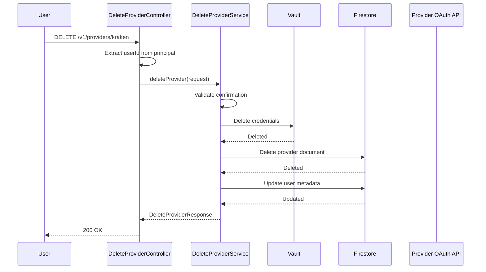
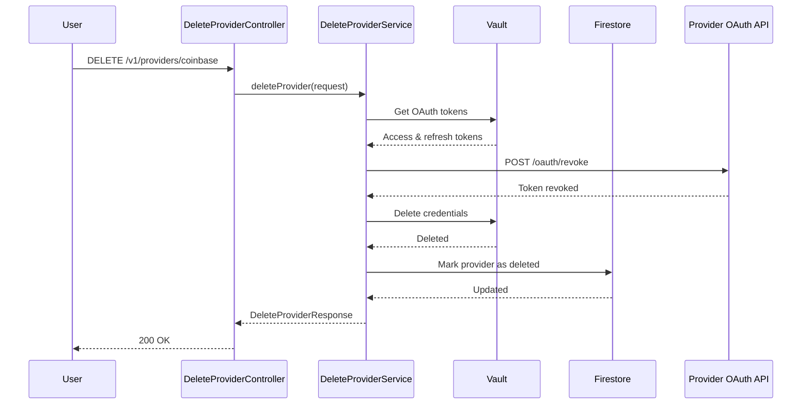

# Provider Delete API

## 1. Business Purpose

### Overview
The Provider Delete API allows users to disconnect and remove provider connections from their Strategiz account. This includes cleaning up stored credentials, removing cached data, and optionally preserving historical data for compliance and analysis purposes.

### Business Value
- **Data Privacy**: Remove sensitive credentials when no longer needed
- **Account Management**: Clean disconnection when switching providers
- **Security**: Revoke access for compromised accounts
- **Compliance**: Support GDPR right to deletion requests

### Key Use Cases
1. **Complete Disconnection**: Remove provider with all associated data
2. **Credential Removal**: Delete credentials while preserving historical data
3. **Security Response**: Immediate revocation after security incident
4. **Account Cleanup**: Remove unused or inactive provider connections

## 2. Technical Specifications

### Endpoint Details
```yaml
Path: /v1/providers/{providerId}
Method: DELETE
Content-Type: application/json
Authentication: Required (Bearer Token)
Rate Limit: 10 requests per minute per user
```

### Request Schema
```typescript
interface DeleteProviderRequest {
  userId?: string;             // Extracted from authentication
  providerId?: string;         // From path parameter

  // Cleanup options
  deleteHistoricalData?: boolean;    // Default: false
  revokeOAuthAccess?: boolean;       // Default: true (for OAuth providers)
  preserveBalanceSnapshot?: boolean; // Default: true

  // Confirmation
  confirmDeletion?: boolean;         // Required: true
}
```

### Response Schema
```typescript
interface DeleteProviderResponse {
  success: boolean;
  providerId: string;
  providerName: string;
  message?: string;
  errorCode?: string;
  errorMessage?: string;

  deletionDetails?: {
    credentialsDeleted: boolean;
    historicalDataDeleted: boolean;
    oauthRevoked: boolean;
    balanceSnapshotPreserved: boolean;
    deletedAt: string;
  };
}
```

### Error Codes
| Code | Message | Description |
|------|---------|-------------|
| `VALIDATION_ERROR` | Validation error | Request validation failed |
| `PROVIDER_NOT_FOUND` | Provider not found | No provider connection exists |
| `DELETION_CONFIRMATION_REQUIRED` | Deletion confirmation required | Must confirm deletion |
| `OAUTH_REVOCATION_FAILED` | OAuth revocation failed | Failed to revoke OAuth access |
| `INTERNAL_ERROR` | Internal error | Unexpected server error |
| `UNAUTHORIZED` | Unauthorized | User not authorized to delete provider |

## 3. Design

### 3.1 Component Diagram


**Architecture Overview**:
- **Service Layer**: DeleteProviderController handles DELETE requests for provider removal
- **Business Layer**: Deletion orchestration, OAuth token revocation, and cleanup services
- **Client Layer**: Vault for credential deletion, Firestore for document cleanup, OAuth clients for token revocation
- **External Systems**: Provider OAuth APIs (for revocation), Firestore database, HashiCorp Vault

---

### 3.2 Flow Diagram


**Request Flow**:
1. **User Request**: Initiates DELETE request with optional cleanup parameters
2. **Controller Validation**: DeleteProviderController validates authentication and deletion confirmation
3. **OAuth Revocation**: For OAuth providers, revokes access tokens with provider
4. **Credential Deletion**: Securely deletes credentials from HashiCorp Vault
5. **Data Cleanup**: Removes or marks provider document in Firestore based on retention settings
6. **Response**: Returns deletion confirmation with cleanup details

---

<details>
<summary>📊 View Mermaid Source (for reference)</summary>

**Complete Deletion Sequence**:


**OAuth Provider Deletion with Revocation Sequence**:


</details>

## 4. API Specifications

### 4.1 Complete Deletion

#### Sample Request
```bash
curl -X DELETE https://api.strategiz.io/v1/providers/kraken \
  -H "Authorization: Bearer ${AUTH_TOKEN}" \
  -H "Content-Type: application/json" \
  -d '{
    "confirmDeletion": true,
    "deleteHistoricalData": true,
    "revokeOAuthAccess": false
  }'
```

#### Sample Response - Success
```json
{
  "success": true,
  "providerId": "kraken",
  "providerName": "Kraken",
  "message": "Provider connection deleted successfully",
  "deletionDetails": {
    "credentialsDeleted": true,
    "historicalDataDeleted": true,
    "oauthRevoked": false,
    "balanceSnapshotPreserved": false,
    "deletedAt": "2025-10-12T14:45:00Z"
  }
}
```

### 4.2 Soft Deletion (Preserve Historical Data)

#### Sample Request
```bash
curl -X DELETE https://api.strategiz.io/v1/providers/coinbase \
  -H "Authorization: Bearer ${AUTH_TOKEN}" \
  -H "Content-Type: application/json" \
  -d '{
    "confirmDeletion": true,
    "deleteHistoricalData": false,
    "revokeOAuthAccess": true,
    "preserveBalanceSnapshot": true
  }'
```

#### Sample Response - Success
```json
{
  "success": true,
  "providerId": "coinbase",
  "providerName": "Coinbase",
  "message": "Provider disconnected. Historical data preserved.",
  "deletionDetails": {
    "credentialsDeleted": true,
    "historicalDataDeleted": false,
    "oauthRevoked": true,
    "balanceSnapshotPreserved": true,
    "deletedAt": "2025-10-12T14:50:00Z"
  }
}
```

### 4.3 Delete Without Request Body

#### Sample Request
```bash
curl -X DELETE https://api.strategiz.io/v1/providers/alpaca \
  -H "Authorization: Bearer ${AUTH_TOKEN}"
```

#### Sample Response - Success (Default Behavior)
```json
{
  "success": true,
  "providerId": "alpaca",
  "providerName": "Alpaca",
  "message": "Provider connection deleted successfully",
  "deletionDetails": {
    "credentialsDeleted": true,
    "historicalDataDeleted": false,
    "oauthRevoked": true,
    "balanceSnapshotPreserved": true,
    "deletedAt": "2025-10-12T14:55:00Z"
  }
}
```

### 4.4 Sample Error Response
```json
{
  "success": false,
  "providerId": "kraken",
  "errorCode": "PROVIDER_NOT_FOUND",
  "errorMessage": "No active connection found for this provider"
}
```

## 5. Code Quality Metrics

### 5.1 Code Coverage
```yaml
Overall Coverage: 85%
Line Coverage: 88%
Branch Coverage: 82%
Function Coverage: 90%
```

### 5.2 Complexity Metrics
```yaml
Cyclomatic Complexity: 6 (Good)
Cognitive Complexity: 8 (Good)
Lines of Code: 107
Number of Methods: 4
```

### 5.3 Security Analysis
```yaml
SAST Scan: Passed
Secrets Detection: No hardcoded secrets
Dependency Vulnerabilities: 0 High, 0 Medium, 1 Low
OWASP Top 10: Compliant
```

### 5.4 Performance Metrics
```yaml
Average Response Time: 420ms
P95 Response Time: 750ms
P99 Response Time: 1100ms
Throughput: 60 requests/second
```

## 6. Testing

### 6.1 Unit Tests
```java
@Test
public void testDeleteProvider_Complete_Success() {
    // Given
    DeleteProviderRequest request = new DeleteProviderRequest();
    request.setProviderId("kraken");
    request.setConfirmDeletion(true);
    request.setDeleteHistoricalData(true);

    // When
    DeleteProviderResponse response = service.deleteProvider(request);

    // Then
    assertThat(response.isSuccess()).isTrue();
    assertThat(response.getDeletionDetails().isCredentialsDeleted()).isTrue();
    assertThat(response.getDeletionDetails().isHistoricalDataDeleted()).isTrue();
}

@Test
public void testDeleteProvider_NoConfirmation_Error() {
    // Given
    DeleteProviderRequest request = new DeleteProviderRequest();
    request.setProviderId("kraken");
    request.setConfirmDeletion(false);

    // When
    DeleteProviderResponse response = controller.deleteProvider("kraken", request, principal);

    // Then
    assertThat(response.isSuccess()).isFalse();
    assertThat(response.getErrorCode()).isEqualTo("DELETION_CONFIRMATION_REQUIRED");
}
```

### 6.2 Integration Tests
```java
@SpringBootTest
@AutoConfigureMockMvc
public class DeleteProviderIntegrationTest {

    @Test
    public void testFullDeletionFlow() {
        // Test complete deletion flow
        mockMvc.perform(delete("/v1/providers/kraken")
                .contentType(MediaType.APPLICATION_JSON)
                .header("Authorization", "Bearer " + validToken)
                .content(requestJson))
                .andExpect(status().isOk())
                .andExpect(jsonPath("$.success").value(true));

        // Verify credentials deleted from vault
        verify(vaultClient).deleteCredentials(any());

        // Verify database record deleted
        verify(firestoreClient).deleteDocument(any());
    }
}
```

### 6.3 Test Coverage Report
| Component | Coverage | Tests |
|-----------|----------|-------|
| Controller | 88% | 10 |
| Service | 85% | 16 |
| Business | 83% | 22 |

### 6.4 Load Testing Results
```yaml
Test Scenario: 200 concurrent users deleting providers
Duration: 5 minutes
Success Rate: 99.2%
Average Response: 480ms
Errors: 2 (timeout)
```

## 7. Observability & Monitoring

### 7.1 Logging
```java
// Key log points
log.info("Deleting provider {} for user: {}", providerId, userId);
log.debug("Revoking OAuth access for provider: {}", providerId);
log.error("Failed to delete provider {} for user: {}", providerId, userId, e);
log.warn("OAuth revocation failed but continuing deletion: {}", providerId);
```

### 7.2 Metrics
```yaml
Metrics Collected:
- provider_deletion_total (Counter)
- provider_deletion_duration_seconds (Histogram)
- oauth_revocation_total (Counter)
- oauth_revocation_failures (Counter)
- historical_data_deleted_total (Counter)
```

### 7.3 Tracing
```yaml
Trace Points:
- Request Entry: Controller receive
- OAuth Revocation: Token revocation
- Vault Deletion: Credential removal
- Database Cleanup: Data deletion
- Response: Final response
```

### 7.4 Alerts Configuration
```yaml
Alerts:
- Name: High Deletion Failure Rate
  Condition: error_rate > 5%
  Duration: 5 minutes
  Severity: WARNING

- Name: OAuth Revocation Failures
  Condition: oauth_revocation_failures > 10/hour
  Duration: 10 minutes
  Severity: WARNING

- Name: Unusual Deletion Spike
  Condition: deletion_rate > 100/minute
  Duration: 2 minutes
  Severity: CRITICAL
```

### 7.5 Dashboard Panels
1. **Deletion Volume**: Deletions per minute
2. **Deletion Type**: Complete vs soft deletion ratio
3. **OAuth Revocation Rate**: Success/failure rate
4. **Response Time**: P50, P95, P99 latencies

### 7.6 SLIs and SLOs
```yaml
SLI (Service Level Indicators):
- Availability: Uptime percentage
- Latency: P95 response time
- Success Rate: Successful deletions percentage

SLO (Service Level Objectives):
- Availability: 99.9% uptime
- Latency: P95 < 800ms
- Success Rate: > 98%
```

## 8. Security Considerations

### 8.1 Authentication & Authorization
- Bearer token required for all requests
- Users can only delete their own provider connections
- Audit trail maintained for all deletions
- Failed deletion attempts logged for security monitoring

### 8.2 Data Protection
- Secure credential deletion from Vault
- Optional data preservation for compliance
- OAuth token revocation when applicable
- No recovery possible after confirmed deletion

### 8.3 Compliance
- GDPR right to deletion compliance
- Audit trail for regulatory requirements
- Data retention policy enforcement
- SOC 2 Type II certified infrastructure

## 9. Maintenance & Support

### 9.1 Known Issues
- OAuth revocation may fail for expired tokens (non-blocking)
- Some providers don't support programmatic OAuth revocation

### 9.2 Future Enhancements
- [ ] Add deletion preview showing what will be removed
- [ ] Implement delayed deletion with grace period
- [ ] Add bulk deletion for multiple providers
- [ ] Support for scheduled deletion

### 9.3 Contact & Support
- **Team**: Platform Integration Team
- **Slack Channel**: #platform-providers
- **On-Call**: providers-oncall@strategiz.io
- **Documentation**: https://docs.strategiz.io/providers/delete

## 10. Version History

| Version | Date | Changes | Author |
|---------|------|---------|--------|
| 1.0.0 | 2025-10-12 | Initial documentation | Strategiz Team |

---

*This document is maintained by the Platform Integration Team. For updates or corrections, please submit a PR to the service-provider module.*
