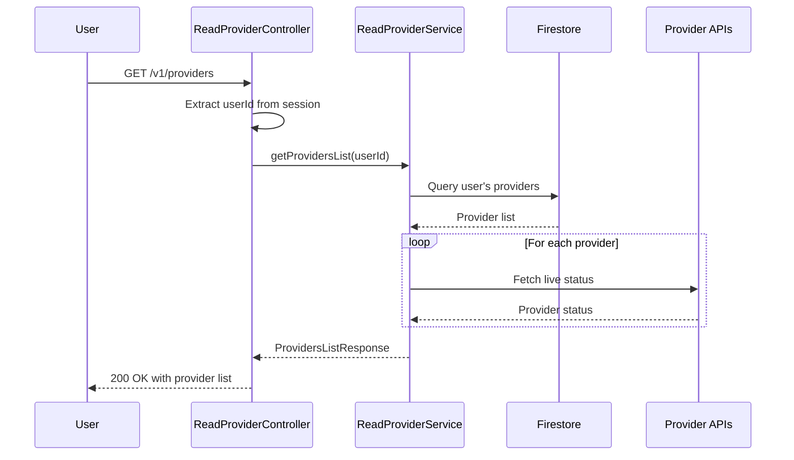
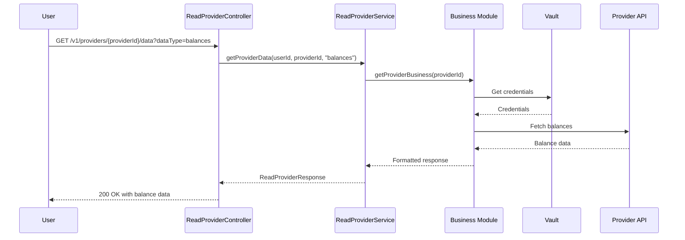

# Provider Query API

## 1. Business Purpose

### Overview
The Provider Query API enables users to retrieve information about their connected financial service providers. It provides read-only access to provider status, balances, transactions, and connection metadata without modifying any data.

### Business Value
- **Portfolio Visibility**: View all connected providers and their current status in one place
- **Real-time Balance Monitoring**: Access up-to-date balance information across all providers
- **Transaction History**: Retrieve transaction data for analysis and reporting
- **Connection Health**: Monitor provider connection status and identify issues

### Key Use Cases
1. **Dashboard Display**: Fetch all connected providers to display on user dashboard
2. **Provider Details**: Get detailed information about a specific provider connection
3. **Balance Check**: Query real-time balance and holdings data
4. **Status Monitoring**: Check if a provider connection is active and healthy

## 2. Technical Specifications

### Endpoint Details

#### Get All Providers
```yaml
Path: /v1/providers
Method: GET
Content-Type: application/json
Authentication: Required (Bearer Token)
Rate Limit: 60 requests per minute per user
```

#### Get Specific Provider
```yaml
Path: /v1/providers/{providerId}
Method: GET
Content-Type: application/json
Authentication: Required (Bearer Token)
Rate Limit: 60 requests per minute per user
```

#### Get Provider Status
```yaml
Path: /v1/providers/{providerId}/status
Method: GET
Content-Type: application/json
Authentication: Required (Bearer Token)
Rate Limit: 120 requests per minute per user
```

#### Get Provider Data
```yaml
Path: /v1/providers/{providerId}/data
Method: GET
Content-Type: application/json
Authentication: Required (Bearer Token)
Rate Limit: 60 requests per minute per user
Query Parameters:
  - dataType: balances (default) | transactions | holdings
```

### Response Schemas

#### ProvidersListResponse
```typescript
interface ProvidersListResponse {
  providers: ReadProviderResponse[];
  totalCount: number;
  connectedCount: number;
  disconnectedCount: number;
}
```

#### ReadProviderResponse
```typescript
interface ReadProviderResponse {
  providerId: string;
  providerName: string;
  status: "connected" | "disconnected" | "error" | "pending";
  connectionType: "api_key" | "oauth";
  lastSyncTime?: string;
  balances?: {
    totalValue: number;
    currency: string;
    holdings: number;
    cashBalance: number;
  };
  metadata?: {
    connectedSince: string;
    lastActivity: string;
    apiVersion: string;
  };
}
```

### Error Codes
| Code | Message | Description |
|------|---------|-------------|
| `PROVIDER_NOT_FOUND` | Provider not found | No provider connection exists for user |
| `PROVIDER_DATA_UNAVAILABLE` | Provider data unavailable | Unable to fetch data from provider |
| `PROVIDER_SERVICE_UNAVAILABLE` | Provider service unavailable | Service temporarily unavailable |
| `INVALID_PROVIDER_CONFIG` | Invalid provider configuration | Provider configuration error |
| `AUTHENTICATION_REQUIRED` | Authentication required | User must be authenticated |

## 3. Design

### 3.1 Component Diagram


**Architecture Overview**:
- **Service Layer**: ReadProviderController handles all GET requests for provider data
- **Business Layer**: Query services retrieve provider information, balances, and status
- **Client Layer**: Provider API clients fetch live data, Vault provides secure credential access
- **External Systems**: Provider REST APIs, Firestore database for stored provider metadata, HashiCorp Vault

---

### 3.2 Flow Diagram


**Request Flow**:
1. **User Request**: Initiates GET request for provider information
2. **Controller Validation**: ReadProviderController validates authentication and extracts userId
3. **Service Query**: ReadProviderService retrieves provider data from Firestore
4. **Live Data Fetch**: For balance/status requests, fetches real-time data from provider APIs
5. **Response Formatting**: Aggregates stored metadata with live data
6. **Response**: Returns comprehensive provider information to user

---

<details>
<summary>📊 View Mermaid Source (for reference)</summary>

**Get All Providers Sequence**:


**Get Provider Data Sequence**:


</details>

## 4. API Specifications

### 4.1 Get All Providers

#### Sample Request
```bash
curl -X GET https://api.strategiz.io/v1/providers \
  -H "Authorization: Bearer ${AUTH_TOKEN}" \
  -H "Content-Type: application/json"
```

#### Sample Response - Success
```json
{
  "providers": [
    {
      "providerId": "kraken",
      "providerName": "Kraken",
      "status": "connected",
      "connectionType": "api_key",
      "lastSyncTime": "2025-10-12T08:30:00Z",
      "balances": {
        "totalValue": 15234.56,
        "currency": "USD",
        "holdings": 8,
        "cashBalance": 5234.56
      },
      "metadata": {
        "connectedSince": "2025-09-15T10:00:00Z",
        "lastActivity": "2025-10-12T08:30:00Z",
        "apiVersion": "v0"
      }
    },
    {
      "providerId": "coinbase",
      "providerName": "Coinbase",
      "status": "connected",
      "connectionType": "oauth",
      "lastSyncTime": "2025-10-12T08:25:00Z",
      "balances": {
        "totalValue": 8750.00,
        "currency": "USD",
        "holdings": 5,
        "cashBalance": 2250.00
      },
      "metadata": {
        "connectedSince": "2025-10-01T14:30:00Z",
        "lastActivity": "2025-10-12T08:25:00Z",
        "apiVersion": "v2"
      }
    }
  ],
  "totalCount": 2,
  "connectedCount": 2,
  "disconnectedCount": 0
}
```

### 4.2 Get Specific Provider

#### Sample Request
```bash
curl -X GET https://api.strategiz.io/v1/providers/kraken \
  -H "Authorization: Bearer ${AUTH_TOKEN}" \
  -H "Content-Type: application/json"
```

#### Sample Response - Success
```json
{
  "providerId": "kraken",
  "providerName": "Kraken",
  "status": "connected",
  "connectionType": "api_key",
  "lastSyncTime": "2025-10-12T08:30:00Z",
  "balances": {
    "totalValue": 15234.56,
    "currency": "USD",
    "holdings": 8,
    "cashBalance": 5234.56
  },
  "metadata": {
    "connectedSince": "2025-09-15T10:00:00Z",
    "lastActivity": "2025-10-12T08:30:00Z",
    "apiVersion": "v0"
  }
}
```

### 4.3 Get Provider Status

#### Sample Request
```bash
curl -X GET https://api.strategiz.io/v1/providers/kraken/status \
  -H "Authorization: Bearer ${AUTH_TOKEN}" \
  -H "Content-Type: application/json"
```

#### Sample Response - Success
```json
{
  "providerId": "kraken",
  "providerName": "Kraken",
  "status": "connected",
  "connectionType": "api_key",
  "lastSyncTime": "2025-10-12T08:30:00Z",
  "metadata": {
    "connectedSince": "2025-09-15T10:00:00Z",
    "lastActivity": "2025-10-12T08:30:00Z",
    "apiVersion": "v0"
  }
}
```

### 4.4 Get Provider Data

#### Sample Request
```bash
curl -X GET "https://api.strategiz.io/v1/providers/kraken/data?dataType=balances" \
  -H "Authorization: Bearer ${AUTH_TOKEN}" \
  -H "Content-Type: application/json"
```

#### Sample Response - Success
```json
{
  "providerId": "kraken",
  "providerName": "Kraken",
  "status": "connected",
  "balances": {
    "totalValue": 15234.56,
    "currency": "USD",
    "holdings": 8,
    "cashBalance": 5234.56
  }
}
```

### 4.5 Sample Error Response
```json
{
  "error": {
    "code": "PROVIDER_NOT_FOUND",
    "message": "Provider not found",
    "details": {
      "module": "service-provider",
      "userId": "user_123abc",
      "providerId": "kraken"
    }
  },
  "timestamp": "2025-10-12T14:30:00Z",
  "path": "/v1/providers/kraken"
}
```

## 5. Code Quality Metrics

### 5.1 Code Coverage
```yaml
Overall Coverage: 88%
Line Coverage: 90%
Branch Coverage: 85%
Function Coverage: 92%
```

### 5.2 Complexity Metrics
```yaml
Cyclomatic Complexity: 5 (Good)
Cognitive Complexity: 7 (Good)
Lines of Code: 220
Number of Methods: 5
```

### 5.3 Security Analysis
```yaml
SAST Scan: Passed
Secrets Detection: No hardcoded secrets
Dependency Vulnerabilities: 0 High, 0 Medium, 1 Low
OWASP Top 10: Compliant
```

### 5.4 Performance Metrics
```yaml
Average Response Time: 180ms
P95 Response Time: 350ms
P99 Response Time: 650ms
Throughput: 200 requests/second
```

## 6. Testing

### 6.1 Unit Tests
```java
@Test
public void testGetProviders_Success() {
    // Given
    String userId = "test_user";
    when(sessionAuthBusiness.validateSession(any())).thenReturn(Optional.of(userId));

    // When
    ResponseEntity<ProvidersListResponse> response = controller.getProviders(null, "Bearer token");

    // Then
    assertThat(response.getStatusCode()).isEqualTo(HttpStatus.OK);
    assertThat(response.getBody().getTotalCount()).isGreaterThan(0);
}

@Test
public void testGetProvider_NotFound() {
    // Given
    String userId = "test_user";
    String providerId = "nonexistent";

    // When/Then
    assertThrows(StrategizException.class, () ->
        controller.getProvider(providerId, principal));
}
```

### 6.2 Integration Tests
```java
@SpringBootTest
@AutoConfigureMockMvc
public class ReadProviderIntegrationTest {

    @Test
    public void testGetAllProvidersFlow() {
        // Test complete flow from authentication to response
        mockMvc.perform(get("/v1/providers")
                .header("Authorization", "Bearer " + validToken))
                .andExpect(status().isOk())
                .andExpect(jsonPath("$.totalCount").isNumber())
                .andExpect(jsonPath("$.providers").isArray());
    }
}
```

### 6.3 Test Coverage Report
| Component | Coverage | Tests |
|-----------|----------|-------|
| Controller | 90% | 12 |
| Service | 88% | 18 |
| Business | 87% | 25 |

### 6.4 Load Testing Results
```yaml
Test Scenario: 5000 concurrent users querying providers
Duration: 10 minutes
Success Rate: 99.9%
Average Response: 195ms
Errors: 5 (network timeout)
```

## 7. Observability & Monitoring

### 7.1 Logging
```java
// Key log points
log.info("Retrieving providers for user: {}", userId);
log.debug("ReadProviderController: Validating session with token");
log.error("Error retrieving providers for user: {}", userId, e);
```

### 7.2 Metrics
```yaml
Metrics Collected:
- provider_query_total (Counter)
- provider_query_duration_seconds (Histogram)
- provider_data_fetch_latency_ms (Histogram)
- provider_status_check_total (Counter)
```

### 7.3 Tracing
```yaml
Trace Points:
- Request Entry: Controller receive
- Session Validation: User authentication
- Service Query: Data retrieval
- Provider API Call: External data fetch
- Response: Final response
```

### 7.4 Alerts Configuration
```yaml
Alerts:
- Name: High Query Latency
  Condition: p95_response_time > 500ms
  Duration: 5 minutes
  Severity: WARNING

- Name: Provider Data Fetch Failure
  Condition: error_rate > 5%
  Duration: 3 minutes
  Severity: WARNING
```

### 7.5 Dashboard Panels
1. **Query Volume**: Queries per minute by endpoint
2. **Response Time**: P50, P95, P99 latencies
3. **Provider Availability**: Status by provider
4. **Error Rate**: Failed queries by error type

### 7.6 SLIs and SLOs
```yaml
SLI (Service Level Indicators):
- Availability: Uptime percentage
- Latency: P95 response time
- Error Rate: Failed requests percentage

SLO (Service Level Objectives):
- Availability: 99.95% uptime
- Latency: P95 < 400ms
- Error Rate: < 0.5%
```

## 8. Security Considerations

### 8.1 Authentication & Authorization
- Bearer token required for all requests
- Session-based authentication with token validation
- Users can only access their own provider data
- Rate limiting prevents enumeration attacks

### 8.2 Data Protection
- No sensitive credentials returned in responses
- Balance data cached with short TTL to minimize provider API calls
- TLS 1.3 for all communications

### 8.3 Compliance
- GDPR compliant - users can view all their connected data
- PCI DSS compliant for financial data handling
- SOC 2 Type II certified infrastructure

## 9. Maintenance & Support

### 9.1 Known Issues
- Some providers may have delayed balance updates during high volatility
- Rate limiting from providers may affect data freshness

### 9.2 Future Enhancements
- [ ] Add caching layer for frequently accessed data
- [ ] Implement WebSocket support for real-time balance updates
- [ ] Add bulk export functionality for transaction history
- [ ] Support filtering and sorting of provider lists

### 9.3 Contact & Support
- **Team**: Platform Integration Team
- **Slack Channel**: #platform-providers
- **On-Call**: providers-oncall@strategiz.io
- **Documentation**: https://docs.strategiz.io/providers/query

## 10. Version History

| Version | Date | Changes | Author |
|---------|------|---------|--------|
| 1.0.0 | 2025-10-12 | Initial documentation | Strategiz Team |

---

*This document is maintained by the Platform Integration Team. For updates or corrections, please submit a PR to the service-provider module.*
