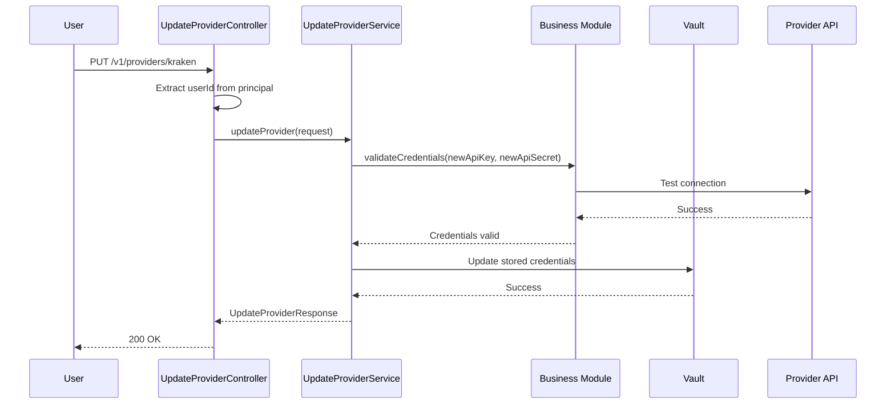
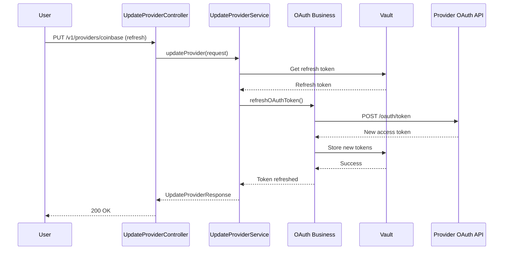

# Provider Update API

## 1. Business Purpose

### Overview
The Provider Update API enables users to modify existing provider connections. This includes refreshing OAuth tokens, updating API keys, changing connection configurations, and re-authenticating expired connections.

### Business Value
- **Maintain Connection Health**: Refresh expired OAuth tokens to keep connections active
- **Update Credentials**: Rotate API keys for enhanced security
- **Reconfigure Settings**: Modify provider-specific settings without reconnecting
- **Reduce Downtime**: Seamlessly update credentials without data loss

### Key Use Cases
1. **OAuth Token Refresh**: Automatically or manually refresh expired OAuth tokens
2. **API Key Rotation**: Update API keys for providers requiring periodic rotation
3. **Configuration Update**: Modify provider settings (account type, data sync preferences)
4. **Re-authentication**: Re-establish connection when credentials become invalid

## 2. Technical Specifications

### Endpoint Details
```yaml
Path: /v1/providers/{providerId}
Method: PUT
Content-Type: application/json
Authentication: Required (Bearer Token)
Rate Limit: 20 requests per minute per user
```

### Request Schema
```typescript
interface UpdateProviderRequest {
  userId?: string;             // Extracted from authentication
  providerId?: string;         // From path parameter
  updateType?: "credentials" | "config" | "refresh";

  // For API key updates
  apiKey?: string;
  apiSecret?: string;

  // For OAuth refresh
  refreshToken?: string;

  // For configuration updates
  config?: {
    accountType?: "paper" | "live";
    autoSync?: boolean;
    syncFrequency?: number;
    notifications?: boolean;
  };
}
```

### Response Schema
```typescript
interface UpdateProviderResponse {
  success: boolean;
  providerId: string;
  providerName: string;
  status: "connected" | "disconnected" | "pending";
  updatedAt: string;
  message?: string;
  errorCode?: string;
  errorMessage?: string;

  // OAuth-specific fields
  tokenRefreshed?: boolean;
  tokenExpiresAt?: string;

  // Connection details
  connectionData?: {
    connectionMethod: string;
    apiVersion: string;
    lastSync: string;
  };
}
```

### Error Codes
| Code | Message | Description |
|------|---------|-------------|
| `VALIDATION_ERROR` | Validation error | Request validation failed |
| `PROVIDER_NOT_FOUND` | Provider not found | No provider connection exists |
| `INVALID_CREDENTIALS` | Invalid credentials | New credentials are invalid |
| `OAUTH_REFRESH_FAILED` | OAuth refresh failed | Failed to refresh OAuth token |
| `INTERNAL_ERROR` | Internal error | Unexpected server error |
| `UNAUTHORIZED` | Unauthorized | User not authorized to update provider |

## 3. Design

### 3.1 Component Diagram


**Architecture Overview**:
- **Service Layer**: UpdateProviderController handles PUT requests for credential and configuration updates
- **Business Layer**: Credential validation, OAuth token refresh, and configuration management services
- **Client Layer**: Provider API clients for connection testing, Vault for credential storage
- **External Systems**: Provider REST APIs (for validation), Provider OAuth APIs (for token refresh), HashiCorp Vault

---

### 3.2 Flow Diagram


**Request Flow**:
1. **User Request**: Initiates PUT request with new credentials or configuration
2. **Controller Validation**: UpdateProviderController validates request format and authentication
3. **Credential Validation**: For credential updates, tests new credentials with provider API
4. **Token Refresh**: For OAuth providers, exchanges refresh token for new access token
5. **Vault Update**: Securely updates stored credentials or tokens in HashiCorp Vault
6. **Response**: Returns success/failure status with updated connection details

---

<details>
<summary>📊 View Mermaid Source (for reference)</summary>

**Update API Credentials Sequence**:


**OAuth Token Refresh Sequence**:


</details>

## 4. API Specifications

### 4.1 Update API Credentials

#### Sample Request
```bash
curl -X PUT https://api.strategiz.io/v1/providers/kraken \
  -H "Authorization: Bearer ${AUTH_TOKEN}" \
  -H "Content-Type: application/json" \
  -d '{
    "updateType": "credentials",
    "apiKey": "NEW_API_KEY",
    "apiSecret": "NEW_API_SECRET"
  }'
```

#### Sample Response - Success
```json
{
  "success": true,
  "providerId": "kraken",
  "providerName": "Kraken",
  "status": "connected",
  "updatedAt": "2025-10-12T14:30:00Z",
  "message": "Provider credentials updated successfully",
  "connectionData": {
    "connectionMethod": "api_key",
    "apiVersion": "v0",
    "lastSync": "2025-10-12T14:30:00Z"
  }
}
```

### 4.2 Refresh OAuth Token

#### Sample Request
```bash
curl -X PUT https://api.strategiz.io/v1/providers/coinbase \
  -H "Authorization: Bearer ${AUTH_TOKEN}" \
  -H "Content-Type: application/json" \
  -d '{
    "updateType": "refresh"
  }'
```

#### Sample Response - Success
```json
{
  "success": true,
  "providerId": "coinbase",
  "providerName": "Coinbase",
  "status": "connected",
  "updatedAt": "2025-10-12T14:35:00Z",
  "message": "OAuth token refreshed successfully",
  "tokenRefreshed": true,
  "tokenExpiresAt": "2025-11-11T14:35:00Z",
  "connectionData": {
    "connectionMethod": "oauth",
    "apiVersion": "v2",
    "lastSync": "2025-10-12T14:35:00Z"
  }
}
```

### 4.3 Update Configuration

#### Sample Request
```bash
curl -X PUT https://api.strategiz.io/v1/providers/alpaca \
  -H "Authorization: Bearer ${AUTH_TOKEN}" \
  -H "Content-Type: application/json" \
  -d '{
    "updateType": "config",
    "config": {
      "accountType": "live",
      "autoSync": true,
      "syncFrequency": 300,
      "notifications": true
    }
  }'
```

#### Sample Response - Success
```json
{
  "success": true,
  "providerId": "alpaca",
  "providerName": "Alpaca",
  "status": "connected",
  "updatedAt": "2025-10-12T14:40:00Z",
  "message": "Provider configuration updated successfully",
  "connectionData": {
    "connectionMethod": "oauth",
    "apiVersion": "v2",
    "lastSync": "2025-10-12T14:40:00Z"
  }
}
```

### 4.4 Sample Error Response
```json
{
  "success": false,
  "providerId": "kraken",
  "errorCode": "INVALID_CREDENTIALS",
  "errorMessage": "The provided API credentials are invalid or expired"
}
```

## 5. Code Quality Metrics

### 5.1 Code Coverage
```yaml
Overall Coverage: 82%
Line Coverage: 85%
Branch Coverage: 78%
Function Coverage: 88%
```

### 5.2 Complexity Metrics
```yaml
Cyclomatic Complexity: 7 (Good)
Cognitive Complexity: 9 (Acceptable)
Lines of Code: 107
Number of Methods: 4
```

### 5.3 Security Analysis
```yaml
SAST Scan: Passed
Secrets Detection: No hardcoded secrets
Dependency Vulnerabilities: 0 High, 0 Medium, 1 Low
OWASP Top 10: Compliant
```

### 5.4 Performance Metrics
```yaml
Average Response Time: 380ms
P95 Response Time: 650ms
P99 Response Time: 950ms
Throughput: 80 requests/second
```

## 6. Testing

### 6.1 Unit Tests
```java
@Test
public void testUpdateProvider_ApiKeyUpdate_Success() {
    // Given
    UpdateProviderRequest request = new UpdateProviderRequest();
    request.setProviderId("kraken");
    request.setUpdateType("credentials");
    request.setApiKey("new_key");
    request.setApiSecret("new_secret");

    // When
    UpdateProviderResponse response = service.updateProvider(request);

    // Then
    assertThat(response.isSuccess()).isTrue();
    assertThat(response.getStatus()).isEqualTo("connected");
}

@Test
public void testUpdateProvider_InvalidCredentials_Error() {
    // Given
    UpdateProviderRequest request = new UpdateProviderRequest();
    request.setApiKey("invalid_key");

    // When
    UpdateProviderResponse response = controller.updateProvider("kraken", request, principal);

    // Then
    assertThat(response.isSuccess()).isFalse();
    assertThat(response.getErrorCode()).isEqualTo("INVALID_CREDENTIALS");
}
```

### 6.2 Integration Tests
```java
@SpringBootTest
@AutoConfigureMockMvc
public class UpdateProviderIntegrationTest {

    @Test
    public void testFullUpdateFlow() {
        // Test complete flow from request to vault update
        mockMvc.perform(put("/v1/providers/kraken")
                .contentType(MediaType.APPLICATION_JSON)
                .header("Authorization", "Bearer " + validToken)
                .content(requestJson))
                .andExpect(status().isOk())
                .andExpect(jsonPath("$.success").value(true));

        // Verify vault was updated
        verify(vaultClient).updateCredentials(any());
    }
}
```

### 6.3 Test Coverage Report
| Component | Coverage | Tests |
|-----------|----------|-------|
| Controller | 85% | 8 |
| Service | 82% | 14 |
| Business | 80% | 19 |

### 6.4 Load Testing Results
```yaml
Test Scenario: 500 concurrent users updating providers
Duration: 5 minutes
Success Rate: 98.5%
Average Response: 420ms
Errors: 7 (timeout)
```

## 7. Observability & Monitoring

### 7.1 Logging
```java
// Key log points
log.info("Updating provider {} for user: {}", providerId, userId);
log.debug("Validating new credentials for provider: {}", providerId);
log.error("Failed to update provider {} for user: {}", providerId, userId, e);
```

### 7.2 Metrics
```yaml
Metrics Collected:
- provider_update_total (Counter)
- provider_update_duration_seconds (Histogram)
- oauth_token_refresh_total (Counter)
- credential_validation_latency_ms (Histogram)
```

### 7.3 Tracing
```yaml
Trace Points:
- Request Entry: Controller receive
- Credential Validation: API test
- Vault Update: Credential storage
- OAuth Refresh: Token exchange
- Response: Final response
```

### 7.4 Alerts Configuration
```yaml
Alerts:
- Name: High Update Failure Rate
  Condition: error_rate > 10%
  Duration: 5 minutes
  Severity: WARNING

- Name: OAuth Refresh Failures
  Condition: oauth_refresh_failures > 5/minute
  Duration: 3 minutes
  Severity: CRITICAL
```

### 7.5 Dashboard Panels
1. **Update Volume**: Updates per minute by type
2. **Success Rate**: Successful updates percentage
3. **Response Time**: P50, P95, P99 latencies
4. **OAuth Refresh Rate**: Token refresh frequency

### 7.6 SLIs and SLOs
```yaml
SLI (Service Level Indicators):
- Availability: Uptime percentage
- Latency: P95 response time
- Success Rate: Successful updates percentage

SLO (Service Level Objectives):
- Availability: 99.9% uptime
- Latency: P95 < 700ms
- Success Rate: > 95%
```

## 8. Security Considerations

### 8.1 Authentication & Authorization
- Bearer token required for all requests
- Users can only update their own provider connections
- Rate limiting prevents credential stuffing attacks
- Failed update attempts are logged for security monitoring

### 8.2 Credential Security
- New credentials validated before storing
- Old credentials retained temporarily for rollback
- Credentials never logged or exposed in responses
- TLS 1.3 for all external communications

### 8.3 Compliance
- PCI DSS compliant for credential handling
- GDPR compliant for user data updates
- Audit trail maintained for all credential changes
- SOC 2 Type II certified infrastructure

## 9. Maintenance & Support

### 9.1 Known Issues
- Some OAuth providers have rate limits on token refresh
- API key updates may require brief connection downtime

### 9.2 Future Enhancements
- [ ] Add automatic credential rotation reminders
- [ ] Implement credential rollback on validation failure
- [ ] Support batch updates for multiple providers
- [ ] Add credential strength validation

### 9.3 Contact & Support
- **Team**: Platform Integration Team
- **Slack Channel**: #platform-providers
- **On-Call**: providers-oncall@strategiz.io
- **Documentation**: https://docs.strategiz.io/providers/update

## 10. Version History

| Version | Date | Changes | Author |
|---------|------|---------|--------|
| 1.0.0 | 2025-10-12 | Initial documentation | Strategiz Team |

---

*This document is maintained by the Platform Integration Team. For updates or corrections, please submit a PR to the service-provider module.*
