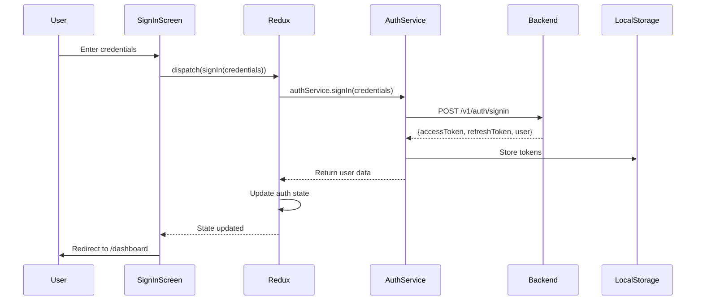
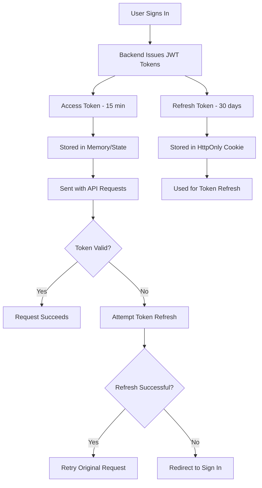
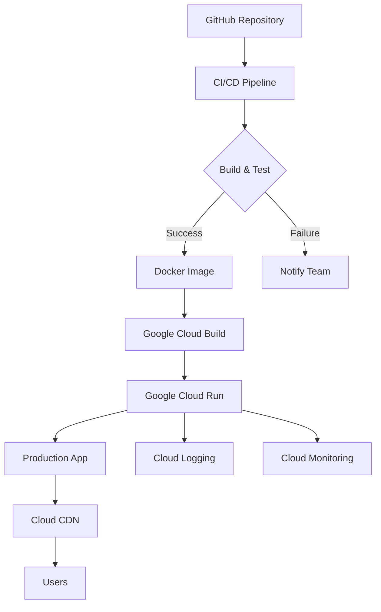

# 🏛️ Strategiz UI Architecture

Comprehensive architectural overview of the Strategiz frontend application, built with React, TypeScript, Redux, and Material-UI.

---

## 📐 High-Level Architecture


---

## 🗂️ Project Structure

```
strategiz-ui/
├── public/                     # Static assets
│   ├── index.html             # HTML entry point
│   └── assets/                # Images, icons, fonts
├── src/
│   ├── features/              # Feature-based modules
│   │   ├── auth/             # Authentication feature
│   │   │   ├── screens/      # Screen components
│   │   │   ├── components/   # Feature-specific components
│   │   │   ├── services/     # API service bridges
│   │   │   ├── redux/        # Redux slices
│   │   │   ├── hooks/        # Custom hooks
│   │   │   ├── types/        # TypeScript types
│   │   │   ├── utils/        # Feature utilities
│   │   │   └── docs/         # Feature documentation
│   │   ├── dashboard/
│   │   ├── portfolio/
│   │   ├── labs/
│   │   ├── live-strategies/
│   │   ├── marketplace/
│   │   ├── profile/
│   │   └── landing/
│   ├── components/            # Shared components
│   │   ├── layout/           # Layout components (Header, Footer)
│   │   ├── providers/        # Provider connection UI
│   │   └── ui/               # Reusable UI components
│   ├── routes/               # Routing configuration
│   │   └── AppRoutes.tsx     # Main route definitions
│   ├── store/                # Redux store configuration
│   │   ├── index.ts          # Store setup
│   │   └── hooks.ts          # Typed Redux hooks
│   ├── services/             # Global API services
│   │   ├── api.ts            # Axios instance configuration
│   │   └── auth.ts           # Auth service utilities
│   ├── utils/                # Global utilities
│   │   ├── deviceFingerprint.ts
│   │   └── storage.ts
│   ├── theme/                # Material-UI theme configuration
│   │   └── theme.ts
│   ├── App.tsx               # Root component
│   └── index.tsx             # Application entry point
├── docs/                      # High-level documentation
│   ├── architecture.mdx      # This file
│   ├── deployment.mdx        # Deployment guide
│   └── development.mdx       # Development setup
├── package.json
├── tsconfig.json
└── README.md
```

---

## 🎯 Architectural Principles

### 1. Feature-Based Organization
Each feature is a **self-contained module** with all related code:
- Screens (route components)
- Components (feature-specific UI)
- Services (API calls)
- Redux slices (state management)
- Hooks (business logic)
- Types (TypeScript definitions)
- Documentation (MDX files)

**Benefits**:
- ✅ Easy to locate all code related to a feature
- ✅ Clear ownership and boundaries
- ✅ Simplified testing (test entire feature in isolation)
- ✅ Enables feature teams to work independently

### 2. Separation of Concerns
- **Screens**: Navigation endpoints, high-level composition
- **Components**: Reusable UI elements
- **Services**: API communication
- **Redux**: State management
- **Hooks**: Business logic and side effects
- **Utils**: Pure functions, no side effects

### 3. Type Safety
- **TypeScript** throughout the entire codebase
- Strict mode enabled
- Type definitions for all API responses
- No `any` types (except rare exceptions)

### 4. State Management Strategy
- **Redux Toolkit** for global state
- **React Context** for theme and UI preferences
- **Local State** (useState) for component-specific state
- **URL State** (React Router) for navigation state

---

## 🔀 Data Flow Architecture


### Example: User Login Flow



---

## 🧩 Key Architectural Components

### 1. Routing System

**React Router v6** with protected routes:

```typescript
// AppRoutes.tsx
<Routes>
  {/* Public Routes */}
  <Route path="/" element={<LandingScreen />} />
  <Route path="/signin" element={<SignInScreen />} />
  <Route path="/signup" element={<SignUpScreen />} />

  {/* Protected Routes */}
  <Route element={<ProtectedRoute />}>
    <Route path="/dashboard" element={<DashboardScreen />} />
    <Route path="/portfolio" element={<PortfolioScreen />} />
    <Route path="/labs" element={<LabsScreen />} />
    <Route path="/live-strategies" element={<LiveStrategiesScreen />} />
    <Route path="/marketplace" element={<MarketplaceScreen />} />
    <Route path="/profile" element={<ProfileScreen />} />
  </Route>

  {/* OAuth Callbacks */}
  <Route path="/auth/oauth/:provider/callback" element={<OAuthCallbackScreen />} />
  <Route path="/auth/providers/:provider/callback" element={<ProviderOAuthCallbackScreen />} />
</Routes>
```

**ProtectedRoute Component**:
```typescript
const ProtectedRoute = () => {
  const { isAuthenticated, isLoading } = useSelector((state) => state.auth);

  if (isLoading) return <LoadingOverlay />;
  if (!isAuthenticated) return <Navigate to="/signin" replace />;

  return <Outlet />;
};
```

### 2. Redux Store Architecture

**Store Configuration**:
```typescript
// store/index.ts
export const store = configureStore({
  reducer: {
    auth: authReducer,
    dashboard: dashboardReducer,
    portfolio: portfolioReducer,
    liveStrategies: liveStrategiesReducer,
    laboratory: laboratoryReducer,
  },
  middleware: (getDefaultMiddleware) =>
    getDefaultMiddleware().concat(apiMiddleware),
});
```

**State Shape**:
```typescript
{
  auth: {
    user: User | null,
    accessToken: string | null,
    refreshToken: string | null,
    isAuthenticated: boolean,
    isLoading: boolean,
    error: string | null
  },
  dashboard: {
    portfolio: PortfolioData | null,
    watchlist: Asset[],
    isLoading: boolean
  },
  // ... other slices
}
```

### 3. API Service Layer

**Axios Instance**:
```typescript
// services/api.ts
export const api = axios.create({
  baseURL: process.env.REACT_APP_API_URL,
  timeout: 10000,
  headers: {
    'Content-Type': 'application/json',
  },
});

// Request interceptor (add auth token)
api.interceptors.request.use((config) => {
  const token = localStorage.getItem('accessToken');
  if (token) {
    config.headers.Authorization = `Bearer ${token}`;
  }
  return config;
});

// Response interceptor (handle token refresh)
api.interceptors.response.use(
  (response) => response,
  async (error) => {
    if (error.response?.status === 401) {
      // Token expired, attempt refresh
      const newToken = await refreshAuthToken();
      error.config.headers.Authorization = `Bearer ${newToken}`;
      return api.request(error.config);
    }
    return Promise.reject(error);
  }
);
```

**Feature Services**:
```typescript
// features/auth/services/authService.ts
export const authService = {
  signIn: async (credentials) => {
    const response = await api.post('/v1/auth/signin', credentials);
    return response.data;
  },

  signUp: async (userData) => {
    const response = await api.post('/v1/auth/signup', userData);
    return response.data;
  },

  verifyPasskey: async (credential) => {
    const response = await api.post('/v1/auth/passkey/verify', credential);
    return response.data;
  },
};
```

### 4. Theme System

**Material-UI Theme Configuration**:
```typescript
// theme/theme.ts
export const theme = createTheme({
  palette: {
    mode: 'dark',
    primary: {
      main: '#39FF14', // Neon green
    },
    secondary: {
      main: '#00BFFF', // Neon blue
    },
    background: {
      default: '#1a1a1a',
      paper: '#2a2a2a',
    },
  },
  typography: {
    fontFamily: '"Roboto", "Helvetica", "Arial", sans-serif',
    h1: {
      fontSize: '2.5rem',
      fontWeight: 700,
    },
  },
  components: {
    MuiButton: {
      styleOverrides: {
        root: {
          borderRadius: 8,
          textTransform: 'none',
        },
      },
    },
  },
});
```

---

## 🔐 Security Architecture

### 1. Authentication Flow


### 2. Device Fingerprinting
- Comprehensive browser fingerprint collected on page load
- Stored with user sessions for fraud detection
- Used to detect suspicious login patterns
- GDPR/privacy-compliant implementation

### 3. XSS Prevention
- React's built-in XSS protection (escaping)
- Content Security Policy (CSP) headers
- No `dangerouslySetInnerHTML` without sanitization
- Input validation and sanitization

### 4. CSRF Protection
- OAuth state parameter validation
- CSRF tokens for state-changing operations
- SameSite cookie attributes

---

## 📊 Performance Optimizations

### 1. Code Splitting
```typescript
// Lazy loading routes
const DashboardScreen = lazy(() => import('./features/dashboard/screens/DashboardScreen'));
const PortfolioScreen = lazy(() => import('./features/portfolio/screens/PortfolioScreen'));

// In routes
<Suspense fallback={<LoadingOverlay />}>
  <Route path="/dashboard" element={<DashboardScreen />} />
</Suspense>
```

### 2. Memoization
```typescript
// Expensive computations
const portfolioValue = useMemo(() => {
  return calculateTotalValue(assets);
}, [assets]);

// Component memoization
export const AssetCard = React.memo(({ asset }) => {
  // Component render
});
```

### 3. Virtual Scrolling
For large lists (watchlist, strategies):
```typescript
import { FixedSizeList } from 'react-window';

<FixedSizeList
  height={600}
  itemCount={watchlist.length}
  itemSize={80}
>
  {AssetRow}
</FixedSizeList>
```

### 4. Image Optimization
- Lazy loading with `loading="lazy"`
- Responsive images with `srcset`
- WebP format with fallbacks
- CDN delivery for static assets

---

## 🧪 Testing Strategy

### Unit Tests (Jest + React Testing Library)
```typescript
// Example: Component test
test('renders sign in form', () => {
  render(<SignInScreen />);
  expect(screen.getByLabelText(/email/i)).toBeInTheDocument();
  expect(screen.getByRole('button', { name: /sign in/i })).toBeInTheDocument();
});

// Example: Redux test
test('auth slice handles sign in', () => {
  const state = authReducer(initialState, signInSuccess(mockUser));
  expect(state.isAuthenticated).toBe(true);
  expect(state.user).toEqual(mockUser);
});
```

### Integration Tests
- Test Redux + API interactions
- Mock API responses with MSW (Mock Service Worker)
- Test complete user flows (sign in → dashboard)

### E2E Tests (Cypress/Playwright)
```typescript
// Example: E2E test
describe('Sign In Flow', () => {
  it('allows user to sign in with email/password', () => {
    cy.visit('/signin');
    cy.findByLabelText(/email/i).type('user@example.com');
    cy.findByLabelText(/password/i).type('password123');
    cy.findByRole('button', { name: /sign in/i }).click();
    cy.url().should('include', '/dashboard');
  });
});
```

---

## 🚀 Deployment Architecture



**Build Process**:
1. Install dependencies (`npm install`)
2. Run linters (`npm run lint`)
3. Run tests (`npm test`)
4. Build production bundle (`npm run build`)
5. Create Docker image
6. Deploy to Google Cloud Run

---

## 📚 Related Documentation

- [Development Setup](development.mdx)
- [Deployment Guide](deployment.mdx)
- [Landing Screen](../src/features/landing/docs/landing-screen.mdx)
- [Authentication Architecture](../src/features/auth/README.md)
- [Redux State Management](../src/store/README.md)

---

## 🔮 Future Architecture Enhancements

1. **Micro-Frontends**: Split app into independently deployable modules
2. **Server-Side Rendering (SSR)**: Next.js migration for better SEO and performance
3. **Progressive Web App (PWA)**: Offline support, push notifications
4. **GraphQL**: Replace REST APIs with GraphQL for flexible data fetching
5. **Real-time Collaboration**: WebSocket-based live collaboration features
6. **Service Workers**: Advanced caching strategies, background sync
7. **Edge Computing**: Deploy edge functions for faster API responses
