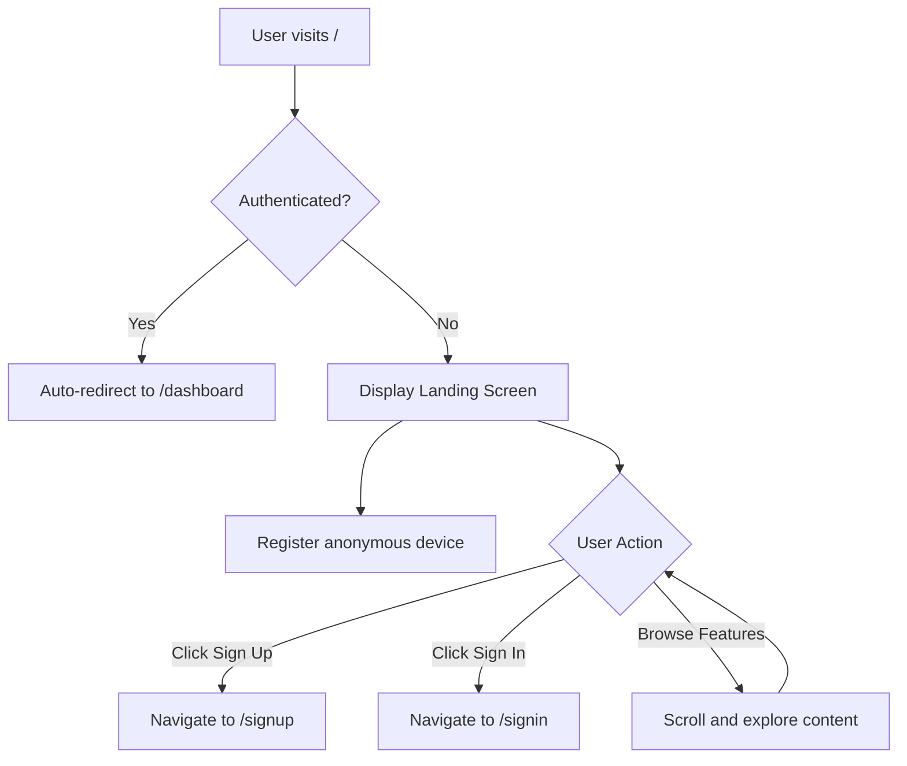

# 🏠 Landing Screen

The Landing Screen is the home page of Strategiz, serving as the primary entry point for unauthenticated users. It showcases the platform's features, displays real-time market data, and provides clear call-to-action buttons for user registration and authentication.

## 📍 Route Information

- **Path**: `/`
- **Component**: `LandingScreen.tsx`
- **Access**: Public (unauthenticated users)
- **Auto-redirect**: Authenticated users are automatically redirected to `/dashboard`

**Source**: `src/features/landing/screens/LandingScreen.tsx`

---

## 🎯 Purpose

The Landing Screen serves multiple critical business functions:

1. **First Impression**: Introduces new users to Strategiz's value proposition
2. **Market Engagement**: Displays live market data to demonstrate platform capabilities
3. **User Acquisition**: Provides clear pathways to sign up or sign in
4. **Anonymous Tracking**: Registers anonymous device fingerprints for security and analytics
5. **Feature Showcase**: Highlights key platform features and benefits

---

## 🏗️ Key Components

### 1. Hero Section
The main banner area featuring:
- Platform tagline and value proposition
- Primary call-to-action buttons (Sign Up, Sign In)
- Engaging visual design with neon color scheme
- Navigation to key platform sections

### 2. Market Ticker
Real-time market data display showing:
- Live cryptocurrency prices
- Price change indicators (up/down)
- Multiple asset tickers scrolling horizontally
- Real-time updates from market data sources

### 3. Features Showcase
Highlights platform capabilities:
- Trading strategy marketplace
- Portfolio management tools
- Backtesting and labs environment
- Multi-provider integration
- Educational resources

### 4. Call-to-Action Section
Bottom section encouraging user registration:
- Prominent "Get Started" button
- Platform benefits summary
- Social proof elements (if applicable)

---

## 🔐 Authentication Behavior

### Unauthenticated Users
- Full access to Landing Screen content
- Can view market data without login
- **Anonymous Device Registration**: Device fingerprint is automatically registered in the background
- Clear prompts to sign up or sign in

### Authenticated Users
- **Auto-redirect**: Immediately redirected to `/dashboard` upon detection of valid authentication
- No manual interaction required
- Maintains session continuity

---

## 🔄 User Flow



---

## 🎨 Design Features

### Color Scheme
- **Neon Green**: `#39FF14` - Primary accent, call-to-action buttons
- **Neon Blue**: `#00BFFF` - Secondary accents, links
- **Dark Theme**: Dark background for modern, professional appearance
- **High Contrast**: Neon colors against dark background for maximum visibility

### Layout
- **Responsive Design**: Mobile-first approach with breakpoints for tablet and desktop
- **Grid System**: Material-UI Grid for consistent spacing and alignment
- **Section Separation**: Clear visual hierarchy between sections
- **Smooth Scrolling**: Animated scroll behaviors for enhanced UX

---

## 🔧 Technical Implementation

### Device Fingerprinting
On page load, the Landing Screen automatically:
1. Generates a comprehensive device fingerprint using browser APIs
2. Sends fingerprint to `/v1/devices/anonymous` endpoint
3. Stores device ID in localStorage for future reference
4. Used for security analytics and fraud prevention

**Fingerprint Data Collected**:
- Browser user agent
- Screen resolution and color depth
- Timezone and language preferences
- Platform and hardware information
- Browser plugins and capabilities
- Canvas fingerprinting data

### Market Data Integration
- Real-time ticker data fetched from market data APIs
- WebSocket connections for live price updates (if applicable)
- Fallback to polling if WebSocket unavailable
- Error handling for data fetch failures

### Performance Optimizations
- **Lazy Loading**: Images and heavy components loaded on-demand
- **Code Splitting**: Route-based code splitting for faster initial load
- **Memoization**: React.memo and useMemo for expensive computations
- **Asset Optimization**: Compressed images and minified assets

---

## 📱 Responsive Behavior

### Mobile (< 600px)
- Single column layout
- Stacked call-to-action buttons
- Simplified market ticker (fewer assets shown)
- Touch-optimized button sizes

### Tablet (600px - 960px)
- Two-column feature showcase
- Expanded market ticker
- Medium-sized hero section

### Desktop (> 960px)
- Full multi-column layout
- Expansive hero section
- Complete market ticker with all assets
- Side-by-side feature comparisons

---

## 🔌 API Integration

### Anonymous Device Registration
**Endpoint**: `POST /v1/devices/anonymous`

**Request**:
```json
{
  "userAgent": "Mozilla/5.0...",
  "screenResolution": "1920x1080",
  "colorDepth": 24,
  "timezone": "America/New_York",
  "language": "en-US",
  "platform": "MacIntel",
  "canvasFingerprint": "abc123...",
  "webglFingerprint": "def456..."
}
```

**Response**:
```json
{
  "deviceId": "device_abc123xyz",
  "fingerprintHash": "sha256_hash_value",
  "isNewDevice": true,
  "riskScore": 0.1
}
```

### Market Data Fetch
**Endpoint**: `GET /v1/market/ticker` (or external market data API)

**Response**:
```json
{
  "tickers": [
    {
      "symbol": "BTC-USD",
      "price": 42350.50,
      "change24h": 2.45,
      "changePercent": 5.78
    },
    {
      "symbol": "ETH-USD",
      "price": 2245.75,
      "change24h": -1.23,
      "changePercent": -2.15
    }
  ]
}
```

---

## 🧪 Testing Considerations

### Unit Tests
- Component rendering without errors
- Correct button navigation
- Device registration function calls
- Market ticker data display

### Integration Tests
- Anonymous device registration flow
- Authentication state detection
- Auto-redirect for authenticated users
- Market data fetching and display

### E2E Tests
- Complete user journey from landing to signup
- Visual regression testing for layout
- Performance benchmarks for page load time
- Cross-browser compatibility

---

## 🚀 Performance Metrics

### Target Metrics
- **First Contentful Paint (FCP)**: < 1.5s
- **Largest Contentful Paint (LCP)**: < 2.5s
- **Time to Interactive (TTI)**: < 3.5s
- **Cumulative Layout Shift (CLS)**: < 0.1

### Monitoring
- Google Analytics for page views and user behavior
- Performance monitoring via browser APIs
- Error tracking for failed API calls
- Heatmap analysis for user engagement

---

## 🔮 Future Enhancements

1. **Personalized Content**: Show different content based on geographic location or browser language
2. **A/B Testing**: Test different hero messages and CTA button placements
3. **Video Integration**: Add demo videos or tutorials
4. **Live Chat**: Integrate customer support chat widget
5. **Social Proof**: Display user testimonials and success stories
6. **Interactive Demos**: Allow users to interact with demo trading interface without login

---

## 📚 Related Documentation

- [Sign In Screen](signin-screen.mdx)
- [Sign Up Screen](signup-screen.mdx)
- [Dashboard Screen](dashboard-screen.mdx)
- [Authentication System](../features/authentication.md)
- [Device Fingerprinting API](../../src/utils/DEVICE_API.md)

---

## 🐛 Common Issues & Troubleshooting

### Issue: Authenticated users see landing page briefly before redirect
**Solution**: Implement authentication check in a suspense boundary or loading state to prevent flash of unauthenticated content.

### Issue: Market ticker not updating
**Solution**: Check WebSocket connection status, verify API endpoint accessibility, ensure fallback polling is working.

### Issue: Device registration fails silently
**Solution**: Check browser console for errors, verify `/v1/devices/anonymous` endpoint is accessible, ensure CORS headers are properly configured.

---

## 🎓 User Education

### For End Users
- "Welcome to Strategiz! Click 'Sign Up' to create your free account and start exploring trading strategies."
- "Already have an account? Click 'Sign In' to access your dashboard."

### For Developers
- Device fingerprinting happens automatically in the background
- Authentication state is checked on component mount via Redux store
- Market data refresh interval can be configured in environment variables
