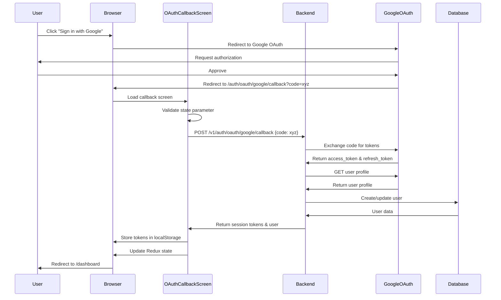
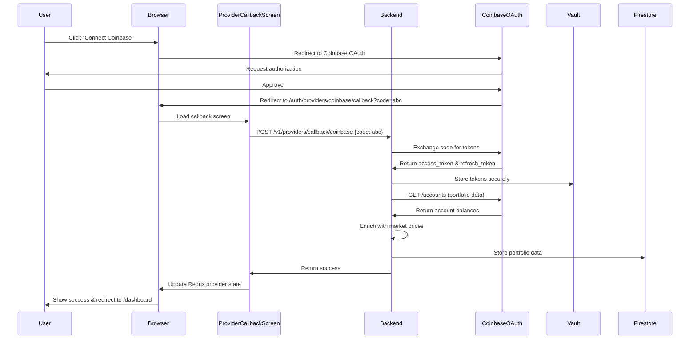

# 🔄 OAuth Callback Screens

The OAuth Callback Screens handle the return flow from external OAuth providers (Google, Facebook) and trading platform providers (Coinbase, Binance, Kraken). These screens process authorization codes, exchange them for access tokens, and complete the authentication or provider connection flow.

## 📍 Route Information

### Social OAuth Callbacks
- **Paths**:
  - `/auth/oauth/google/callback`
  - `/auth/oauth/facebook/callback`
  - `/auth/oauth/:provider/callback` (generic)
- **Component**: `OAuthCallbackScreen.tsx`
- **Access**: Public (during OAuth flow)

### Provider OAuth Callbacks
- **Paths**:
  - `/auth/providers/:provider/callback`
  - `/auth/callback/:provider`
  - `/providers/callback/:provider/success`
  - `/providers/callback/:provider/error`
  - `/providers/callback/cb/success` (Coinbase specific)
  - `/providers/callback/cb/error` (Coinbase specific)
- **Component**: `ProviderOAuthCallbackScreen.tsx`
- **Access**: Public (during OAuth flow)

### Success Screen
- **Path**: `/auth/signup-success`
- **Component**: `OAuthSuccessScreen.tsx`
- **Access**: Semi-public (after successful OAuth)

**Sources**:
- `src/features/auth/screens/OAuthCallbackScreen.tsx`
- `src/features/auth/screens/ProviderOAuthCallbackScreen.tsx`
- `src/features/auth/screens/OAuthSuccessScreen.tsx`

---

## 🎯 Purpose

OAuth Callback Screens serve critical functions in the authentication and provider connection flows:

1. **Authorization Code Exchange**: Convert OAuth authorization codes into access/refresh tokens
2. **State Validation**: Verify OAuth state parameter to prevent CSRF attacks
3. **User Creation/Login**: Create new user accounts or authenticate existing users (social OAuth)
4. **Provider Connection**: Link trading platform accounts to user profiles (provider OAuth)
5. **Error Handling**: Gracefully handle OAuth failures and user cancellations
6. **Token Storage**: Securely store access tokens and refresh tokens

---

## 🏗️ OAuth Flow Types

### 1. Social OAuth (Google/Facebook)
**Purpose**: User authentication and account creation

```mermaid
graph TD
    A[User clicks "Sign in with Google"] --> B[Redirect to Google OAuth]
    B --> C[User authorizes on Google]
    C --> D[Google redirects to /auth/oauth/google/callback]
    D --> E[OAuthCallbackScreen loads]
    E --> F[Extract authorization code from URL]
    F --> G[Send code to backend API]
    G --> H[Backend exchanges code for tokens]
    H --> I[Backend fetches user profile from Google]
    I --> J{User exists?}
    J -->|Yes| K[Login existing user]
    J -->|No| L[Create new user account]
    K --> M[Issue session tokens]
    L --> M
    M --> N[Store tokens in localStorage/cookies]
    N --> O[Update Redux auth state]
    O --> P[Redirect to /auth/signup-success]
    P --> Q[Auto-redirect to /dashboard]
```

### 2. Provider OAuth (Coinbase/Binance/Kraken)
**Purpose**: Connect trading platform to existing user account

```mermaid
graph TD
    A[User clicks "Connect Coinbase"] --> B[Redirect to Coinbase OAuth]
    B --> C[User authorizes on Coinbase]
    C --> D[Coinbase redirects to /auth/providers/coinbase/callback]
    D --> E[ProviderOAuthCallbackScreen loads]
    E --> F[Extract authorization code and state]
    F --> G{State valid?}
    G -->|No| H[Show error: Invalid state]
    G -->|Yes| I[Send code to backend API]
    I --> J[Backend exchanges code for tokens]
    J --> K[Backend stores tokens in Vault]
    K --> L[Backend fetches portfolio data from Coinbase]
    L --> M[Backend enriches with market prices]
    M --> N[Backend stores portfolio in Firestore]
    N --> O[Return success response]
    O --> P[Update Redux provider state]
    P --> Q[Show success message]
    Q --> R[Redirect to /dashboard or /profile]
```

---

## 🔐 Security Features

### 1. State Parameter Validation
**Prevents CSRF Attacks**

Before OAuth redirect:
```javascript
const state = crypto.randomUUID();
localStorage.setItem('oauth_state', state);
window.location.href = `https://provider.com/oauth?state=${state}`;
```

On callback:
```javascript
const urlParams = new URLSearchParams(window.location.search);
const returnedState = urlParams.get('state');
const storedState = localStorage.getItem('oauth_state');

if (returnedState !== storedState) {
  throw new Error('Invalid state parameter - possible CSRF attack');
}
localStorage.removeItem('oauth_state');
```

### 2. PKCE (Proof Key for Code Exchange)
**Enhanced Security for Public Clients**

For providers that support PKCE:
```javascript
// Before OAuth redirect
const codeVerifier = generateRandomString(128);
const codeChallenge = await sha256(codeVerifier);
localStorage.setItem('pkce_verifier', codeVerifier);

// Include in OAuth URL
const authUrl = `https://provider.com/oauth?code_challenge=${codeChallenge}&code_challenge_method=S256`;

// On callback, include verifier in token exchange
const response = await fetch('/v1/auth/oauth/token', {
  body: JSON.stringify({
    code: authorizationCode,
    code_verifier: localStorage.getItem('pkce_verifier')
  })
});
```

### 3. Token Security
- **Access Tokens**: Short-lived (15 minutes), stored in memory or secure cookies
- **Refresh Tokens**: Long-lived (30 days), stored in HttpOnly cookies
- **Provider Tokens**: Stored in HashiCorp Vault, never exposed to frontend
- **Encryption**: All tokens encrypted at rest

### 4. Error Handling
- **User Cancellation**: Gracefully handle when user denies authorization
- **Invalid Codes**: Detect and handle expired or invalid authorization codes
- **Network Failures**: Retry logic with exponential backoff
- **Rate Limiting**: Prevent abuse of OAuth endpoints

---

## 🎨 UI Components

### Loading State
**Shown While Processing OAuth**
- Animated spinner or progress indicator
- "Connecting to [Provider]..." message
- Brand colors and logo
- No user interaction required

### Success State
**OAuth Success Screen**
- Success checkmark animation
- "Successfully connected!" message
- Provider logo and name
- Account details (email, username)
- "Continue to Dashboard" button
- Auto-redirect after 3 seconds

### Error State
**When OAuth Fails**
- Error icon (not checkmark)
- Clear error message:
  - "Connection failed"
  - "Authorization denied"
  - "Invalid or expired code"
- "Try Again" button
- "Contact Support" link
- "Return to [Previous Page]" option

---

## 🔄 Detailed Flow Diagrams

### Social OAuth Callback Flow



### Provider OAuth Callback Flow



---

## 🔌 API Integration

### Social OAuth Callback
**Endpoint**: `POST /v1/auth/oauth/:provider/callback`

**Request**:
```json
{
  "code": "authorization_code_from_provider",
  "state": "csrf_protection_state",
  "redirectUri": "https://app.strategiz.io/auth/oauth/google/callback"
}
```

**Response**:
```json
{
  "accessToken": "eyJhbGc...",
  "refreshToken": "eyJhbGc...",
  "user": {
    "id": "user_123",
    "email": "user@gmail.com",
    "displayName": "John Doe",
    "profilePicture": "https://...",
    "emailVerified": true,
    "authProvider": "google"
  },
  "isNewUser": false,
  "expiresIn": 900
}
```

### Provider OAuth Callback
**Endpoint**: `POST /v1/providers/callback/:provider`

**Request**:
```json
{
  "code": "authorization_code_from_coinbase",
  "state": "csrf_protection_state"
}
```

**Response**:
```json
{
  "providerId": "coinbase_xyz",
  "providerName": "coinbase",
  "status": "connected",
  "accountInfo": {
    "username": "john_trader",
    "accountType": "pro",
    "permissions": ["wallet:accounts:read", "wallet:transactions:read"]
  },
  "portfolio": {
    "totalValue": 15420.50,
    "assets": [
      {
        "symbol": "BTC",
        "quantity": 0.5,
        "currentPrice": 42000,
        "value": 21000
      }
    ]
  },
  "createdAt": "2024-01-15T10:30:00Z"
}
```

### Error Response
```json
{
  "error": "oauth_error",
  "errorDescription": "Invalid authorization code",
  "errorCode": "OAUTH_001",
  "message": "The authorization code is invalid or has expired",
  "retryable": true
}
```

---

## 🚨 Error Handling

### Common OAuth Errors

| Error Code | Cause | User Message | Action |
|------------|-------|--------------|--------|
| `OAUTH_001` | Invalid authorization code | "Connection failed. Please try again." | Retry OAuth flow |
| `OAUTH_002` | State parameter mismatch | "Security validation failed." | Clear state and retry |
| `OAUTH_003` | User denied authorization | "Authorization cancelled." | Return to previous page |
| `OAUTH_004` | Provider API error | "Provider temporarily unavailable." | Retry later |
| `OAUTH_005` | Network timeout | "Connection timeout. Check your network." | Retry |
| `OAUTH_006` | Duplicate provider connection | "This account is already connected." | Go to dashboard |
| `OAUTH_007` | Invalid scope/permissions | "Insufficient permissions granted." | Re-authorize with correct permissions |

### Error Recovery Strategies

**Automatic Retry**:
```javascript
const retryOAuthExchange = async (code, retries = 3) => {
  for (let i = 0; i < retries; i++) {
    try {
      const response = await exchangeOAuthCode(code);
      return response;
    } catch (error) {
      if (i === retries - 1) throw error;
      await sleep(1000 * Math.pow(2, i)); // Exponential backoff
    }
  }
};
```

**User-Initiated Retry**:
- "Try Again" button restarts OAuth flow from beginning
- Preserves user context (which provider, what action)
- Clears corrupted state before retry

**Graceful Degradation**:
- If provider connection fails during signup, allow user to skip
- Can connect providers later from profile settings
- Partial failures don't block user from accessing app

---

## 📱 Responsive Design

### Mobile (< 600px)
- Full-screen loading overlay
- Large status messages
- Big touch-friendly buttons
- Simplified success/error screens

### Desktop (> 960px)
- Centered modal-style callback screen
- Detailed status information
- Side-by-side layout for success info

---

## 🧪 Testing Considerations

### Unit Tests
- URL parameter parsing (code, state, error)
- State validation logic
- Error message formatting
- Redirect logic based on success/failure

### Integration Tests
- Mock OAuth provider responses
- Test successful authorization flow
- Test error scenarios (invalid code, state mismatch)
- Test Redux state updates
- Test token storage

### E2E Tests
- **Cannot fully test** due to external OAuth providers
- Use OAuth provider sandbox environments where available
- Mock OAuth providers in test environment
- Test user cancellation flow
- Test network failure scenarios

---

## 🔮 Future Enhancements

1. **OAuth Activity Logging**: Record all OAuth attempts for security audit
2. **Multi-Account Support**: Connect multiple accounts from same provider
3. **Token Refresh UI**: Show when tokens are being refreshed in background
4. **Permission Management**: Allow users to review and modify granted permissions
5. **Automatic Re-authorization**: Detect expired tokens and prompt re-authorization
6. **Provider Health Status**: Show if provider API is experiencing issues

---

## 📚 Related Documentation

- [Sign In Screen](signin-screen.mdx)
- [Sign Up Screen](signup-screen.mdx)
- [Provider Connection API](../../../../strategiz-core/service-provider/docs/provider-connection-api.mdx)
- [Provider Callback API](../../../../strategiz-core/service-provider/docs/provider-callback-api.mdx)
- [Authentication Service](../README.md)
- [Vault Credentials Storage](../../../../strategiz-core/client-vault/README.md)

---

## 🐛 Common Issues & Solutions

### Issue: Infinite redirect loop
**Cause**: State parameter keeps failing validation
**Solution**: Clear localStorage OAuth state. Check for browser extensions blocking state storage.

### Issue: "Invalid redirect URI" error
**Cause**: OAuth callback URL not whitelisted in provider console
**Solution**: Add all callback URLs to provider OAuth settings (development, staging, production).

### Issue: Tokens not persisting after callback
**Cause**: localStorage/cookies blocked by browser privacy settings
**Solution**: Check third-party cookie settings. Use first-party cookies or session storage.

### Issue: Provider connection shows success but portfolio empty
**Cause**: API permissions insufficient or portfolio fetch failed
**Solution**: Re-authorize with correct scopes. Check backend logs for fetch errors.

### Issue: OAuth works in dev but not production
**Cause**: Different callback URLs, CORS issues, HTTPS requirement
**Solution**: Ensure production OAuth app is configured separately. Verify HTTPS is enabled.
