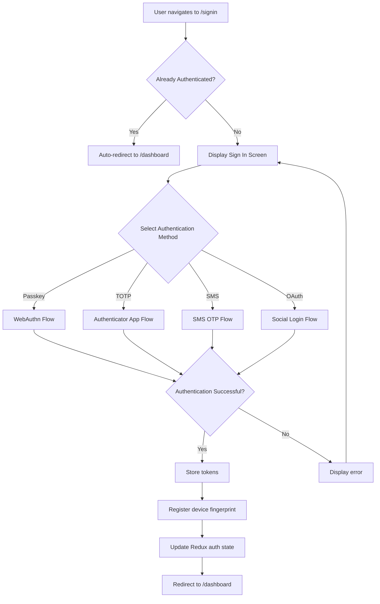

# 🔐 Sign In Screen

The Sign In Screen provides multiple authentication methods for users to securely access their Strategiz accounts. It supports modern authentication methods including passkeys (WebAuthn), TOTP, SMS OTP, and traditional OAuth providers.

## 📍 Route Information

- **Path**: `/signin`
- **Component**: `SignInScreen.tsx`
- **Access**: Public (unauthenticated users only)
- **Auto-redirect**: Authenticated users are redirected to `/dashboard`

**Source**: `src/features/auth/screens/SignInScreen.tsx`

---

## 🎯 Purpose

The Sign In Screen enables secure user authentication through multiple methods:

1. **Passkey Authentication**: WebAuthn-based biometric/hardware key login
2. **TOTP Authentication**: Time-based one-time password (Google Authenticator, Authy)
3. **SMS Authentication**: One-time password sent via SMS
4. **OAuth Authentication**: Social login (Google, Facebook)
5. **Email/Password**: Traditional username/password login (if enabled)

---

## 🏗️ Authentication Methods

### 1. Passkey (WebAuthn)
**Most Secure & Convenient**

- Biometric authentication (Face ID, Touch ID, Windows Hello)
- Hardware security keys (YubiKey, etc.)
- No password needed
- Phishing-resistant
- FIDO2/WebAuthn standard

**User Flow**:
```mermaid
graph TD
    A[Click "Sign In with Passkey"] --> B[Browser prompts for biometric/security key]
    B --> C[User authenticates]
    C --> D[WebAuthn credential sent to server]
    D --> E[Server validates signature]
    E --> F[Session token issued]
    F --> G[Redirect to /dashboard]
```

### 2. TOTP (Time-Based One-Time Password)
**High Security**

- Works with Google Authenticator, Authy, 1Password, etc.
- Generates 6-digit codes every 30 seconds
- Offline authentication (no SMS needed)
- Industry standard (RFC 6238)

**User Flow**:
```mermaid
graph TD
    A[Enter email] --> B[Click "Sign In with Authenticator"]
    B --> C[Enter 6-digit TOTP code]
    C --> D[Server validates code against shared secret]
    D --> E{Code Valid?}
    E -->|Yes| F[Session token issued]
    E -->|No| G[Error: Invalid or expired code]
    F --> H[Redirect to /dashboard]
```

### 3. SMS OTP
**User-Friendly**

- One-time password sent via SMS
- No app installation required
- Time-limited codes (5-10 minutes)
- Carrier-dependent delivery

**User Flow**:
```mermaid
graph TD
    A[Enter phone number] --> B[Click "Send SMS Code"]
    B --> C[Server sends OTP via SMS]
    C --> D[User receives SMS]
    D --> E[Enter OTP code]
    E --> F[Server validates code]
    F --> G{Code Valid?}
    G -->|Yes| H[Session token issued]
    G -->|No| I[Error: Invalid or expired code]
    H --> J[Redirect to /dashboard]
```

### 4. OAuth (Social Login)
**Quick Setup**

Supported providers:
- **Google**: OAuth 2.0 with Google accounts
- **Facebook**: Facebook Login integration

**User Flow**:
```mermaid
graph TD
    A[Click "Sign In with Google/Facebook"] --> B[Redirect to provider OAuth page]
    B --> C[User authorizes on provider site]
    C --> D[Redirect to /auth/oauth/:provider/callback]
    D --> E[Exchange authorization code for tokens]
    E --> F[Create/update user account]
    F --> G[Issue session token]
    G --> H[Redirect to /dashboard]
```

---

## 🎨 UI Components

### Sign In Form
- **Email Input**: For TOTP and traditional login
- **Phone Input**: For SMS authentication
- **Code Input**: 6-digit OTP input field
- **Method Selector**: Toggle between authentication methods
- **Remember Me**: Optional session persistence
- **Forgot Password**: Link to password reset flow

### Authentication Method Tabs
- Visual tab interface for switching methods
- Icons for each authentication type
- Active state highlighting
- Tooltips explaining each method

### Error Handling
- **Invalid Credentials**: Clear error message with retry option
- **Expired Codes**: Prompt to resend OTP
- **Rate Limiting**: Warning when too many attempts
- **Account Locked**: Contact support message

---

## 🔐 Security Features

### 1. Device Fingerprinting
Every sign-in attempt captures:
- Browser fingerprint
- IP address
- Geolocation (approximate)
- Device type and OS
- Timestamp

Stored for fraud detection and security analytics.

### 2. Rate Limiting
- **Per Account**: Max 5 failed attempts per 15 minutes
- **Per IP**: Max 20 failed attempts per hour
- **Per Device**: Max 10 failed attempts per day

Prevents brute force attacks.

### 3. Session Management
- **Access Token**: Short-lived (15 minutes)
- **Refresh Token**: Long-lived (30 days)
- **Secure Storage**: HttpOnly cookies or secure localStorage
- **Token Rotation**: Automatic refresh before expiration

### 4. Multi-Factor Authentication (MFA)
- Optional secondary verification
- Required for high-risk actions
- Configurable in user profile

---

## 🔄 User Flow Diagram



---

## 🔌 API Integration

### 1. Passkey Sign In
**Endpoint**: `POST /v1/auth/passkey/verify`

**Request**:
```json
{
  "email": "user@example.com",
  "credential": {
    "id": "credential_id",
    "rawId": "base64_raw_id",
    "response": {
      "authenticatorData": "base64_data",
      "clientDataJSON": "base64_json",
      "signature": "base64_signature"
    },
    "type": "public-key"
  },
  "deviceFingerprint": {...}
}
```

**Response**:
```json
{
  "accessToken": "eyJhbGc...",
  "refreshToken": "eyJhbGc...",
  "user": {
    "id": "user_123",
    "email": "user@example.com",
    "displayName": "John Doe"
  },
  "expiresIn": 900
}
```

### 2. TOTP Sign In
**Endpoint**: `POST /v1/auth/totp/verify`

**Request**:
```json
{
  "email": "user@example.com",
  "code": "123456",
  "deviceFingerprint": {...}
}
```

**Response**: Same as passkey response

### 3. SMS OTP Sign In
**Step 1 - Request OTP**
**Endpoint**: `POST /v1/auth/sms/send`

**Request**:
```json
{
  "phoneNumber": "+1234567890"
}
```

**Response**:
```json
{
  "success": true,
  "message": "OTP sent to +1***7890",
  "expiresIn": 300
}
```

**Step 2 - Verify OTP**
**Endpoint**: `POST /v1/auth/sms/verify`

**Request**:
```json
{
  "phoneNumber": "+1234567890",
  "code": "123456",
  "deviceFingerprint": {...}
}
```

**Response**: Same as passkey response

### 4. OAuth Sign In
**Endpoint**: `GET /v1/auth/oauth/:provider`

Redirects to provider OAuth page. After authorization, callback handled by `OAuthCallbackScreen`.

---

## 📱 Responsive Design

### Mobile (< 600px)
- Single column layout
- Large touch-friendly buttons
- Stacked authentication method tabs
- Simplified UI with essential elements only

### Tablet (600px - 960px)
- Two-column layout (form + illustration)
- Medium-sized buttons
- Horizontal method tabs

### Desktop (> 960px)
- Split-screen design (form left, branding right)
- Spacious layout with whitespace
- Hover effects on interactive elements

---

## 🧪 Testing Considerations

### Unit Tests
- Each authentication method component renders correctly
- Form validation works (email format, phone number format)
- Error messages display for invalid inputs
- Method switching works properly

### Integration Tests
- Passkey authentication flow (with mock WebAuthn)
- TOTP code validation
- SMS OTP send and verify flow
- OAuth redirect and callback handling
- Token storage after successful login
- Redux state updates correctly

### E2E Tests
- Complete sign-in journey for each method
- Error handling for failed authentications
- Rate limiting behavior
- Auto-redirect for authenticated users
- Cross-browser compatibility (especially for WebAuthn)

---

## 🚨 Error Handling

### Common Errors

| Error Code | Message | User Action |
|------------|---------|-------------|
| `AUTH_001` | Invalid credentials | Re-enter credentials or use different method |
| `AUTH_002` | Account not found | Sign up or verify email address |
| `AUTH_003` | Code expired | Request new OTP |
| `AUTH_004` | Too many attempts | Wait 15 minutes or contact support |
| `AUTH_005` | Account locked | Contact support |
| `AUTH_006` | WebAuthn not supported | Use different browser or method |
| `AUTH_007` | SMS delivery failed | Check phone number or use different method |

### Error Display
- **Inline Errors**: Field-level validation errors
- **Alert Banner**: System-level errors at top of form
- **Toast Notifications**: Temporary messages for non-critical errors
- **Retry Buttons**: Clear call-to-action for recoverable errors

---

## 🎓 User Education

### First-Time Users
- Tooltips explaining each authentication method
- "What is Passkey?" information dialog
- Security benefits comparison table
- Video tutorial links

### Help Resources
- Link to FAQ: "Trouble signing in?"
- Contact support button
- Password reset flow
- Account recovery options

---

## 🔮 Future Enhancements

1. **Biometric Fallback**: Automatically suggest passkey if device supports it
2. **Remember Device**: Skip 2FA on trusted devices
3. **Security Notifications**: Email alerts for new sign-ins
4. **Login History**: Show recent login attempts
5. **Magic Links**: Passwordless email authentication
6. **Enterprise SSO**: SAML/OIDC for corporate accounts

---

## 📚 Related Documentation

- [Sign Up Screen](signup-screen.mdx)
- [OAuth Callback Screens](oauth-callback-screen.mdx)
- [Passkey API](../clients/PASSKEY_API.md)
- [TOTP API](../clients/TOTP_API.md)
- [SMS API](../clients/SMS_API.md)
- [Authentication Service](../README.md)
- [Device Fingerprinting](../../../utils/DEVICE_API.md)

---

## 🐛 Common Issues & Solutions

### Issue: Passkey not working on mobile
**Solution**: Ensure HTTPS is enabled. WebAuthn requires secure context. Check browser compatibility.

### Issue: TOTP code always fails
**Solution**: Verify server and client clocks are synchronized. TOTP is time-sensitive (±30 seconds tolerance).

### Issue: SMS not received
**Solution**: Check phone number format (+1234567890). Verify SMS service provider status. Check spam/blocked messages.

### Issue: OAuth redirect loop
**Solution**: Verify OAuth callback URL is whitelisted in provider console. Check state parameter validation.
