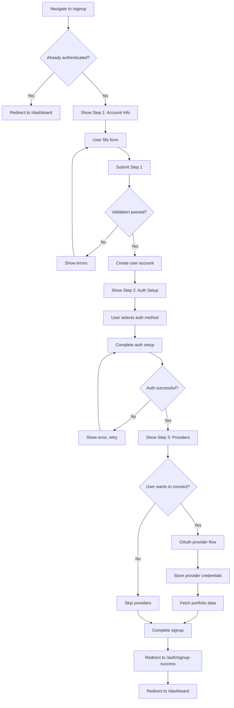

# ✍️ Sign Up Screen

The Sign Up Screen provides a comprehensive three-step registration flow for new users to create their Strategiz accounts. It supports multiple authentication methods and guides users through account creation, verification, and optional provider connection.

## 📍 Route Information

- **Path**: `/signup`
- **Component**: `SignUpScreen.tsx`
- **Access**: Public (unauthenticated users only)
- **Auto-redirect**: Authenticated users are redirected to `/dashboard`

**Source**: `src/features/auth/screens/SignUpScreen.tsx`

---

## 🎯 Purpose

The Sign Up Screen facilitates new user onboarding through a multi-step process:

1. **Account Creation**: Capture user information and credentials
2. **Verification**: Verify email/phone and set up authentication
3. **Provider Connection**: (Optional) Connect trading platform accounts

---

## 🏗️ Three-Step Registration Flow

### Step 1: Account Information
**Collect Basic User Data**

Fields:
- **Full Name**: User's display name
- **Email Address**: Primary account identifier
- **Phone Number** (Optional): For SMS authentication
- **Password**: Secure password (if not using passwordless)
- **Terms Agreement**: Accept terms of service and privacy policy

Validation:
- Email format and uniqueness check
- Password strength requirements (min 8 chars, uppercase, lowercase, number, special char)
- Phone number format validation
- Real-time availability checking

**User Flow**:
```mermaid
graph TD
    A[User enters account info] --> B{Valid format?}
    B -->|No| C[Show inline errors]
    B -->|Yes| D[Check email availability]
    D --> E{Email available?}
    E -->|No| F[Show "Email already registered"]
    E -->|Yes| G[Enable "Next" button]
    G --> H[Click Next]
    H --> I[Proceed to Step 2]
    C --> A
    F --> A
```

### Step 2: Authentication Setup
**Configure Secure Authentication Method**

Available Methods:
1. **Passkey (Recommended)**: WebAuthn-based biometric/hardware key
2. **TOTP**: Set up Google Authenticator or similar app
3. **SMS OTP**: Use phone number for one-time passwords
4. **Email Verification**: Basic email-based verification

**Passkey Setup Flow**:
```mermaid
graph TD
    A[Click "Set up Passkey"] --> B[Server generates challenge]
    B --> C[Browser prompts for biometric/security key]
    C --> D[User authenticates]
    D --> E[Public key credential created]
    E --> F[Send credential to server]
    F --> G[Server stores public key]
    G --> H[Passkey registered successfully]
    H --> I[Proceed to Step 3]
```

**TOTP Setup Flow**:
```mermaid
graph TD
    A[Click "Set up Authenticator App"] --> B[Server generates TOTP secret]
    B --> C[Display QR code]
    C --> D[User scans QR code in authenticator app]
    D --> E[Enter verification code from app]
    E --> F{Code valid?}
    F -->|No| G[Show error, retry]
    F -->|Yes| H[TOTP registered successfully]
    G --> E
    H --> I[Proceed to Step 3]
```

### Step 3: Connect Trading Providers (Optional)
**Link Exchange/Brokerage Accounts**

Supported Providers:
- **Coinbase**: Cryptocurrency exchange
- **Binance**: Global crypto exchange
- **Kraken**: Crypto trading platform
- **Charles Schwab**: Traditional brokerage (coming soon)
- **Interactive Brokers**: Multi-asset broker (coming soon)

**Provider Connection Flow**:
```mermaid
graph TD
    A[Click "Connect Provider"] --> B[Select provider from list]
    B --> C[Click "Connect"]
    C --> D[Redirect to provider OAuth page]
    D --> E[User authorizes on provider]
    E --> F[Redirect to /auth/providers/:provider/callback]
    F --> G[Exchange OAuth code for tokens]
    G --> H[Store tokens in Vault]
    H --> I[Fetch initial portfolio data]
    I --> J[Store portfolio in Firestore]
    J --> K[Display success message]
    K --> L{Connect another?}
    L -->|Yes| A
    L -->|No| M[Click "Finish"]
    M --> N[Redirect to /dashboard]
```

Users can also skip this step and connect providers later from their profile.

---

## 🎨 UI Components

### Multi-Step Indicator
- Visual progress indicator (1 of 3, 2 of 3, 3 of 3)
- Checkmarks for completed steps
- Active step highlighting
- Back button to return to previous steps

### Form Components
- **Text Inputs**: Name, email, phone
- **Password Input**: With strength indicator and toggle visibility
- **Checkbox**: Terms and conditions agreement
- **QR Code Display**: For TOTP setup
- **Provider Cards**: Visual cards for each trading platform
- **Success Animations**: Checkmark animations for completed steps

### Error Handling
- **Inline Validation**: Real-time field validation
- **Error Messages**: Clear, actionable error descriptions
- **Retry Mechanisms**: Easy retry for failed operations
- **Help Text**: Contextual guidance for each field

---

## 🔐 Security Features

### 1. Email Verification
- Verification email sent upon account creation
- Time-limited verification links (24 hours)
- Re-send verification email option
- Account partially restricted until verified

### 2. Password Requirements
If using password-based auth:
- Minimum 8 characters
- At least one uppercase letter
- At least one lowercase letter
- At least one number
- At least one special character
- Not commonly used password (checked against breach database)

### 3. Device Registration
During signup:
- Comprehensive device fingerprint captured
- Stored for future login anomaly detection
- Used for fraud prevention
- Linked to user account

### 4. Rate Limiting
- Max 5 signup attempts per IP per hour
- Email domain validation to prevent disposable emails
- CAPTCHA for suspicious activity

---

## 🔄 Complete User Flow



---

## 🔌 API Integration

### Step 1: Create Account
**Endpoint**: `POST /v1/auth/signup`

**Request**:
```json
{
  "displayName": "John Doe",
  "email": "john.doe@example.com",
  "phoneNumber": "+1234567890",
  "password": "SecurePass123!",
  "termsAccepted": true,
  "deviceFingerprint": {
    "userAgent": "Mozilla/5.0...",
    "screenResolution": "1920x1080",
    "timezone": "America/New_York",
    "language": "en-US"
  }
}
```

**Response**:
```json
{
  "userId": "user_123abc",
  "email": "john.doe@example.com",
  "verificationEmailSent": true,
  "message": "Account created. Please verify your email.",
  "nextStep": "authentication_setup"
}
```

### Step 2a: Setup Passkey
**Endpoint**: `POST /v1/auth/passkey/register`

**Request**:
```json
{
  "userId": "user_123abc",
  "credential": {
    "id": "credential_id",
    "rawId": "base64_raw_id",
    "response": {
      "attestationObject": "base64_attestation",
      "clientDataJSON": "base64_client_data"
    },
    "type": "public-key"
  }
}
```

**Response**:
```json
{
  "success": true,
  "credentialId": "credential_id",
  "message": "Passkey registered successfully"
}
```

### Step 2b: Setup TOTP
**Endpoint**: `POST /v1/auth/totp/setup`

**Request**:
```json
{
  "userId": "user_123abc"
}
```

**Response**:
```json
{
  "secret": "JBSWY3DPEHPK3PXP",
  "qrCodeUrl": "data:image/png;base64,...",
  "backupCodes": ["12345678", "87654321", ...]
}
```

**Verification Endpoint**: `POST /v1/auth/totp/verify-setup`

**Request**:
```json
{
  "userId": "user_123abc",
  "code": "123456"
}
```

**Response**:
```json
{
  "success": true,
  "message": "TOTP setup complete"
}
```

### Step 3: Connect Provider
**Endpoint**: `GET /v1/providers/connect/:provider`

Initiates OAuth flow. See [Provider Connection API](../../../docs/strategiz-core/service/provider-connection-api.mdx) for details.

---

## 📱 Responsive Design

### Mobile (< 600px)
- Single column layout
- Large form fields for easy touch input
- Stacked buttons
- Simplified provider cards
- Full-screen step transitions

### Tablet (600px - 960px)
- Wider form fields
- Two-column provider grid
- Side-by-side buttons

### Desktop (> 960px)
- Centered form with max-width
- Three-column provider grid
- Spacious layout with whitespace
- Hover effects and animations

---

## 🧪 Testing Considerations

### Unit Tests
- Each step component renders correctly
- Form validation logic works
- Step navigation (next, back) functions properly
- Passkey registration flow (mocked WebAuthn)
- TOTP QR code generation
- Provider card selection

### Integration Tests
- Complete 3-step signup flow
- Email verification link generation and validation
- TOTP setup and verification
- Provider OAuth flow (mocked)
- Redux state management across steps
- Local storage persistence of partial progress

### E2E Tests
- Full user journey from landing to dashboard
- Error handling at each step
- Back navigation preserves form data
- Skip provider connection flow
- Multiple provider connections
- Cross-browser compatibility (especially WebAuthn)

---

## 🚨 Error Handling

### Common Errors

| Error Code | Message | User Action |
|------------|---------|-------------|
| `SIGNUP_001` | Email already registered | Use different email or sign in |
| `SIGNUP_002` | Invalid email format | Correct email format |
| `SIGNUP_003` | Weak password | Use stronger password |
| `SIGNUP_004` | Phone number invalid | Correct phone format |
| `SIGNUP_005` | Terms not accepted | Accept terms to continue |
| `SIGNUP_006` | Verification email failed | Retry sending email |
| `SIGNUP_007` | Passkey registration failed | Try different browser or method |
| `SIGNUP_008` | TOTP code invalid | Re-scan QR code or try different code |
| `SIGNUP_009` | Provider connection failed | Retry or skip for now |

### Error Recovery
- **Auto-save Progress**: Form data saved to localStorage
- **Resume Signup**: Return to where user left off
- **Clear Retry Actions**: Obvious buttons to retry failed operations
- **Alternative Paths**: Offer different auth methods if one fails

---

## 💾 Data Persistence

### Local Storage
During incomplete signups:
```javascript
{
  "signupProgress": {
    "currentStep": 2,
    "step1Data": {
      "displayName": "John Doe",
      "email": "john@example.com",
      "phoneNumber": "+1234567890"
    },
    "step2Completed": false,
    "timestamp": 1699123456789
  }
}
```

### Database (Firestore)
After account creation:
```
users/{userId}
  ├── email: "john@example.com"
  ├── displayName: "John Doe"
  ├── phoneNumber: "+1234567890"
  ├── emailVerified: false
  ├── authMethods: ["totp"]
  ├── createdAt: timestamp
  └── lastLogin: timestamp

users/{userId}/auth_credentials/
  └── totp
      ├── secret: "encrypted_secret"
      └── backupCodes: [...]

users/{userId}/devices/
  └── {deviceId}
      ├── fingerprint: {...}
      ├── firstSeen: timestamp
      └── lastSeen: timestamp
```

---

## 🎓 User Education

### Help Resources
- **Inline Tooltips**: Explain each field's purpose
- **Password Strength Meter**: Visual indicator of password quality
- **Authentication Method Comparison**: Table showing pros/cons
- **Provider Benefits**: Why connect trading accounts
- **Video Tutorials**: Step-by-step setup guides
- **FAQ Links**: Common signup questions

### Progressive Disclosure
- Show help text only when needed
- Expand detailed explanations on click
- Contextual tips based on user actions

---

## 🔮 Future Enhancements

1. **Social Signup**: Sign up with Google/Facebook directly (skips Step 1)
2. **Referral Codes**: Enter referral code during signup
3. **Email Domain Validation**: Warn about typos in email domains
4. **Phone Verification**: SMS verification during signup
5. **KYC Integration**: Identity verification for regulated features
6. **Promo Codes**: Apply promotional offers during signup
7. **A/B Testing**: Test different signup flows for optimization

---

## 📚 Related Documentation

- [Sign In Screen](signin-screen.mdx)
- [OAuth Callback Screens](oauth-callback-screen.mdx)
- [Signup API](../services/SIGNUP_API.md)
- [Passkey API](../clients/PASSKEY_API.md)
- [TOTP API](../clients/TOTP_API.md)
- [SMS API](../clients/SMS_API.md)
- [Provider Connection API](../../../../strategiz-core/service-provider/docs/provider-connection-api.mdx)
- [Device Fingerprinting](../../../utils/DEVICE_API.md)

---

## 🐛 Common Issues & Solutions

### Issue: "Email already registered" but user can't sign in
**Solution**: Email may be in pending verification state. Resend verification email or contact support.

### Issue: Passkey setup fails on iPhone
**Solution**: Ensure iOS 16+ and Safari 16+. Try Chrome if Safari fails. Check Face ID/Touch ID is enabled.

### Issue: TOTP QR code won't scan
**Solution**: Manually enter the secret code shown below QR. Check authenticator app is up-to-date.

### Issue: Provider connection redirects but fails
**Solution**: Check OAuth callback URL is correct. Verify provider account is active. Check network connectivity.

### Issue: Form data lost after browser refresh
**Solution**: Implement auto-save to localStorage. Restore from localStorage on component mount.
