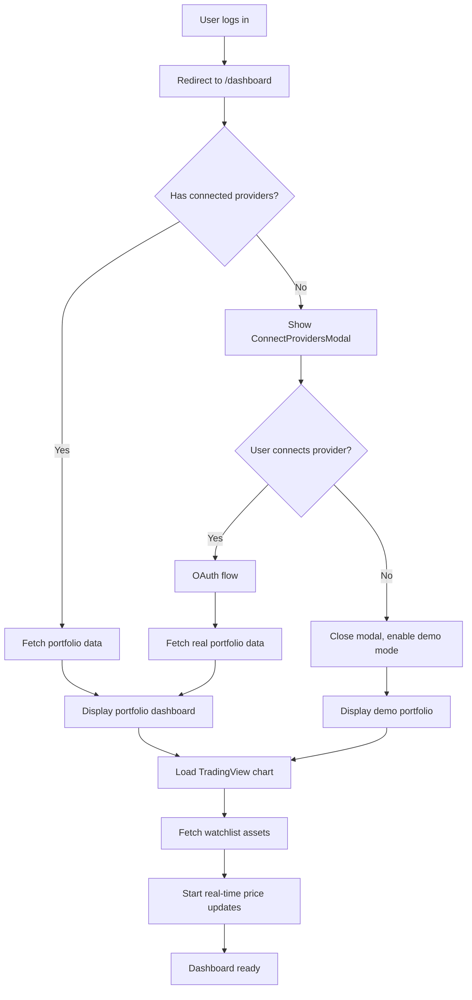

# 📊 Dashboard Screen

The Dashboard Screen is the main hub for authenticated users, providing a comprehensive overview of their portfolio performance, market data, watchlists, and quick access to key platform features. It serves as the central command center for trading and strategy management.

## 📍 Route Information

- **Path**: `/dashboard`
- **Component**: `DashboardScreen.tsx`
- **Access**: Protected (requires authentication)
- **Default Landing**: Users are redirected here after successful login

**Source**: `src/features/dashboard/screens/DashboardScreen.tsx`

---

## 🎯 Purpose

The Dashboard Screen provides users with:

1. **Portfolio Overview**: Real-time portfolio value, performance metrics, and asset allocation
2. **Market Data**: Live market prices, trending assets, and market indicators
3. **Watchlist**: Customizable list of tracked assets with real-time price updates
4. **Chart Visualization**: Interactive TradingView charts for technical analysis
5. **Quick Actions**: Fast access to trading, strategy deployment, and provider connections
6. **Demo Mode**: Simulated portfolio and market data for users without connected providers

---

## 🏗️ Key Components

### 1. Portfolio Dashboard
**Top Section - Portfolio Summary**

Displays:
- **Total Portfolio Value**: Aggregate value across all connected providers
- **24h Change**: Dollar and percentage change in last 24 hours
- **Performance Chart**: Mini sparkline or area chart showing performance trend
- **Asset Breakdown**: Pie chart or bar chart of asset allocation
- **Top Movers**: Assets with biggest gains/losses in portfolio

**Color Coding**:
- 🟢 Green: Positive performance (gains)
- 🔴 Red: Negative performance (losses)
- ⚪ Gray: Neutral or unchanged

**Demo Mode**:
- Shows simulated portfolio with realistic mock data
- Banner: "Demo Mode - Connect a provider to see real data"
- Sample portfolio: BTC, ETH, SOL with fake values

### 2. TradingView Widget
**Interactive Charting**

Features:
- Real-time price charts for selected assets
- Multiple chart types (candlestick, line, bar, area)
- Technical indicators (MA, RSI, MACD, Bollinger Bands)
- Drawing tools (trendlines, support/resistance)
- Multiple timeframes (1m, 5m, 15m, 1h, 4h, 1d, 1w)
- Full-screen mode

**Default View**:
- Asset: BTC-USD
- Timeframe: 1 day
- Chart Type: Candlestick
- Indicators: None (user can add)

### 3. Market Watchlist
**Asset Monitoring**

Features:
- **Add Assets**: Search and add assets to watchlist
- **Real-time Prices**: Live price updates (WebSocket or polling)
- **Price Alerts**: Set custom price alerts (coming soon)
- **Quick View**: Click asset to load chart
- **Remove Assets**: Remove from watchlist
- **Sorting**: Sort by name, price, % change
- **Filtering**: Filter by asset type (crypto, stocks, forex)

**Default Watchlist**:
- BTC-USD
- ETH-USD
- SPY (S&P 500 ETF)
- AAPL
- TSLA

**Add Asset Flow**:
```mermaid
graph TD
    A[Click "+ Add Asset"] --> B[Open AssetSearchAutocomplete]
    B --> C[User types asset symbol/name]
    C --> D[Search API returns matches]
    D --> E[User selects asset from dropdown]
    E --> F[Asset added to watchlist]
    F --> G[Persist to user preferences]
    G --> H[Start real-time price updates]
```

### 4. Quick Action Cards
**Feature Navigation**

Cards:
- **Deploy Strategy**: Navigate to Labs or Marketplace
- **View Portfolio**: Navigate to Portfolio Screen
- **Connect Provider**: Open ConnectProvidersModal
- **Educational Content**: Navigate to Learn Screen
- **Live Strategies**: Navigate to Live Strategies Screen

### 5. Connect Providers Modal
**For Users Without Connected Providers**

**Trigger**: Automatically shown on first dashboard visit if no providers connected

**Content**:
- Provider selection grid (Coinbase, Binance, Kraken, etc.)
- "Connect" buttons for each provider
- "Skip for now" option
- "Demo Mode" toggle

**Modal Behavior**:
- Can be dismissed and accessed later from profile
- Remembers user preference (don't show again checkbox)
- Re-appears after X days if still no providers connected

---

## 🎨 UI Layout

### Desktop Layout (> 960px)
```
┌─────────────────────────────────────────────────────────────┐
│  Header (GlobalHeader)                                      │
├───────────────────────┬─────────────────────────────────────┤
│  Portfolio Dashboard  │  TradingView Widget                 │
│  (Total Value, Chart) │  (Interactive Chart)                │
│  (Asset Breakdown)    │                                     │
├───────────────────────┼─────────────────────────────────────┤
│  Market Watchlist     │  Quick Action Cards                 │
│  (Asset List)         │  (Deploy, Portfolio, Connect)       │
│  (+ Add Asset)        │                                     │
└───────────────────────┴─────────────────────────────────────┘
```

### Mobile Layout (< 600px)
```
┌──────────────────────────┐
│  Header (GlobalHeader)   │
├──────────────────────────┤
│  Portfolio Dashboard     │
│  (Total Value, Change)   │
├──────────────────────────┤
│  TradingView Widget      │
│  (Compact Chart)         │
├──────────────────────────┤
│  Market Watchlist        │
│  (Scrollable List)       │
├──────────────────────────┤
│  Quick Actions (Stacked) │
└──────────────────────────┘
```

---

## 🔄 User Flow



---

## 🔌 API Integration

### 1. Fetch Portfolio Data
**Endpoint**: `GET /v1/portfolio`

**Response**:
```json
{
  "totalValue": 25430.50,
  "change24h": {
    "value": 1234.56,
    "percentage": 5.12
  },
  "providers": [
    {
      "providerId": "coinbase_xyz",
      "providerName": "Coinbase",
      "value": 15000.00,
      "assets": [
        {
          "symbol": "BTC",
          "name": "Bitcoin",
          "quantity": 0.5,
          "currentPrice": 42000,
          "value": 21000,
          "change24h": 2.5
        }
      ]
    }
  ],
  "assetAllocation": {
    "BTC": 0.65,
    "ETH": 0.25,
    "SOL": 0.10
  }
}
```

### 2. Fetch Watchlist
**Endpoint**: `GET /v1/users/me/watchlist`

**Response**:
```json
{
  "watchlist": [
    {
      "symbol": "BTC-USD",
      "name": "Bitcoin",
      "currentPrice": 42000,
      "change24h": 2.5,
      "changePercent24h": 0.006,
      "marketCap": 820000000000,
      "volume24h": 35000000000
    }
  ]
}
```

### 3. Add Asset to Watchlist
**Endpoint**: `POST /v1/users/me/watchlist`

**Request**:
```json
{
  "symbol": "ETH-USD"
}
```

**Response**:
```json
{
  "success": true,
  "watchlist": [...]
}
```

### 4. Search Assets
**Endpoint**: `GET /v1/market/search?q={query}`

**Response**:
```json
{
  "results": [
    {
      "symbol": "BTC-USD",
      "name": "Bitcoin",
      "type": "crypto",
      "exchange": "Multiple"
    }
  ]
}
```

### 5. Real-time Price Updates
**WebSocket** (preferred): `wss://api.strategiz.io/market/stream`

**Message Format**:
```json
{
  "type": "price_update",
  "symbol": "BTC-USD",
  "price": 42150.50,
  "timestamp": 1699123456789
}
```

**Polling Fallback**: `GET /v1/market/prices?symbols=BTC-USD,ETH-USD`

---

## 📱 Responsive Behavior

### Mobile (< 600px)
- Single column stacked layout
- Collapsible sections (accordion style)
- Simplified charts (fewer indicators)
- Bottom navigation for quick actions
- Horizontal scroll for watchlist

### Tablet (600px - 960px)
- Two-column grid layout
- Portfolio and chart side-by-side
- Watchlist below in full width
- Touch-optimized controls

### Desktop (> 960px)
- Full multi-column grid
- Side-by-side portfolio and chart
- Watchlist and actions in bottom row
- Hover effects and tooltips
- Keyboard shortcuts for navigation

---

## 🎨 Design Features

### Color Scheme
- **Background**: Dark theme (`#1a1a1a`)
- **Cards**: Slightly lighter (`#2a2a2a`)
- **Accent**: Neon green (`#39FF14`) for positive values
- **Alert**: Neon red for negative values
- **Neutral**: White/gray for text

### Animations
- **Smooth Transitions**: Card hover effects, page transitions
- **Number Animations**: Portfolio value changes animate (count-up effect)
- **Loading States**: Skeleton screens while data loads
- **Micro-interactions**: Button feedback, asset selection highlights

### Typography
- **Headers**: Bold, 24-32px for section titles
- **Values**: Monospace font for prices and numbers
- **Labels**: 12-14px regular for field labels

---

## 🔐 Demo Mode

### Purpose
Allow users to explore the platform without connecting real accounts.

### Demo Data
- **Simulated Portfolio**: $10,000 starting value
- **Sample Assets**: BTC, ETH, SOL, AAPL, TSLA
- **Fake Transactions**: Historical trades for realism
- **Performance Chart**: Simulated growth/decline

### Banner
Persistent banner at top of dashboard:
```
🎭 Demo Mode Active - Connect a provider to see your real portfolio
[Connect Provider] [Dismiss]
```

### Limitations
- No real trading
- No actual provider data
- Educational purposes only
- Can switch to real mode anytime

---

## 🧪 Testing Considerations

### Unit Tests
- Portfolio dashboard renders with data
- Watchlist add/remove functionality
- Asset search autocomplete
- Demo mode toggle
- Price formatting and display

### Integration Tests
- Fetch portfolio data on mount
- Real-time price updates via WebSocket
- Add/remove assets from watchlist
- Navigate to other screens from quick actions
- Redux state updates correctly

### E2E Tests
- Complete dashboard load for authenticated user
- Connect provider from modal
- Add asset to watchlist and see price updates
- Click asset to load chart
- Navigate to Portfolio, Labs, Marketplace from quick actions

---

## 🚨 Error Handling

### Common Errors

| Error Scenario | User Message | Action |
|----------------|--------------|--------|
| Portfolio fetch fails | "Unable to load portfolio. Please try again." | Retry button |
| WebSocket disconnected | "Live prices paused. Reconnecting..." | Auto-reconnect |
| Asset search fails | "Search temporarily unavailable." | Retry search |
| TradingView widget fails | "Chart could not load." | Refresh or use alternative |
| No providers connected | "Connect a provider to see your portfolio." | Show modal |

### Graceful Degradation
- If WebSocket fails, fall back to polling
- If portfolio fails, show demo mode
- If chart fails, show static image or simplified chart
- Cache last known data during outages

---

## 🔮 Future Enhancements

1. **Customizable Layout**: Drag-and-drop dashboard widgets
2. **Performance Analytics**: Detailed charts for portfolio performance over time
3. **News Feed**: Relevant market news and alerts
4. **Social Features**: Follow other traders, share strategies
5. **AI Insights**: Personalized trading suggestions based on portfolio
6. **Multi-Currency Support**: Display values in different fiat currencies
7. **Mobile App**: Native iOS/Android dashboard experience

---

## 📚 Related Documentation

- [Portfolio Screen](../../portfolio/docs/portfolio-screen.mdx)
- [Labs Screen](../../labs/docs/labs-screen.mdx)
- [Live Strategies Screen](../../live-strategies/docs/live-strategies-screen.mdx)
- [Marketplace Screen](../../marketplace/docs/marketplace-screen.mdx)
- [Connect Providers Modal](../../../components/providers/ConnectProvidersModal.tsx)
- [Portfolio API](../../../../strategiz-core/service-portfolio/README.md)
- [Market Data API](../../../../strategiz-core/client-yahoofinance/README.md)

---

## 🐛 Common Issues & Solutions

### Issue: Portfolio value shows $0 despite connected provider
**Solution**: Check provider connection status. Verify API permissions include account balances. Refresh provider data.

### Issue: Real-time prices not updating
**Solution**: Check WebSocket connection status in browser console. Verify network allows WebSocket. Fall back to polling mode.

### Issue: TradingView chart not loading
**Solution**: Check third-party script loading. Verify adblockers aren't blocking TradingView. Use fallback chart library.

### Issue: Watchlist persists old assets after deletion
**Solution**: Clear localStorage cache. Verify API delete request succeeded. Force refresh dashboard.

### Issue: Demo mode stuck, can't switch to real mode
**Solution**: Clear demo mode flag from localStorage. Connect at least one provider. Reload dashboard.
