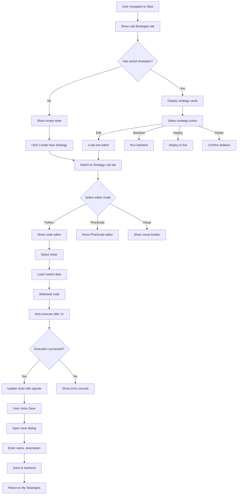

# 🧪 Labs Screen

The Labs Screen is Strategiz's innovation hub for strategy development, backtesting, and experimentation. It provides a comprehensive environment for creating, testing, and deploying trading strategies using visual builders, code editors (Python/Java), and PineScript.

## 📍 Route Information

- **Path**: `/labs`
- **Component**: `LabsScreen.tsx`
- **Access**: Protected (requires authentication)
- **Features**: Strategy editor, backtesting engine, market data integration

**Source**: `src/features/labs/screens/LabsScreen.tsx`

---

## 🎯 Purpose

The Labs Screen enables users to:

1. **Strategy Development**: Create custom trading strategies using multiple languages
2. **Live Backtesting**: Test strategies against real market data with instant feedback
3. **Visual Analysis**: View strategy signals and indicators on interactive charts
4. **Code Execution**: Run Python/Java code in a sandboxed environment
5. **Strategy Management**: Save, load, edit, and deploy custom strategies
6. **Learning**: Access sample strategies to understand different approaches

---

## 🏗️ Key Components

### 1. Strategy Editor Modes

#### Visual Builder
**Drag-and-Drop Strategy Creation**

- Node-based interface for strategy logic
- Pre-built components: indicators, conditions, actions
- Connect nodes to create trading rules
- Real-time validation and preview
- Export to code for advanced editing

**Status**: Placeholder (coming soon)

#### PineScript Editor
**TradingView-Compatible Strategy Scripting**

Features:
- Syntax highlighting for PineScript
- Multi-line code editor with 15+ rows
- Sample PineScript template included
- Version 4 compatibility
- Strategy execution and visualization

**Example PineScript**:
```pinescript
//@version=4
strategy("Sample Strategy", overlay=true)

// Input parameters
fast_length = input(12)
slow_length = input(26)

// Calculate indicators
fastMA = sma(close, fast_length)
slowMA = sma(close, slow_length)

// Define conditions
longCondition = crossover(fastMA, slowMA)
shortCondition = crossunder(fastMA, slowMA)

// Plot indicators
plot(fastMA, color=color.blue, title="Fast MA")
plot(slowMA, color=color.red, title="Slow MA")

// Execute strategy
if (longCondition)
  strategy.entry("Long", strategy.long)

if (shortCondition)
  strategy.entry("Short", strategy.short)
```

#### Code Editor (Python/Java)
**Full Programming Language Support**

**Python Mode**:
- Live code execution with 1-second debounce
- Market data integration via pandas DataFrame
- Custom indicator support
- Signal generation API
- Real-time chart updates

**Java Mode**:
- Coming soon (currently disabled)
- Planned support for algorithmic strategies

**Python API**:
```python
# Market data available as 'data' DataFrame
import pandas as pd
import numpy as np

# Calculate indicators
sma_short = data['close'].rolling(window=20).mean()
sma_long = data['close'].rolling(window=50).mean()

# Generate signals
for i in range(len(data)):
    if i > 50:
        timestamp = data.index[i]

        # Buy signal
        if sma_short.iloc[i] > sma_long.iloc[i]:
            add_signal(timestamp, 'BUY', data['close'].iloc[i], 'SMA crossover')

        # Sell signal
        elif sma_short.iloc[i] < sma_long.iloc[i]:
            add_signal(timestamp, 'SELL', data['close'].iloc[i], 'SMA crossover')

        # Add indicators to chart
        add_indicator('SMA 20', timestamp, sma_short.iloc[i])
        add_indicator('SMA 50', timestamp, sma_long.iloc[i])
```

### 2. StrategyChart
**Interactive Market Data Visualization**

Features:
- Real-time OHLC candlestick chart
- Strategy signal overlays (BUY/SELL markers)
- Custom indicator plotting
- Multiple timeframes
- Zoom and pan controls
- Height: 450-500px

**Signal Display**:
- 🟢 **BUY**: Green upward triangle
- 🔴 **SELL**: Red downward triangle
- Signal tooltips with price and reason

**Indicator Overlays**:
- Moving averages
- RSI, MACD, Bollinger Bands
- Custom calculated indicators
- Color-coded lines

### 3. Market Data Integration
**Real-Time and Historical Data**

**Data Sources**:
- Yahoo Finance API
- Alpaca Market Data
- Custom market data service

**Supported Tickers**:
- Stocks: AAPL, GOOGL, MSFT, AMZN, TSLA
- Crypto: BTC-USD, ETH-USD
- Customizable ticker selection via autocomplete

**Data Format**:
```typescript
{
  timestamp: Date,
  open: number,
  high: number,
  low: number,
  close: number,
  volume: number
}
```

### 4. Sample Strategies Library

Four pre-built strategies to learn from:

1. **Moving Average Crossover**
   - Classic trend-following strategy
   - Uses 20/50 SMA crossover
   - Generates buy/sell signals

2. **RSI Oversold/Overbought**
   - Mean reversion approach
   - RSI < 30 (oversold) = BUY
   - RSI > 70 (overbought) = SELL

3. **MACD Strategy**
   - Momentum-based trading
   - MACD/Signal line crossovers
   - Histogram divergence detection

4. **Bollinger Bands Squeeze**
   - Volatility breakout system
   - Buy at lower band touch
   - Sell at upper band touch

**Loading Samples**:
Click any sample strategy button to load code into editor

### 5. Strategy Management

**My Lab Strategies Tab**:
- View all saved strategies
- Filter by language, tags, date
- Edit existing strategies
- Backtest saved strategies
- Deploy to live trading
- Delete unwanted strategies

**Strategy Card**:
- Strategy name and description
- Language badge (Python, PineScript)
- Last modified date
- Quick actions: Edit, Backtest, Deploy, Delete

---

## 🎨 UI Layout

### Desktop Layout (> 960px)
```
┌─────────────────────────────────────────────────────────────┐
│  Labs Header                                                │
├─────────────────────────────────────────────────────────────┤
│  [My Lab Strategies] [Strategy Lab]                         │
├─────────────────────────────────────────────────────────────┤
│  Tab: Strategy Lab                                          │
│  ├─ [Visual Builder] [PineScript] [Code Editor]             │
│  │                                                           │
│  │  Ticker: [AAPL ▼]  Language: [Python]  [Run] [Save]      │
│  │                                                           │
│  │  Sample Strategies: [MA Cross] [RSI] [MACD] [BB]         │
│  │                                                           │
│  │  ┌─────────────────────────────────────────────┐         │
│  │  │  StrategyChart (OHLC + Signals)             │         │
│  │  │  [Interactive Chart with Buy/Sell Markers]  │         │
│  │  │  Height: 500px                               │         │
│  │  └─────────────────────────────────────────────┘         │
│  │                                                           │
│  │  ┌─────────────────────────────────────────────┐         │
│  │  │  Python Code Editor                          │         │
│  │  │  [Syntax-highlighted code]                   │         │
│  │  │  [Auto-complete, line numbers]               │         │
│  │  │  Height: 400px                               │         │
│  │  └─────────────────────────────────────────────┘         │
│  │                                                           │
│  │  Execution Errors: [Error console if any]                │
└─────────────────────────────────────────────────────────────┘
```

---

## 🔄 User Flow



---

## 🔌 API Integration

### 1. Execute Strategy Code
**Endpoint**: `POST /v1/strategies/execute`

**Request**:
```json
{
  "ticker": "AAPL",
  "code": "# Python strategy code...",
  "language": "python",
  "marketData": [...],
  "timeframe": "1D"
}
```

**Response**:
```json
{
  "success": true,
  "signals": [
    {
      "timestamp": "2024-10-25T10:30:00Z",
      "type": "BUY",
      "price": 178.50,
      "reason": "SMA crossover"
    }
  ],
  "indicators": [
    {
      "name": "SMA 20",
      "data": [
        { "timestamp": "2024-10-25T10:30:00Z", "value": 175.20 }
      ]
    }
  ],
  "errors": [],
  "executionTime": 245
}
```

### 2. Fetch Market Data
**Service**: `marketDataService.fetchOHLCData(ticker)`

Returns array of OHLC candlestick data from Yahoo Finance or Alpaca.

### 3. Get User Strategies
**Endpoint**: `GET /v1/strategies`

**Response**:
```json
[
  {
    "id": "strategy_123",
    "name": "My MA Strategy",
    "description": "Moving average crossover with RSI filter",
    "code": "# Python code...",
    "language": "python",
    "type": "technical",
    "tags": ["momentum", "trend-following"],
    "isPublic": false,
    "createdAt": "2024-10-20T12:00:00Z",
    "updatedAt": "2024-10-25T10:00:00Z"
  }
]
```

### 4. Create Strategy
**Endpoint**: `POST /v1/strategies`

**Request**:
```json
{
  "name": "My New Strategy",
  "description": "Custom trading strategy",
  "code": "# Python code...",
  "language": "python",
  "type": "technical",
  "tags": ["custom"],
  "isPublic": false
}
```

### 5. Update Strategy
**Endpoint**: `PUT /v1/strategies/:id`

### 6. Delete Strategy
**Endpoint**: `DELETE /v1/strategies/:id`

---

## 📱 Responsive Behavior

### Mobile (< 600px)
- Stacked layout
- Code editor reduced to 8 rows
- Chart height: 300px
- Simplified toolbar
- Vertical sample strategy buttons

### Tablet (600px - 960px)
- Two-column layout where possible
- Chart height: 400px
- Code editor: 10 rows
- Horizontal sample buttons

### Desktop (> 960px)
- Full multi-column layout
- Chart height: 500px
- Code editor: 12 rows
- All features visible
- Keyboard shortcuts enabled

---

## 🎨 Design Features

### Color Scheme
- **Neon Green**: `#39FF14` - Success, buy signals
- **Neon Blue**: `#00BFFF` - Interactive elements
- **Neon Purple**: `#bf00ff` - Special features
- **Python Blue**: `#3776AB` - Python code
- **PineScript Orange**: `#FF9800` - PineScript code

### Syntax Highlighting
- Code editor uses monospace font
- Different colors for keywords, strings, numbers
- Line numbers displayed
- Auto-indent support

### Animations
- Smooth tab transitions
- Chart loading spinner
- Code execution indicator
- Toast notifications for actions

---

## 🔐 Code Execution Security

### Sandboxed Environment
- Code runs in isolated backend container
- Limited execution time (10 seconds max)
- Memory limits enforced
- No file system access
- No network access except approved APIs

### Rate Limiting
- Max 60 executions per minute per user
- Prevents abuse and excessive resource usage

### Input Validation
- Code size limit: 50KB
- Malicious code detection
- SQL injection prevention
- XSS protection

---

## 🧪 Testing Considerations

### Unit Tests
- Editor mode switching works
- Sample strategy loading
- Code execution request formatting
- Chart renders with data
- Save dialog validation

### Integration Tests
- Execute Python code and receive signals
- Load market data for ticker
- Save strategy to backend
- Load saved strategy into editor
- Delete strategy confirmation

### E2E Tests
- Complete strategy creation flow
- Test all editor modes
- Backtest execution with results
- Strategy deployment
- Error handling for invalid code

---

## 🚨 Error Handling

### Common Errors

| Error Type | Message | User Action |
|------------|---------|-------------|
| Syntax Error | Invalid Python syntax | Fix code syntax |
| Runtime Error | Division by zero, index error | Debug code logic |
| Timeout | Execution exceeded 10s | Optimize code |
| Data Error | Market data unavailable | Try different ticker |
| Save Error | Failed to save strategy | Check network, retry |
| API Error | Backend service unavailable | Wait and retry |

### Error Display
- **Execution Errors Panel**: Below code editor
- **Red border**: Code editor on error
- **Toast Notifications**: Save/load failures
- **Console output**: Detailed stack traces

---

## 🔮 Future Enhancements

1. **Visual Strategy Builder**: Full drag-and-drop interface
2. **Collaborative Editing**: Share strategies with team
3. **Version Control**: Track strategy changes over time
4. **Performance Metrics**: Sharpe ratio, drawdown, win rate
5. **Advanced Backtesting**: Walk-forward analysis, Monte Carlo simulation
6. **Strategy Marketplace**: Publish and sell strategies
7. **Multi-Asset Strategies**: Trade multiple symbols simultaneously
8. **Machine Learning Integration**: AutoML for strategy optimization

---

## 📚 Related Documentation

- [Live Strategies Screen](../../live-strategies/docs/live-strategies-screen.mdx)
- [Marketplace Screen](../../marketplace/docs/marketplace-screen.mdx)
- [Strategy Service API](../services/strategyService.ts)
- [Market Data Service](../services/marketDataService.ts)
- [StrategyChart Component](../components/StrategyChart.tsx)

---

## 🐛 Common Issues & Solutions

### Issue: Code execution not updating chart
**Solution**: Check for syntax errors. Ensure debounce timer (1s) has elapsed. Verify market data loaded successfully.

### Issue: Market data not loading for ticker
**Solution**: Verify ticker symbol is valid. Check network connection. Try alternate data source.

### Issue: Cannot save strategy
**Solution**: Ensure strategy name is not empty. Check authentication token. Verify backend service is running.

### Issue: Sample strategy not loading
**Solution**: Click sample button again. Clear code editor and retry. Check browser console for errors.

### Issue: Python code execution timeout
**Solution**: Optimize code loops. Reduce data processing. Avoid expensive operations in hot paths.

### Issue: Indicators not showing on chart
**Solution**: Verify `add_indicator()` is called correctly. Check indicator values are not NaN. Ensure timestamps match data.
