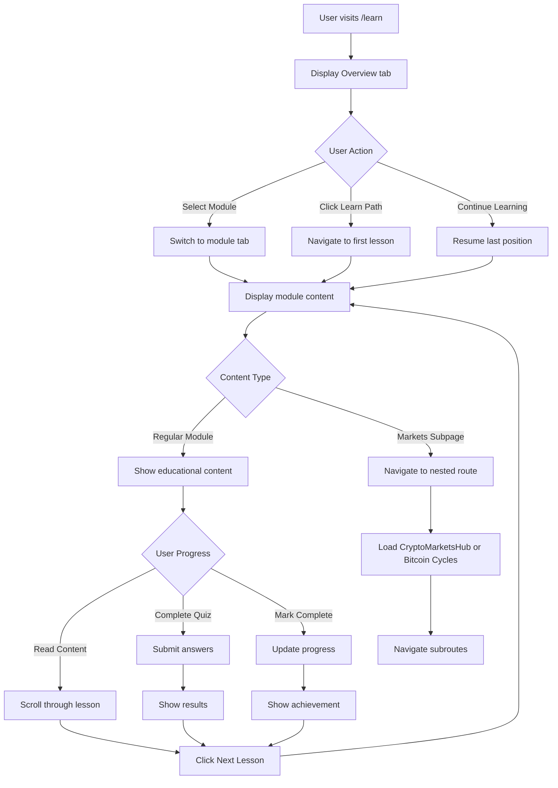

# 📚 Learn Screen

The Learn Screen is Strategiz's comprehensive educational platform providing structured learning paths for traders of all levels. It covers everything from basic trading concepts to advanced algorithmic strategies, market analysis, and cryptocurrency fundamentals.

## 📍 Route Information

- **Path**: `/learn` (main hub)
- **Nested Routes**: `/learn/markets/*` (market-specific content)
- **Component**: `LearnScreen.tsx`
- **Access**: Public (no authentication required)
- **Features**: Multi-module curriculum, interactive content, progress tracking

**Source**: `src/features/learn/screens/LearnScreen.tsx`

---

## 🎯 Purpose

The Learn Screen enables users to:

1. **Master Trading Fundamentals**: Learn core concepts, terminology, and principles
2. **Technical Analysis**: Understand chart patterns and technical indicators
3. **Market Education**: Deep dive into stocks, crypto, forex, and options markets
4. **Strategy Development**: Advanced techniques and algorithmic trading
5. **Risk Management**: Portfolio theory, position sizing, and risk control
6. **Continuous Learning**: Stay updated with market trends and new strategies

---

## 🏗️ Key Learning Modules

### 1. Overview (Landing Page)
**LearnLandingPage Component**

Central hub featuring:
- **Quick Access Cards**: Jump to any module
- **Learning Paths**: Structured curricula (Beginner → Advanced)
- **Featured Content**: Highlighted lessons and updates
- **Progress Tracker**: Visual progress across modules
- **Recent Activity**: Continue where you left off

**Featured Sections**:
- Getting Started Guide
- Popular Topics
- Advanced Courses
- Community Resources

### 2. Chart Patterns
**ChartPatterns Component**

**Content Covered**:
- **Continuation Patterns**:
  - Triangles (Ascending, Descending, Symmetrical)
  - Flags and Pennants
  - Rectangles
  - Wedges

- **Reversal Patterns**:
  - Head and Shoulders (Regular & Inverse)
  - Double Top/Bottom
  - Triple Top/Bottom
  - Rounding Bottom/Top

- **Candlestick Patterns**:
  - Doji, Hammer, Shooting Star
  - Engulfing patterns
  - Morning Star, Evening Star
  - Three White Soldiers, Three Black Crows

**Interactive Elements**:
- Visual pattern recognition exercises
- Chart examples with annotations
- Pattern success rate statistics
- Practice quizzes

### 3. Trading Fundamentals
**TradingFundamentals Component**

**Core Topics**:
- **Market Basics**:
  - What are stocks, bonds, commodities?
  - Market participants (buyers, sellers, market makers)
  - Order types (market, limit, stop)
  - Bid-ask spread

- **Trading Mechanics**:
  - How exchanges work
  - Settlement and clearing
  - Short selling
  - Margin trading

- **Analysis Methods**:
  - Fundamental analysis basics
  - Technical analysis introduction
  - Sentiment analysis
  - Intermarket analysis

- **Risk & Money Management**:
  - Position sizing
  - Stop losses
  - Risk-reward ratios
  - Portfolio diversification

### 4. Markets Overview
**MarketsOverview Component**

**Market Categories**:

#### Stock Markets
- Major exchanges (NYSE, NASDAQ, LSE)
- Market indices (S&P 500, Dow Jones, FTSE)
- Sector analysis
- Market hours and holidays

#### Cryptocurrency Markets
- Blockchain fundamentals
- Major cryptocurrencies (BTC, ETH, SOL)
- Decentralized exchanges (DEXs)
- Crypto market dynamics
- **Deep Dive**: CryptoMarketsHub
- **Special Topic**: BitcoinCyclesDeepDive

#### Forex Markets
- Currency pairs (majors, minors, exotics)
- Forex market structure
- Pips and lots
- Leverage in forex

#### Options & Derivatives
- Options basics (calls, puts)
- Futures contracts
- Options strategies
- Derivatives risk

### 5. Technical Indicators
**TechnicalIndicators Component**

**Indicator Categories**:

#### Trend Indicators
- Moving Averages (SMA, EMA, WMA)
- MACD (Moving Average Convergence Divergence)
- Parabolic SAR
- ADX (Average Directional Index)

#### Momentum Indicators
- RSI (Relative Strength Index)
- Stochastic Oscillator
- Williams %R
- Rate of Change (ROC)

#### Volume Indicators
- On-Balance Volume (OBV)
- Volume Price Trend (VPT)
- Accumulation/Distribution
- Chaikin Money Flow

#### Volatility Indicators
- Bollinger Bands
- Average True Range (ATR)
- Keltner Channels
- Donchian Channels

**For Each Indicator**:
- Formula and calculation
- Interpretation guidelines
- Trading signals
- Common pitfalls
- Example charts

### 6. Options Greeks
**OptionsGreeks Component**

**The Greeks Explained**:

#### Delta (Δ)
- Measures price sensitivity
- Delta hedging strategies
- Delta-neutral portfolios

#### Gamma (Γ)
- Rate of change of delta
- Gamma risk management
- Convexity considerations

#### Theta (Θ)
- Time decay
- Theta harvesting strategies
- Weekend and holiday effects

#### Vega (ν)
- Volatility sensitivity
- Vega hedging
- Implied vs. realized volatility

#### Rho (ρ)
- Interest rate sensitivity
- Less commonly used
- Long-term options impact

**Advanced Topics**:
- Greeks interactions
- Portfolio Greeks
- Greeks in different market conditions

### 7. Advanced Strategies
**AdvancedStrategies Component**

**Strategy Types**:

#### Multi-Leg Options
- Iron Condor
- Butterfly Spread
- Calendar Spread
- Straddle and Strangle

#### Pairs Trading
- Statistical arbitrage
- Correlation analysis
- Mean reversion strategies

#### Arbitrage
- Triangular arbitrage
- Cash and carry
- Merger arbitrage

#### Quantitative Strategies
- Factor models
- Statistical models
- Machine learning applications

**Case Studies**:
- Real-world examples
- Backtest results
- Risk analysis
- Performance attribution

### 8. Algorithmic Trading
**AlgorithmicTrading Component**

**Topics Covered**:

#### Algorithm Basics
- What is algorithmic trading?
- Advantages and risks
- Common misconceptions

#### Strategy Development
- Idea generation
- Backtesting methodology
- Walk-forward analysis
- Monte Carlo simulation

#### Programming Languages
- Python for trading
- Java alternatives
- PineScript introduction
- API integrations

#### Execution Algorithms
- VWAP (Volume Weighted Average Price)
- TWAP (Time Weighted Average Price)
- Implementation shortfall
- Market making algorithms

#### Risk Management
- Pre-trade risk checks
- Position limits
- Circuit breakers
- Disaster recovery

### 9. Crypto Markets Hub (Nested Route)
**CryptoMarketsHub Component**
**Route**: `/learn/markets/crypto/*`

**Comprehensive Crypto Education**:

#### Blockchain Fundamentals
- Distributed ledger technology
- Consensus mechanisms (PoW, PoS)
- Smart contracts
- Tokenomics

#### Major Cryptocurrencies
- Bitcoin deep dive
- Ethereum ecosystem
- Altcoins overview
- Stablecoins

#### DeFi (Decentralized Finance)
- Lending and borrowing
- Yield farming
- Liquidity pools
- DEX trading

#### NFTs and Web3
- NFT marketplaces
- Gaming and metaverse
- Digital ownership

#### Trading Strategies
- Spot vs. futures
- Arbitrage opportunities
- Seasonal patterns
- On-chain analysis

### 10. Bitcoin Cycles Deep Dive (Special Module)
**BitcoinCyclesDeepDive Component**
**Route**: `/learn/markets/bitcoin-cycles`

**In-Depth Analysis**:

#### Historical Cycles
- 2011-2013 cycle
- 2013-2017 cycle
- 2017-2021 cycle
- Current cycle analysis

#### Cycle Indicators
- Stock-to-Flow model
- Halving events impact
- MVRV ratio
- Pi Cycle Top indicator
- 200-week moving average

#### On-Chain Metrics
- Active addresses
- Exchange flows
- Miner behavior
- Whale accumulation

#### Market Psychology
- Phases: Accumulation, Markup, Distribution, Decline
- Fear and Greed Index
- Social sentiment analysis

#### Trading the Cycles
- Entry and exit strategies
- DCA vs. lump sum
- Risk management in cycles
- Portfolio allocation

---

## 🎨 UI Layout

### Desktop Layout (> 960px)
```
┌─────────────────────────────────────────────────────────────┐
│  Learn Platform Header                                      │
├─────────────────────────────────────────────────────────────┤
│  [Overview] [Chart Patterns] [Fundamentals] [Markets]       │
│  [Indicators] [Options] [Advanced] [Algorithmic] ───────►   │
├─────────────────────────────────────────────────────────────┤
│  Selected Module Content                                    │
│  ┌─────────────────────────────────────────────────────┐    │
│  │  Module Title and Description                       │    │
│  ├─────────────────────────────────────────────────────┤    │
│  │  Interactive Content:                               │    │
│  │  • Text lessons with formatting                     │    │
│  │  • Interactive charts and diagrams                  │    │
│  │  • Code examples with syntax highlighting           │    │
│  │  • Video embeds (if applicable)                     │    │
│  │  • Practice quizzes and exercises                   │    │
│  ├─────────────────────────────────────────────────────┤    │
│  │  [Previous Lesson] [Mark Complete] [Next Lesson]    │    │
│  └─────────────────────────────────────────────────────┘    │
└─────────────────────────────────────────────────────────────┘
```

### Mobile Layout (< 600px)
```
┌──────────────────────────┐
│  Learn                   │
├──────────────────────────┤
│  [Scrollable Tabs]       │
│  ◄ [Overview] [Charts] ► │
├──────────────────────────┤
│  Module Content          │
│  (Vertical scroll)       │
│                          │
│  [Lesson content...]     │
│                          │
│  [Interactive elements]  │
│                          │
│  [Navigation buttons]    │
└──────────────────────────┘
```

---

## 🔄 User Flow



---

## 🔌 API Integration

### 1. Get Learning Progress
**Endpoint**: `GET /v1/learn/progress`

**Response**:
```json
{
  "userId": "user_123",
  "overallProgress": 45.5,
  "modules": [
    {
      "moduleId": "chart-patterns",
      "moduleName": "Chart Patterns",
      "progress": 75.0,
      "lessonsCompleted": 12,
      "totalLessons": 16,
      "lastAccessed": "2024-10-25T10:30:00Z"
    }
  ],
  "achievements": ["completed_basics", "pattern_master"],
  "streakDays": 7
}
```

### 2. Mark Lesson Complete
**Endpoint**: `POST /v1/learn/lessons/:lessonId/complete`

**Request**:
```json
{
  "moduleId": "technical-indicators",
  "lessonId": "rsi-fundamentals",
  "completedAt": "2024-10-25T10:30:00Z"
}
```

### 3. Submit Quiz
**Endpoint**: `POST /v1/learn/quizzes/:quizId/submit`

**Request**:
```json
{
  "quizId": "chart-patterns-quiz-1",
  "answers": [
    { "questionId": "q1", "selectedAnswer": "A" },
    { "questionId": "q2", "selectedAnswer": "C" }
  ],
  "completedAt": "2024-10-25T10:30:00Z"
}
```

**Response**:
```json
{
  "score": 85,
  "totalQuestions": 10,
  "correctAnswers": 8,
  "passed": true,
  "feedback": [
    { "questionId": "q1", "correct": true },
    { "questionId": "q2", "correct": false, "explanation": "..." }
  ]
}
```

### 4. Get Recommended Content
**Endpoint**: `GET /v1/learn/recommendations`

Based on user progress and interests.

---

## 📱 Responsive Behavior

### Mobile (< 600px)
- Single column layout
- Scrollable horizontal tabs
- Stacked content cards
- Simplified diagrams
- Touch-optimized interactions
- Bottom navigation for lessons

### Tablet (600px - 960px)
- Two-column layout where appropriate
- Expanded tab bar
- Medium-sized charts
- Side-by-side comparisons

### Desktop (> 960px)
- Full multi-column layout
- Large interactive charts
- Side-by-side code examples
- Hover tooltips
- Keyboard navigation

---

## 🎨 Design Features

### Color Scheme
- **Primary Green**: `#39FF14` - Progress, completed items
- **Dark Background**: `#1a1a1a` - Main background
- **Text Gray**: `#a0a0a0` - Body text
- **Accent Colors**: Per module theme

### Typography
- **Headings**: Bold, large (24-32px)
- **Body**: Readable (16-18px)
- **Code**: Monospace with syntax highlighting
- **Captions**: Smaller (12-14px)

### Interactive Elements
- Expandable sections
- Tabbed content
- Interactive charts (TradingView-style)
- Code playgrounds
- Quiz interfaces

### Animations
- Tab transitions
- Progress bar fills
- Card hover effects
- Achievement unlocks

---

## 🎓 Learning Paths

### Beginner Path
1. Trading Fundamentals
2. Chart Patterns (Basics)
3. Markets Overview
4. Technical Indicators (Simple)
5. Risk Management

### Intermediate Path
1. Advanced Chart Patterns
2. Technical Indicators (Advanced)
3. Options Basics
4. Trading Psychology
5. Strategy Development

### Advanced Path
1. Options Greeks
2. Advanced Strategies
3. Algorithmic Trading
4. Quantitative Analysis
5. Portfolio Optimization

---

## 🏆 Gamification Features

### Achievements
- 📖 **Book Worm**: Complete 10 lessons
- 🎯 **Pattern Pro**: Master all chart patterns
- 📊 **Indicator Expert**: Learn all indicators
- 🚀 **Algo Trader**: Complete algorithmic trading
- 🏅 **Learn Streak**: 30-day learning streak

### Progress Tracking
- Per-module completion percentage
- Overall learning progress
- Time spent learning
- Quiz scores and history
- Streak days

### Certifications (Future)
- Completion certificates
- Skill badges
- Leaderboards
- Community recognition

---

## 🧪 Testing Considerations

### Unit Tests
- Tab switching functionality
- Progress calculation accuracy
- Quiz scoring logic
- Content rendering
- Responsive breakpoints

### Integration Tests
- Load module content
- Track progress updates
- Submit quiz answers
- Navigate nested routes
- Save learning state

### E2E Tests
- Complete learning path
- Take and pass quizzes
- Earn achievements
- Resume progress after logout
- Cross-module navigation

---

## 🚨 Error Handling

### Common Issues

| Issue | Message | User Action |
|-------|---------|-------------|
| Content not loading | Network error | Refresh page |
| Progress not saving | Sync failed | Re-complete lesson |
| Quiz submission failed | Server error | Retry submission |
| Video won't play | Check connection | Reload video |

### Offline Support (Future)
- Cache lessons for offline reading
- Sync progress when online
- Download modules

---

## 🔮 Future Enhancements

1. **Video Courses**: Structured video lessons
2. **Live Webinars**: Expert-led training sessions
3. **Certifications**: Accredited trading certifications
4. **Mentorship**: Connect with experienced traders
5. **Community Forum**: Discuss lessons and strategies
6. **Practice Simulator**: Paper trading tied to lessons
7. **Adaptive Learning**: AI-powered personalized paths
8. **Mobile App**: Native iOS/Android learning

---

## 📚 Related Documentation

- [Dashboard Screen](../../dashboard/docs/dashboard-screen.mdx)
- [Labs Screen](../../labs/docs/labs-screen.mdx)
- [CryptoMarketsHub](../markets/CryptoMarketsHub.tsx)
- [BitcoinCyclesDeepDive](../markets/crypto/BitcoinCyclesDeepDive.tsx)
- [Learning Components](../components/)

---

## 🐛 Common Issues & Solutions

### Issue: Nested routes not loading
**Solution**: Ensure React Router configured correctly. Check route paths match. Verify component imports.

### Issue: Progress not updating
**Solution**: Check localStorage quota. Verify API endpoint accessible. Ensure user authenticated (if required).

### Issue: Charts not rendering
**Solution**: Verify TradingView script loaded. Check network for blocked resources. Clear browser cache.

### Issue: Tab switching slow
**Solution**: Implement code splitting. Lazy load module content. Optimize component re-renders.

### Issue: Mobile tabs cut off
**Solution**: Enable horizontal scrolling. Use scrollButtons="auto" on Tabs. Test on various screen sizes.

### Issue: Quiz answers not submitting
**Solution**: Validate all questions answered. Check network connection. Verify API endpoint status.
