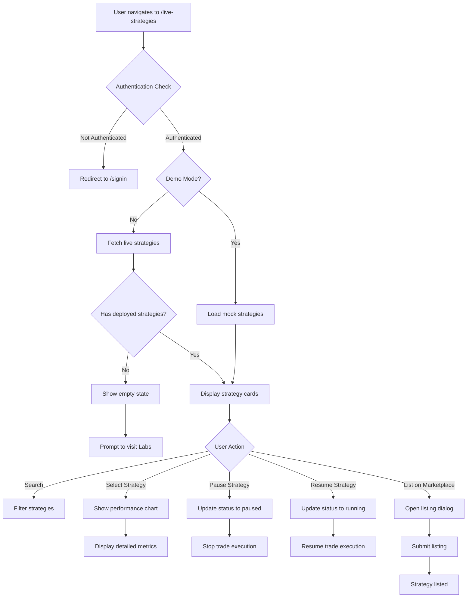

# 📈 Live Strategies Screen

The Live Strategies Screen provides real-time monitoring and management of deployed trading strategies. Users can track performance metrics, control strategy execution, and analyze running algorithms across multiple providers and trading pairs.

## 📍 Route Information

- **Path**: `/live-strategies`
- **Component**: `LiveStrategiesScreen.tsx`
- **Access**: Protected (requires authentication)
- **Demo Mode**: Available with mock strategy data

**Source**: `src/features/live-strategies/screens/LiveStrategiesScreen.tsx`

---

## 🎯 Purpose

The Live Strategies Screen enables users to:

1. **Monitor Performance**: Track real-time P&L, win rates, and execution metrics
2. **Control Execution**: Start, pause, or stop running strategies
3. **View Details**: Analyze individual strategy performance and trade history
4. **Manage Risk**: Monitor drawdowns, position sizes, and exposure
5. **Marketplace Integration**: List successful strategies for sale
6. **Filter & Search**: Find strategies by status, provider, or performance

---

## 🏗️ Key Components

### 1. Summary Cards
**High-Level Performance Metrics**

Four key metric cards:

#### Active Strategies
- **Icon**: ⚡ Speed
- **Display**: Count of running strategies
- **Subtitle**: Total strategies deployed
- **Color**: Neon Green

#### Total Value
- **Icon**: 💰 Money
- **Display**: Aggregate portfolio value
- **Subtitle**: Total allocated funds
- **Color**: Neon Blue

#### Total Return
- **Icon**: 📈 Trending Up
- **Display**: Overall P&L percentage
- **Subtitle**: Profit/loss amount
- **Color**: Green (profit) / Red (loss)

#### Marketplace Listed
- **Icon**: 🏪 Storefront
- **Display**: Count of strategies for sale
- **Subtitle**: Strategies in marketplace
- **Color**: Neon Purple

**Example Summary**:
```
Active Strategies: 2 of 3 total
Total Value: $22,300 ($15,000 allocated)
Total Return: +17.0% ($7,300 profit)
Marketplace Listed: 1 strategies for sale
```

### 2. StrategyCard
**Individual Strategy Overview**

**Card Layout**:
```
┌─────────────────────────────────────────┐
│  [Status Badge] Strategy Name            │
│  Description text...                     │
├─────────────────────────────────────────┤
│  Provider: Binance                       │
│  Pairs: BTC/USDT, ETH/USDT               │
│  Risk: High | Version: 2.1.0             │
├─────────────────────────────────────────┤
│  P&L: +24.5% ($2,450)                    │
│  Win Rate: 68.5% (234/342 trades)        │
│  Sharpe: 1.8 | Drawdown: -8.5%          │
├─────────────────────────────────────────┤
│  [Pause] [View Details] [⋮ Menu]        │
└─────────────────────────────────────────┘
```

**Status Badges**:
- 🟢 **Running**: Active and executing trades
- 🟡 **Paused**: Temporarily stopped
- 🔴 **Stopped**: Permanently disabled
- 🔵 **Error**: Requires attention

**Actions**:
- **Pause/Resume**: Toggle strategy execution
- **View Details**: Show performance chart
- **Menu**: Settings, Deploy, List on Marketplace, Delete

### 3. StrategyPerformanceChart
**Detailed Analytics Panel**

Opens in side panel when strategy selected:

**Chart Types**:
- **Equity Curve**: Portfolio value over time
- **Drawdown Chart**: Peak-to-trough decline
- **Trade Distribution**: Win/loss histogram
- **Return Distribution**: Daily returns

**Performance Metrics**:
```typescript
{
  totalReturn: 2450.50,
  totalReturnPercentage: 24.5,
  dailyReturn: 0.8,
  weeklyReturn: 5.2,
  monthlyReturn: 12.3,
  yearlyReturn: 24.5,
  sharpeRatio: 1.8,
  maxDrawdown: -8.5,
  winRate: 68.5,
  totalTrades: 342,
  profitableTrades: 234,
  averageProfit: 45.20,
  averageLoss: -22.10,
  bestTrade: 250.00,
  worstTrade: -120.00,
  lastTradeTime: "2024-02-20T14:45:00Z"
}
```

**Trade History**:
- Recent trades list
- Entry/exit prices
- P&L per trade
- Execution timestamp

### 4. Filtering & Search

**Search Bar**:
- Real-time text search
- Searches strategy name and description
- Debounced for performance

**Filter Menu**:
- **Status**: Running, Paused, Stopped, All
- **Provider**: Coinbase, Binance, Kraken, All
- **Risk Level**: Low, Medium, High, All
- **Performance**: Profitable, Losing, All

**View Modes**:
- **Grid View**: Card layout (default)
- **List View**: Compact table format

### 5. Marketplace Integration

**List Strategy Dialog**:
- Strategy name and description
- Performance metrics display
- Pricing options
- Royalty settings
- Terms and conditions

**Listed Strategies**:
- Badge indicator on card
- Marketplace listing ID
- Sales analytics
- Earnings tracker

---

## 🎨 UI Layout

### Desktop Layout (> 960px)
```
┌─────────────────────────────────────────────────────────────┐
│  Live Strategies Header                                     │
├─────────────────────────────────────────────────────────────┤
│  [Active: 2] [Total: $22K] [Return: +17%] [Listed: 1]      │
├─────────────────────────────────────────────────────────────┤
│  [Search...] [🔽 Filters] [⊞ Grid] [≡ List]                │
├───────────────────────────┬─────────────────────────────────┤
│  Strategy Cards (Grid)     │  Performance Chart (Sidebar)   │
│  ┌──────────┐ ┌──────────┐│  ┌────────────────────────────┐│
│  │Strategy 1│ │Strategy 2││  │ Equity Curve               ││
│  │[Running] │ │[Running] ││  │ [Line Chart]               ││
│  │+24.5%    │ │+17.0%    ││  │                            ││
│  └──────────┘ └──────────┘│  ├────────────────────────────┤│
│  ┌──────────┐              │  │ Metrics:                   ││
│  │Strategy 3│              │  │ Win Rate: 75.2%            ││
│  │[Paused]  │              │  │ Sharpe: 2.1                ││
│  │-2.5%     │              │  │ Total Trades: 523          ││
│  └──────────┘              │  └────────────────────────────┘│
└───────────────────────────┴─────────────────────────────────┘
```

### Mobile Layout (< 600px)
```
┌──────────────────────────┐
│  Live Strategies         │
├──────────────────────────┤
│  Summary Metrics         │
│  [Swipeable Cards]       │
├──────────────────────────┤
│  [Search...]             │
├──────────────────────────┤
│  Strategy List (Stacked) │
│  ┌────────────────────┐  │
│  │ Strategy 1         │  │
│  │ [Running] +24.5%   │  │
│  │ [Tap for details]  │  │
│  └────────────────────┘  │
│  ┌────────────────────┐  │
│  │ Strategy 2         │  │
│  │ [Running] +17.0%   │  │
│  └────────────────────┘  │
└──────────────────────────┘
```

---

## 🔄 User Flow



---

## 🔌 API Integration

### 1. Fetch Live Strategies
**Endpoint**: `GET /v1/strategies/live`

**Response**:
```json
[
  {
    "id": "1",
    "name": "Momentum Alpha",
    "description": "High-frequency momentum trading strategy",
    "status": "running",
    "deployedAt": "2024-01-15T10:00:00Z",
    "lastUpdated": "2024-02-20T15:30:00Z",
    "provider": "binanceus",
    "performance": {
      "totalReturn": 2450.50,
      "totalReturnPercentage": 24.5,
      "sharpeRatio": 1.8,
      "maxDrawdown": -8.5,
      "winRate": 68.5,
      "totalTrades": 342,
      "profitableTrades": 234
    },
    "allocatedFunds": 10000,
    "currentValue": 12450.50,
    "isMarketplaceListed": false,
    "tags": ["momentum", "high-frequency"],
    "riskLevel": "high",
    "tradingPairs": ["BTC/USDT", "ETH/USDT"],
    "executionCount": 342,
    "version": "2.1.0"
  }
]
```

### 2. Update Strategy Status
**Endpoint**: `PATCH /v1/strategies/live/:id/status`

**Request**:
```json
{
  "status": "paused"
}
```

**Statuses**: `running`, `paused`, `stopped`

### 3. Get Strategy Performance
**Endpoint**: `GET /v1/strategies/live/:id/performance`

**Response**:
```json
{
  "equityCurve": [
    { "timestamp": "2024-01-15T00:00:00Z", "value": 10000 },
    { "timestamp": "2024-01-16T00:00:00Z", "value": 10250 }
  ],
  "trades": [
    {
      "id": "trade_123",
      "timestamp": "2024-01-15T10:30:00Z",
      "type": "BUY",
      "symbol": "BTC/USDT",
      "quantity": 0.1,
      "price": 42000,
      "total": 4200,
      "pnl": 0
    }
  ],
  "metrics": { /* performance metrics */ }
}
```

### 4. List Strategy on Marketplace
**Endpoint**: `POST /v1/strategies/live/:id/marketplace`

**Request**:
```json
{
  "price": 99.99,
  "royaltyPercentage": 5.0,
  "description": "Proven momentum strategy",
  "category": "momentum"
}
```

### 5. Delete Strategy
**Endpoint**: `DELETE /v1/strategies/live/:id`

Permanently removes strategy and stops all execution.

---

## 📱 Responsive Behavior

### Mobile (< 600px)
- Single column layout
- Stacked strategy cards
- Swipeable summary metrics
- Bottom sheet for details
- Simplified performance view
- Touch-optimized controls

### Tablet (600px - 960px)
- Two-column grid
- Expanded metric cards
- Side-by-side strategies
- Slide-out detail panel

### Desktop (> 960px)
- Three-column grid (optional two if detail open)
- Persistent side panel
- Hover effects
- Keyboard shortcuts
- Advanced filtering

---

## 🎨 Design Features

### Color Scheme
- **Neon Green**: `#39FF14` - Positive returns, running status
- **Neon Blue**: `#00BFFF` - Interactive elements
- **Neon Purple**: `#bf00ff` - Marketplace features
- **Red**: `#FF073A` - Negative returns, errors

### Status Colors
- 🟢 **Running**: Green glow
- 🟡 **Paused**: Yellow/orange
- 🔴 **Stopped**: Red
- 🔵 **Error**: Blue alert

### Animations
- Card hover lift effect
- Smooth status transitions
- Chart animations on load
- Number count-up for metrics

---

## 🔐 Demo Mode

### Mock Strategies

**Strategy 1: Momentum Alpha**
- Status: Running
- P&L: +24.5% ($2,450)
- Provider: Binance
- Risk: High
- Win Rate: 68.5%

**Strategy 2: Smart Grid Bot**
- Status: Running
- P&L: +17.0% ($850)
- Provider: Kraken
- Risk: Medium
- Win Rate: 75.2%
- Marketplace Listed: Yes

**Strategy 3: DCA Pro Max**
- Status: Paused
- P&L: -2.5% (-$125)
- Provider: Coinbase
- Risk: Low
- Win Rate: 45.0%

### Demo Banner
```
🎭 Demo Mode - Sample strategies shown. Deploy real strategies from Labs.
[Go to Labs] [Dismiss]
```

---

## 🧪 Testing Considerations

### Unit Tests
- StrategyCard renders correctly
- Summary cards calculate totals
- Performance chart displays data
- Status toggle works
- Search filters strategies

### Integration Tests
- Fetch strategies on mount
- Update status via API
- Load performance data
- Marketplace listing flow
- Delete strategy confirmation

### E2E Tests
- Complete strategy monitoring flow
- Pause/resume strategy
- View detailed analytics
- List strategy on marketplace
- Filter and search strategies

---

## 🚨 Error Handling

### Common Errors

| Error Code | Message | User Action |
|------------|---------|-------------|
| `LIVE_001` | Failed to load strategies | Refresh page |
| `LIVE_002` | Strategy update failed | Check connection, retry |
| `LIVE_003` | Cannot pause strategy | Verify strategy status |
| `LIVE_004` | Marketplace listing failed | Check listing details |
| `LIVE_005` | Performance data unavailable | Wait and retry |

### Error States
- **Empty State**: No deployed strategies
- **Network Error**: Connection timeout
- **API Error**: Backend unavailable
- **Permission Error**: Insufficient rights

---

## 🔮 Future Enhancements

1. **Real-Time Updates**: WebSocket for live P&L
2. **Notifications**: Trade alerts, performance milestones
3. **Advanced Analytics**: Risk metrics, correlation analysis
4. **Strategy Cloning**: Duplicate and modify strategies
5. **Portfolio Rebalancing**: Automatic allocation adjustment
6. **Social Trading**: Follow other traders' strategies
7. **Mobile App**: Native iOS/Android monitoring
8. **API Access**: Programmatic strategy control

---

## 📚 Related Documentation

- [Labs Screen](../../labs/docs/labs-screen.mdx)
- [Marketplace Screen](../../marketplace/docs/marketplace-screen.mdx)
- [Dashboard Screen](../../dashboard/docs/dashboard-screen.mdx)
- [Live Strategies Redux](../redux/liveStrategiesSlice.ts)
- [Strategy Types](../types/index.ts)

---

## 🐛 Common Issues & Solutions

### Issue: Strategies not loading
**Solution**: Check authentication token. Verify backend service running. Clear cache and reload.

### Issue: Cannot pause strategy
**Solution**: Ensure strategy is in "running" state. Check for active trades. Verify API permissions.

### Issue: Performance chart empty
**Solution**: Strategy may have no trades yet. Wait for execution. Check data availability.

### Issue: Marketplace listing failed
**Solution**: Verify all required fields filled. Check strategy has positive performance. Ensure not already listed.

### Issue: Strategy showing wrong status
**Solution**: Refresh page to sync latest status. Check backend logs for errors. Verify WebSocket connection.

### Issue: Demo mode strategies persist
**Solution**: Disable demo mode in auth settings. Clear Redux store. Reload application.
