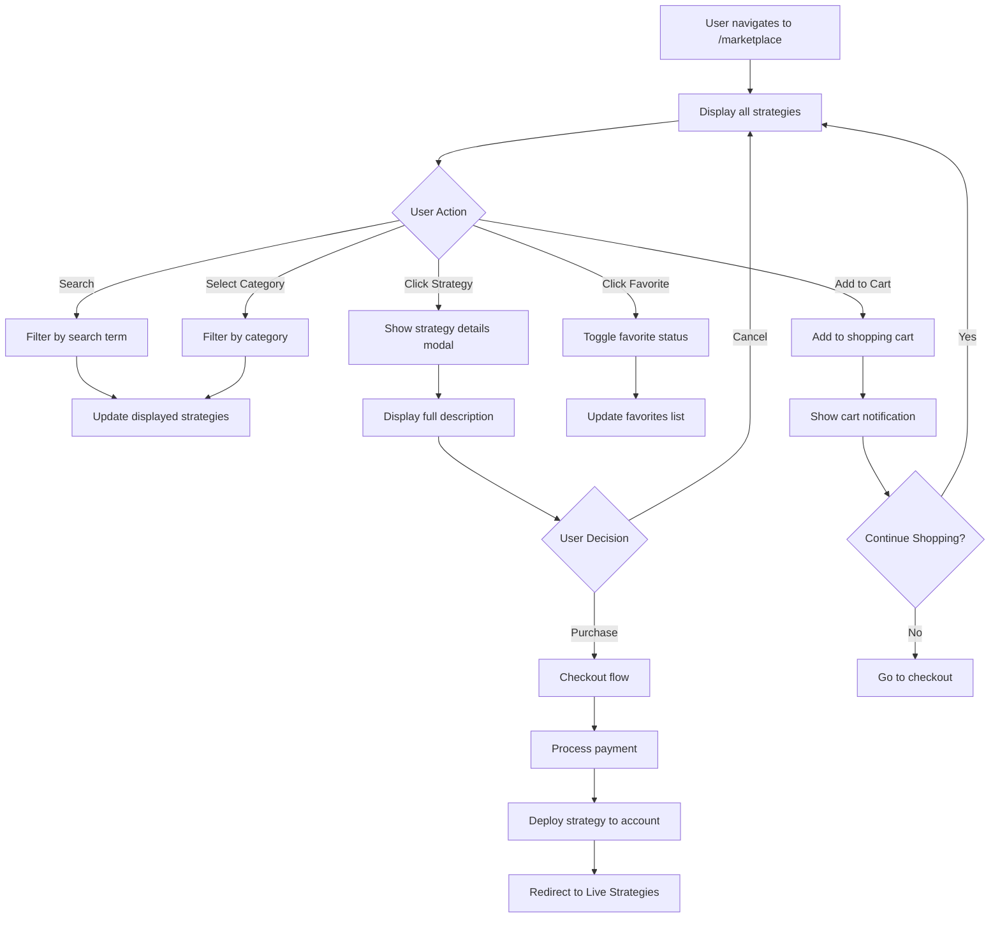

# 🛒 Marketplace Screen

The Marketplace Screen is Strategiz's strategy exchange where users can discover, browse, and purchase proven trading strategies created by the community. It features advanced filtering, ratings, reviews, and a seamless purchasing experience.

## 📍 Route Information

- **Path**: `/marketplace`
- **Component**: `MarketplaceScreen.tsx`
- **Access**: Protected (requires authentication)
- **Features**: Strategy browsing, purchasing, favorites, filtering

**Source**: `src/features/marketplace/screens/MarketplaceScreen.tsx`

---

## 🎯 Purpose

The Marketplace Screen enables users to:

1. **Discover Strategies**: Browse curated and community-created trading algorithms
2. **Filter & Search**: Find strategies by category, rating, price, and performance
3. **Compare Options**: View ratings, reviews, and performance metrics
4. **Purchase Strategies**: Buy and deploy strategies to personal accounts
5. **Track Favorites**: Save interesting strategies for later
6. **View Details**: Analyze strategy performance before purchase

---

## 🏗️ Key Components

### 1. Search & Filter Bar
**Discovery Tools**

**Search Bar**:
- Real-time text search
- Searches strategy name and description
- Placeholder: "Search strategies"
- Search icon and filter icon

**Filter Options**:
- Status filter menu
- Provider filter
- Risk level filter
- Performance filter
- Price range slider

**View Toggle**:
- Grid view (cards)
- List view (compact)

### 2. Category Tabs
**Strategy Organization**

**Categories**:
1. **All Strategies**: Complete catalog
2. **Trending**: 📈 Popular and gaining traction
3. **AI Powered**: 🤖 Machine learning algorithms
4. **New Releases**: 🆕 Recently added
5. **Momentum**: Trend-following strategies
6. **Value**: Value investing approaches
7. **Volatility**: Volatility-based trading

**Tab Features**:
- Icon + label display
- Active tab highlighting (neon purple)
- Scrollable on mobile
- Indicator line animation

### 3. Featured Banner
**Premium Strategy Showcase**

**Layout**:
```
┌─────────────────────────────────────────────────────┐
│  AI-Driven Trading Strategies                       │
│  Discover our premium collection of cutting-edge    │
│  trading strategies powered by advanced ML...       │
│                                                      │
│  [Explore AI Strategies] [Learn More]               │
└─────────────────────────────────────────────────────┘
```

**Styling**:
- Gradient background
- Radial glow effect
- Prominent CTA buttons
- Neon purple accent

### 4. Strategy Cards
**Individual Strategy Display**

**Card Layout**:
```
┌───────────────────────────────────┐
│ [Best Seller] [New] [Trending]    │
│ ┌─────────────────────────────┐   │
│ │ Strategy Image Placeholder  │   │
│ └─────────────────────────────┘   │
│ Strategy Name              [♥]    │
│ Description text...                │
│ ★★★★☆ 4.8 (124 reviews)           │
│ $99                                │
│ [Add to Cart]                      │
└───────────────────────────────────┘
```

**Badges**:
- 🏆 **Best Seller**: Top-selling strategies (green)
- 🆕 **New**: Recently added (orange)
- 📈 **Trending**: Gaining popularity (blue)

**Card Features**:
- Strategy name and description
- Star rating (1-5 stars)
- Review count
- Price display
- Favorite toggle (heart icon)
- Add to cart button
- Hover effects (lift, glow)

### 5. Featured Strategies Section
**Curated Picks**

Displays 3-6 featured strategies with:
- Larger card size
- Prominent placement
- Multiple badges
- Enhanced styling
- Priority positioning

### 6. All Strategies Grid
**Complete Catalog**

**Layout Options**:
- **Grid**: Flexible wrap, 3-4 columns on desktop
- **List**: Single column, compact info

**Sorting**:
- Price (low to high, high to low)
- Rating (highest first)
- Newest first
- Most reviewed
- Best selling

---

## 🎨 UI Layout

### Desktop Layout (> 960px)
```
┌─────────────────────────────────────────────────────────────┐
│  Strategy Marketplace Header                                │
│  [Search...] [Filter 🔽]                                     │
├─────────────────────────────────────────────────────────────┤
│  [All] [Trending] [AI] [New] [Momentum] [Value] [Volatility]│
├─────────────────────────────────────────────────────────────┤
│  Featured Banner                                            │
│  [Large promotional section]                                │
├─────────────────────────────────────────────────────────────┤
│  Featured Strategies                                        │
│  ┌─────────┐ ┌─────────┐ ┌─────────┐                       │
│  │Featured │ │Featured │ │Featured │                       │
│  │Strategy1│ │Strategy2│ │Strategy3│                       │
│  └─────────┘ └─────────┘ └─────────┘                       │
├─────────────────────────────────────────────────────────────┤
│  All Strategies                                             │
│  ┌────────┐ ┌────────┐ ┌────────┐ ┌────────┐              │
│  │Strategy│ │Strategy│ │Strategy│ │Strategy│              │
│  │   1    │ │   2    │ │   3    │ │   4    │              │
│  └────────┘ └────────┘ └────────┘ └────────┘              │
│  ┌────────┐ ┌────────┐                                     │
│  │Strategy│ │Strategy│                                     │
│  │   5    │ │   6    │                                     │
│  └────────┘ └────────┘                                     │
└─────────────────────────────────────────────────────────────┘
```

### Mobile Layout (< 600px)
```
┌──────────────────────────┐
│  Marketplace             │
│  [Search...]             │
├──────────────────────────┤
│  [Categories - Scroll]   │
├──────────────────────────┤
│  Featured Banner         │
├──────────────────────────┤
│  Featured (Scroll)       │
│  ◄ [Card] [Card] ►       │
├──────────────────────────┤
│  All Strategies          │
│  ┌────────────────────┐  │
│  │ Strategy 1         │  │
│  │ [Details]          │  │
│  └────────────────────┘  │
│  ┌────────────────────┐  │
│  │ Strategy 2         │  │
│  └────────────────────┘  │
└──────────────────────────┘
```

---

## 🔄 User Flow



---

## 🔌 API Integration

### 1. Fetch Marketplace Strategies
**Endpoint**: `GET /v1/marketplace/strategies`

**Query Parameters**:
```
?category=ai
&minRating=4.0
&maxPrice=200
&sortBy=rating
&order=desc
&page=1
&limit=20
```

**Response**:
```json
{
  "strategies": [
    {
      "id": "mp_strategy_123",
      "name": "Momentum Wave Rider",
      "description": "Advanced trend-following strategy utilizing momentum indicators",
      "price": 99.00,
      "rating": 4.8,
      "reviewCount": 124,
      "imageUrl": "https://cdn.strategiz.io/strategies/momentum-wave.jpg",
      "category": "momentum",
      "tags": ["momentum", "trend-following", "high-frequency"],
      "isFeatured": true,
      "isBestSeller": true,
      "isTrending": false,
      "isNew": false,
      "author": {
        "id": "user_456",
        "name": "John Doe",
        "verified": true
      },
      "performance": {
        "backtestReturn": 42.5,
        "sharpeRatio": 2.1,
        "maxDrawdown": -8.3,
        "winRate": 72.5
      },
      "purchaseCount": 1243,
      "createdAt": "2024-01-15T00:00:00Z"
    }
  ],
  "total": 156,
  "page": 1,
  "totalPages": 8
}
```

### 2. Get Strategy Details
**Endpoint**: `GET /v1/marketplace/strategies/:id`

**Response**: Extended strategy object with:
- Full description
- Code preview (if applicable)
- Backtest results
- User reviews
- Purchase history
- Supported providers

### 3. Purchase Strategy
**Endpoint**: `POST /v1/marketplace/strategies/:id/purchase`

**Request**:
```json
{
  "paymentMethod": "stripe_card_xyz",
  "deployToProvider": "binance",
  "allocatedFunds": 5000,
  "autoStart": true
}
```

**Response**:
```json
{
  "success": true,
  "purchaseId": "purchase_789",
  "strategyId": "strategy_123",
  "deploymentId": "deployment_456",
  "status": "deployed",
  "message": "Strategy purchased and deployed successfully"
}
```

### 4. Add to Favorites
**Endpoint**: `POST /v1/marketplace/favorites`

**Request**:
```json
{
  "strategyId": "mp_strategy_123"
}
```

### 5. Submit Review
**Endpoint**: `POST /v1/marketplace/strategies/:id/reviews`

**Request**:
```json
{
  "rating": 5,
  "comment": "Excellent strategy, highly profitable!",
  "wouldRecommend": true
}
```

### 6. Add to Cart
**Endpoint**: `POST /v1/marketplace/cart`

**Request**:
```json
{
  "strategyId": "mp_strategy_123",
  "quantity": 1
}
```

---

## 📱 Responsive Behavior

### Mobile (< 600px)
- Single column layout
- Stacked strategy cards
- Horizontal scrolling categories
- Simplified search (no advanced filters)
- Bottom sheet for details
- Touch-optimized buttons

### Tablet (600px - 960px)
- Two-column grid
- Expanded search and filters
- Side-by-side featured strategies
- Moderate card size

### Desktop (> 960px)
- Three-column grid (flexible to 4)
- Full filter sidebar (optional)
- Hover effects and tooltips
- Quick view modals
- Keyboard navigation

---

## 🎨 Design Features

### Color Scheme
- **Neon Purple**: `#bf00ff` - Primary brand, CTAs
- **Neon Green**: `#39FF14` - Best Seller badges
- **Neon Blue**: `#00BFFF` - Trending badges
- **Neon Orange**: `#FF5722` - New badges

### Card Styling
- **Border**: Subtle purple outline
- **Hover**: Glow effect, lift transform
- **Images**: Placeholder with gradient
- **Shadows**: Layered depth effect

### Typography
- **Headings**: Bold, large (24-32px)
- **Prices**: Prominent, neon blue
- **Ratings**: Star icons with color
- **Descriptions**: 2-line clamp

### Animations
- Card hover lift (translateY -3px)
- Smooth tab transitions
- Favorite heart pulse
- Add to cart bounce

---

## 🛒 Shopping Experience

### Shopping Cart (Future)
- Persistent cart icon in header
- Item count badge
- Quick checkout
- Saved for later

### Payment Integration
- Stripe payment processing
- Credit card support
- PayPal integration
- Cryptocurrency payments (future)

### Purchase Confirmation
- Email receipt
- Strategy download/deployment
- Access to seller support
- Review prompt after trial period

---

## 🧪 Testing Considerations

### Unit Tests
- Strategy cards render correctly
- Search filtering works
- Category tabs switch content
- Favorite toggle updates state
- Price formatting displays properly

### Integration Tests
- Fetch marketplace strategies
- Filter by category and rating
- Add strategy to cart
- Purchase flow completes
- Review submission

### E2E Tests
- Browse marketplace catalog
- Search and filter strategies
- View strategy details
- Complete purchase flow
- Add and remove favorites

---

## 🚨 Error Handling

### Common Errors

| Error Code | Message | User Action |
|------------|---------|-------------|
| `MARKET_001` | Failed to load strategies | Refresh page |
| `MARKET_002` | Strategy not found | Return to browse |
| `MARKET_003` | Purchase failed | Check payment method |
| `MARKET_004` | Already purchased | View in Live Strategies |
| `MARKET_005` | Payment declined | Update payment info |
| `MARKET_006` | Insufficient funds | Add payment method |

### Empty States
- **No Results**: Adjust filters or search
- **No Favorites**: Browse and add favorites
- **Cart Empty**: Add strategies to cart

---

## 🔮 Future Enhancements

1. **Strategy Trials**: 7-day free trial before purchase
2. **Subscription Model**: Monthly access to premium strategies
3. **Bundle Deals**: Discounted strategy packs
4. **Affiliate Program**: Earn commissions on referrals
5. **Strategy Builder**: Create and sell custom strategies
6. **Community Reviews**: In-depth user feedback
7. **Performance Leaderboard**: Top performing strategies
8. **Live Webinars**: Strategy creators showcase their work

---

## 📚 Related Documentation

- [Live Strategies Screen](../../live-strategies/docs/live-strategies-screen.mdx)
- [Labs Screen](../../labs/docs/labs-screen.mdx)
- [Profile Screen](../../profile/docs/profile-screen.mdx)
- [Payment Integration](../../../services/paymentService.ts)
- [Cart Redux](../redux/cartSlice.ts)

---

## 🐛 Common Issues & Solutions

### Issue: Strategies not loading
**Solution**: Check network connection. Verify API endpoint accessible. Clear cache and reload.

### Issue: Search returns no results
**Solution**: Try broader search terms. Remove filters. Check spelling.

### Issue: Cannot add to cart
**Solution**: Ensure authenticated. Check if already purchased. Verify cart service running.

### Issue: Favorites not persisting
**Solution**: Check localStorage quota. Verify authentication token. Clear browser data.

### Issue: Images not displaying
**Solution**: Check CDN availability. Verify image URLs. Use placeholder fallback.

### Issue: Purchase button disabled
**Solution**: Ensure payment method added. Check account balance. Verify strategy not already owned.
