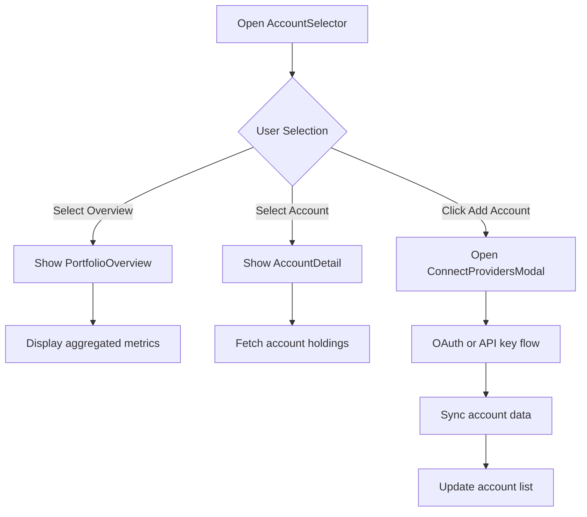
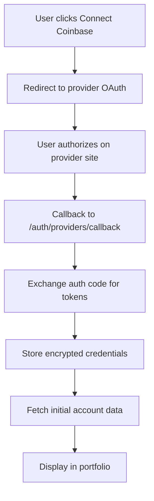
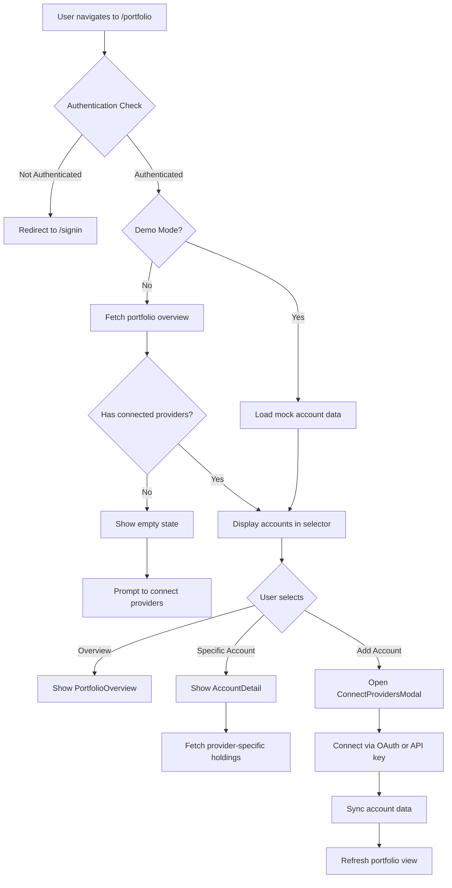

# 📊 Portfolio Screen

The Portfolio Screen provides a comprehensive multi-account portfolio management system, allowing users to track holdings across multiple connected trading providers in a unified dashboard. It serves as the central hub for monitoring account balances, asset allocations, and performance across various platforms.

## 📍 Route Information

- **Path**: `/portfolio`
- **Component**: `PortfolioScreen.tsx`
- **Access**: Protected (requires authentication)
- **Demo Mode**: Available with mock account data

**Source**: `src/features/portfolio/screens/PortfolioScreen.tsx`

---

## 🎯 Purpose

The Portfolio Screen enables users to:

1. **Unified View**: See all connected accounts in one place
2. **Multi-Provider Support**: Track holdings across Coinbase, Binance, Kraken, Robinhood, Fidelity, and more
3. **Portfolio Overview**: Aggregate portfolio value, asset allocation, and performance metrics
4. **Account Details**: View individual account holdings, balances, and transaction history
5. **Provider Management**: Connect new providers or manage existing connections
6. **Demo Mode**: Explore features with realistic mock data before connecting real accounts

---

## 🏗️ Key Components

### 1. AccountSelector
**Provider and Account Selection Interface**

Features:
- **Overview Tab**: Shows aggregated portfolio across all accounts
- **Individual Accounts**: Switch between connected providers
- **Account Status Indicators**: Active, syncing, or error states
- **Add Account Button**: Opens provider connection modal
- **Account Metadata**: Provider name, account type, last sync time

Account Types:
- `crypto`: Cryptocurrency exchange accounts
- `stock`: Stock brokerage accounts
- `retirement`: 401k, IRA, and pension accounts

**User Flow**:


### 2. PortfolioOverview
**Aggregated Portfolio Dashboard**

Displays:
- **Total Portfolio Value**: Sum of all connected accounts
- **Asset Allocation Chart**: Pie or bar chart showing distribution
- **Performance Metrics**: Total return, percentage gain/loss
- **Top Holdings**: Largest positions across all accounts
- **Account Breakdown**: Value and performance by provider
- **Recent Activity**: Latest transactions and changes

**Visualizations**:
- Pie chart for asset allocation (BTC, ETH, stocks, cash)
- Line chart for portfolio value over time
- Bar chart comparing account values
- Heat map for gains/losses by asset

### 3. AccountDetail
**Individual Account Holdings View**

Features:
- **Holdings Table**: All positions in selected account
- **Position Details**: Symbol, quantity, current value, cost basis, P&L
- **Account Metrics**: Total balance, available cash, margin (if applicable)
- **Refresh Button**: Manual sync trigger
- **Sort & Filter**: By asset type, value, performance
- **Export Data**: Download holdings as CSV

**Holdings Display**:
```tsx
{
  id: 'btc-1',
  name: 'Bitcoin',
  currency: 'BTC',
  balance: '0.5234',
  currentValue: 25678.90,
  costBasis: 20000,
  profitLoss: 5678.90,
  profitLossPercent: 28.39,
  type: 'crypto'
}
```

### 4. ConnectProvidersModal
**Provider Connection Interface**

Two connection methods:
1. **OAuth Flow**: For supported providers (Coinbase, Robinhood)
2. **API Key**: For manual configuration (Binance, Kraken)

**OAuth Flow**:


**API Key Flow**:
- User enters API key, API secret, optional passphrase
- Credentials validated with test request
- Encrypted and stored in backend
- Account data synced immediately

Supported Providers:
- **Coinbase**: OAuth + API key
- **Binance**: API key only
- **Kraken**: API key only
- **Robinhood**: OAuth only
- **Fidelity**: OAuth only

---

## 🎨 UI Layout

### Desktop Layout (> 960px)
```
┌─────────────────────────────────────────────────────────────┐
│  Portfolio Manager Header                                   │
├─────────────────────────────────────────────────────────────┤
│  AccountSelector (Overview | Account 1 | Account 2 | +)     │
├─────────────────────────────────────────────────────────────┤
│  PortfolioOverview / AccountDetail                          │
│  ┌───────────────────┬───────────────────┐                  │
│  │ Total Value       │ Asset Allocation  │                  │
│  │ $271,493.68       │ [Pie Chart]       │                  │
│  ├───────────────────┴───────────────────┤                  │
│  │ Holdings Table                        │                  │
│  │ Symbol | Qty | Value | P&L            │                  │
│  │ BTC    | 0.5 | $25K  | +28%           │                  │
│  │ ETH    | 10  | $20K  | +11%           │                  │
│  └───────────────────────────────────────┘                  │
└─────────────────────────────────────────────────────────────┘
```

### Mobile Layout (< 600px)
```
┌──────────────────────────┐
│  Portfolio Manager       │
├──────────────────────────┤
│  Account Selector (⬇)    │
├──────────────────────────┤
│  Total Value             │
│  $271,493.68             │
├──────────────────────────┤
│  Asset Allocation        │
│  [Compact Chart]         │
├──────────────────────────┤
│  Holdings (Scrollable)   │
│  ┌────────────────────┐  │
│  │ BTC | $25K | +28% │  │
│  │ ETH | $20K | +11% │  │
│  └────────────────────┘  │
└──────────────────────────┘
```

---

## 🔄 User Flow



---

## 🔌 API Integration

### 1. Fetch Portfolio Overview
**Endpoint**: `GET /v1/portfolio`

**Response**:
```json
{
  "totalValue": 271493.68,
  "change24h": {
    "value": 12345.67,
    "percentage": 4.76
  },
  "providers": [
    {
      "providerId": "coinbase_xyz",
      "providerName": "Coinbase",
      "accountType": "crypto",
      "totalValue": 45678.90,
      "syncStatus": "active",
      "lastSynced": "2024-10-25T10:30:00Z",
      "positions": [
        {
          "symbol": "BTC",
          "name": "Bitcoin",
          "quantity": 0.5234,
          "currentPrice": 49000,
          "currentValue": 25678.90,
          "costBasis": 20000,
          "profitLoss": 5678.90,
          "profitLossPercent": 28.39
        }
      ]
    }
  ],
  "assetAllocation": {
    "BTC": 0.35,
    "ETH": 0.25,
    "AAPL": 0.20,
    "cash": 0.20
  }
}
```

### 2. Fetch Provider Portfolio
**Endpoint**: `GET /v1/portfolio/providers/:providerId`

**Response**:
```json
{
  "providerId": "coinbase_xyz",
  "providerName": "Coinbase",
  "accountType": "crypto",
  "totalValue": 45678.90,
  "availableBalance": 1234.56,
  "positions": [
    {
      "symbol": "BTC",
      "name": "Bitcoin",
      "quantity": 0.5234,
      "currentPrice": 49000,
      "currentValue": 25678.90,
      "costBasis": 20000,
      "profitLoss": 5678.90,
      "profitLossPercent": 28.39,
      "assetType": "crypto"
    }
  ],
  "lastSynced": "2024-10-25T10:30:00Z"
}
```

### 3. Connect Provider (OAuth)
**Endpoint**: `POST /v1/providers/connect/oauth`

**Request**:
```json
{
  "providerId": "coinbase",
  "redirectUri": "https://app.strategiz.io/auth/providers/callback"
}
```

**Response**:
```json
{
  "authUrl": "https://coinbase.com/oauth/authorize?client_id=...&redirect_uri=...",
  "state": "random_csrf_token"
}
```

### 4. Connect Provider (API Key)
**Endpoint**: `POST /v1/providers/connect/api-key`

**Request**:
```json
{
  "providerId": "binance",
  "connectionType": "api_key",
  "apiKey": "your_api_key",
  "apiSecret": "your_api_secret",
  "passphrase": "optional_passphrase",
  "accountType": "live",
  "enableNotifications": true,
  "enableAutoRefresh": true
}
```

**Response**:
```json
{
  "status": "connected",
  "providerId": "binance_abc",
  "providerName": "Binance",
  "message": "Successfully connected to Binance"
}
```

### 5. Sync Account Data
**Endpoint**: `POST /v1/portfolio/providers/:providerId/sync`

Triggers manual refresh of account data from provider API.

---

## 📱 Responsive Behavior

### Mobile (< 600px)
- Single column layout
- Compact account selector dropdown
- Stacked cards for overview metrics
- Simplified holdings table (key columns only)
- Bottom sheet for account switching
- Touch-optimized buttons

### Tablet (600px - 960px)
- Two-column grid for metrics
- Expanded holdings table
- Side-by-side charts
- Larger touch targets

### Desktop (> 960px)
- Full multi-column layout
- Complete holdings table with all columns
- Side-by-side account comparison
- Hover tooltips and details
- Keyboard navigation support

---

## 🎨 Design Features

### Color Scheme
- **Primary**: Neon Green (`#39FF14`) for positive values
- **Accent**: Neon Blue (`#00BFFF`) for interactive elements
- **Error**: Neon Red (`#FF073A`) for negative values
- **Background**: Dark gradient for modern appearance

### Status Indicators
- 🟢 **Active**: Account synced successfully
- 🟡 **Syncing**: Data refresh in progress
- 🔴 **Error**: Connection or sync issue

### Animations
- Smooth transitions between accounts
- Loading skeletons during data fetch
- Number count-up animations for values
- Chart animations on data load

---

## 🔐 Demo Mode

### Purpose
Allow users to explore portfolio features without connecting real accounts.

### Demo Data
Includes mock accounts:
1. **Main Account (Coinbase)**: $45,678.90
   - 0.5234 BTC
   - 10.234 ETH

2. **Trading Account (Binance)**: $23,456.78
   - 50 BNB
   - 100 SOL

3. **Investment (Robinhood)**: $78,901.23
   - 100 shares AAPL
   - 50 shares TSLA

4. **Retirement (Fidelity)**: $123,456.78
   - 200 shares SPY
   - 100 shares VOO

### Demo Mode Banner
```
🎭 Demo Mode Active - Sample data shown. Connect a provider to see your real portfolio.
[Connect Provider] [Dismiss]
```

---

## 🧪 Testing Considerations

### Unit Tests
- AccountSelector renders with accounts
- PortfolioOverview calculates total value correctly
- AccountDetail displays holdings
- Provider modal connects successfully
- Asset allocation chart renders correctly

### Integration Tests
- Fetch portfolio overview on mount
- Switch between accounts updates holdings
- Connect provider flow completes
- Sync account data refreshes view
- Demo mode loads mock data

### E2E Tests
- Complete portfolio view journey
- Connect new provider via OAuth
- Connect provider via API key
- View account details and holdings
- Switch between demo and real mode
- Error handling for failed connections

---

## 🚨 Error Handling

### Common Errors

| Error Code | Message | User Action |
|------------|---------|-------------|
| `PORTFOLIO_001` | Failed to load portfolio | Retry or check connection |
| `PORTFOLIO_002` | No connected accounts | Connect a provider |
| `PORTFOLIO_003` | Provider sync failed | Re-authenticate or check API keys |
| `PORTFOLIO_004` | Invalid API credentials | Update credentials in settings |
| `PORTFOLIO_005` | Rate limit exceeded | Wait and retry |
| `PORTFOLIO_006` | Account suspended | Contact provider support |

### Error Display
- **Toast Notifications**: Temporary errors
- **Empty State**: No connected accounts
- **Error Banner**: Persistent connection issues
- **Retry Buttons**: For recoverable errors

---

## 🔮 Future Enhancements

1. **Real-time Updates**: WebSocket for live balance updates
2. **Portfolio Analytics**: Performance charts, Sharpe ratio, drawdown
3. **Tax Reporting**: Capital gains/losses, CSV export for taxes
4. **Custom Grouping**: Organize accounts by goals or strategies
5. **Budget Tracking**: Spending and income across accounts
6. **Alerts**: Price alerts, balance thresholds, unusual activity
7. **Multi-Currency**: Display values in different fiat currencies
8. **Historical Data**: Portfolio value over time, transaction history

---

## 📚 Related Documentation

- [Dashboard Screen](../../dashboard/docs/dashboard-screen.mdx)
- [Profile Screen](../../profile/docs/profile-screen.mdx)
- [Provider Connection Modal](../../../components/providers/ConnectProvidersModal.tsx)
- [Portfolio Service API](../services/portfolioService.ts)
- [Provider Service API](../../../services/providerService.ts)

---

## 🐛 Common Issues & Solutions

### Issue: Portfolio shows $0 despite connected provider
**Solution**: Check provider connection status. Verify API permissions include balance reading. Trigger manual sync.

### Issue: Holdings not updating
**Solution**: Check last sync timestamp. Verify provider API is accessible. Re-authenticate if needed.

### Issue: Cannot connect provider
**Solution**: Verify API keys are correct. Check provider API status. Ensure OAuth redirect URI is whitelisted.

### Issue: Missing holdings data
**Solution**: Some providers have delayed data. Wait a few minutes and refresh. Check if provider API returned empty response.

### Issue: Demo mode data not showing
**Solution**: Ensure demo mode is enabled in Redux store. Check browser console for errors. Clear cache and reload.
