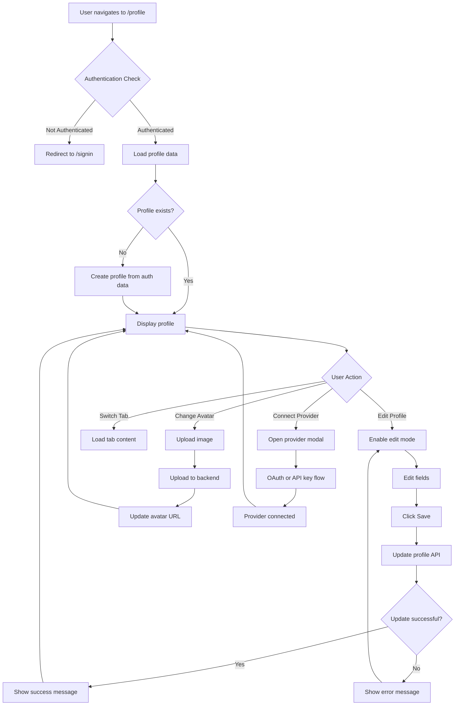

# 👤 Profile Screen

The Profile Screen serves as the user's personal hub for managing account information, security settings, provider connections, trading preferences, and viewing achievements. It combines profile management with comprehensive account settings in a unified interface.

## 📍 Route Information

- **Path**: `/profile`
- **Component**: `ProfileScreen.tsx`
- **Access**: Protected (requires authentication)
- **Persistence**: Profile data cached and synced with backend

**Source**: `src/features/profile/screens/ProfileScreen.tsx`

---

## 🎯 Purpose

The Profile Screen enables users to:

1. **Profile Management**: Update personal information, bio, and profile picture
2. **Security Settings**: Configure 2FA, password, and privacy controls
3. **Provider Connections**: Manage trading platform integrations
4. **Notifications**: Configure email and push notification preferences
5. **Trading Preferences**: Set default risk parameters and market preferences
6. **Achievements**: View earned badges and milestones
7. **Statistics**: Track trading performance and account metrics

---

## 🏗️ Key Components

### 1. Profile Header
**User Identity Section**

**Layout**:
```
┌─────────────────────────────────────────────────────────────┐
│  [Avatar]  John Doe ✓                                       │
│  (150px)   @johndoe • john@example.com                      │
│            Bio: Professional trader specializing in...       │
│            📍 New York • 💼 Trader • 🎓 MBA Finance          │
│            Member since October 2024                         │
│                                                              │
│            🐦 Twitter  💼 LinkedIn  💻 GitHub  🌐 Website   │
│                                       [Edit Profile] ──────►│
└─────────────────────────────────────────────────────────────┘
```

**Features**:
- **Profile Avatar**: 150x150px circular image
  - Upload button (camera icon overlay)
  - Gradient background if no image
  - 5MB size limit
  - Formats: JPG, PNG, GIF

- **User Info**:
  - Name (editable)
  - Username (derived from email)
  - Email (editable)
  - Verified badge (if applicable)

- **Bio**: Multi-line text area (max 500 chars)

- **Metadata Chips**:
  - Member since date
  - Location
  - Occupation
  - Education

- **Social Links**:
  - Twitter, LinkedIn, GitHub, Website
  - Icon buttons with links

### 2. Statistics Cards
**Performance Metrics Overview**

Six metric cards displayed in responsive grid:

#### Strategies (Neon Green)
- **Icon**: 📈 Auto Graph
- **Count**: Total strategies created
- **Subtitle**: Active strategies count

#### Total Profit (Neon Blue)
- **Icon**: 📊 Trending Up
- **Percentage**: All-time return
- **Subtitle**: Performance period

#### Win Rate (Neon Orange)
- **Icon**: 🏆 Trophy
- **Percentage**: Success ratio
- **Subtitle**: Win/loss breakdown

#### Total Trades (Neon Purple)
- **Icon**: 💰 Wallet
- **Count**: Executed trades
- **Subtitle**: Trade volume

#### Experience Level (Neon Green)
- **Icon**: 🚀 Rocket
- **Label**: Beginner/Intermediate/Advanced
- **Subtitle**: Trader level

#### Followers (Neon Blue)
- **Icon**: 🧠 Psychology
- **Count**: Following traders
- **Subtitle**: Community engagement

**Card Styling**:
- Dark background with blur
- Neon border (matches metric color)
- Hover effect: lift and glow
- Smooth transitions

### 3. Achievements Section
**Gamification & Milestones**

**Achievement Badge**:
```
   ┌─────────┐
   │   🚀    │  Welcome
   │ [Icon]  │  Joined Strategiz
   └─────────┘
```

**Badge Types** (Future):
- 🚀 **Welcome**: Account created
- 🎯 **First Trade**: Executed first trade
- 💯 **100 Trades**: Milestone achievement
- 🏆 **Profitable Month**: 30-day profit
- ⭐ **Strategy Creator**: Published strategy
- 🔥 **Win Streak**: 10 consecutive wins

**Layout**:
- Circular badge containers (80x80px)
- Icon centered in badge
- Title and description below
- Grid layout (4-6 columns)

### 4. Settings Tabs
**Configuration Management**

Four tabbed sections:

#### Tab 1: Security & Privacy

**Two-Factor Authentication**:
- Toggle switch for 2FA
- Setup wizard (future)
- Backup codes generation

**Password Management**:
- Change password button
- View login history button
- Password strength requirements

**Privacy Settings**:
- Show profile to other traders
- Display trading statistics publicly
- Allow strategy followers

**Account Management**:
- Export account data (GDPR)
- Delete account (with confirmation)

#### Tab 2: Provider Integrations

**ProviderConnectionContent Component**:
- Grid of available providers
- Connection status indicators
- OAuth and API key flows
- Real-time sync status
- Disconnect option

**Supported Providers**:
- Coinbase (OAuth + API)
- Binance (API key)
- Kraken (API key)
- Robinhood (OAuth)
- Fidelity (OAuth)
- TD Ameritrade (OAuth)

**Provider Card**:
```
┌─────────────────────────────┐
│  [Coinbase Logo]            │
│  Coinbase                   │
│  Status: ✓ Connected        │
│  Last Sync: 5 minutes ago   │
│  [Disconnect] [Refresh]     │
└─────────────────────────────┘
```

#### Tab 3: Notifications

**Email Notifications**:
- ✓ Trade executions and updates
- ✓ Strategy performance alerts
- ☐ Market news and updates
- ☐ Product updates and announcements

**Push Notifications** (Future):
- Mobile app alerts
- Desktop notifications
- SMS alerts

**Notification Frequency**:
- Real-time
- Hourly digest
- Daily summary

#### Tab 4: Preferences

**Trading Style**:
- Dropdown: Algorithmic, Day Trading, Swing, Position
- Multi-select preferred markets: Crypto, Forex, Stocks, Options, Futures

**Risk Management**:
- Max position size (% of portfolio)
- Default stop loss (%)
- Take profit targets (%)
- Trailing stop configuration

**Display Settings**:
- Currency: USD, EUR, GBP, etc.
- Timezone selection
- Date format
- Number formatting

---

## 🎨 UI Layout

### Desktop Layout (> 960px)
```
┌─────────────────────────────────────────────────────────────┐
│  Profile Header (Gradient background)                       │
│  [Avatar] Name, Bio, Chips, Social Links    [Edit Profile]  │
├─────────────────────────────────────────────────────────────┤
│  Statistics Cards (6-column grid)                           │
│  [Strategies] [Profit] [Win Rate] [Trades] [Exp] [Followers]│
├─────────────────────────────────────────────────────────────┤
│  Achievements                                               │
│  [Badge 1] [Badge 2] [Badge 3] [Badge 4]                    │
├─────────────────────────────────────────────────────────────┤
│  Settings Tabs                                              │
│  [Security] [Providers] [Notifications] [Preferences]       │
│  ┌─────────────────────────────────────────────────────┐    │
│  │ Tab Content                                         │    │
│  │ [Settings forms and controls]                       │    │
│  └─────────────────────────────────────────────────────┘    │
└─────────────────────────────────────────────────────────────┘
```

### Mobile Layout (< 600px)
```
┌──────────────────────────┐
│  Profile Header          │
│  [Avatar Centered]       │
│  Name, Bio               │
│  [Edit Button]           │
├──────────────────────────┤
│  Stats (2-column grid)   │
│  [Str.] [Prof.]          │
│  [Win]  [Trades]         │
├──────────────────────────┤
│  Achievements (Scroll)   │
│  ◄ [Badge] [Badge] ►     │
├──────────────────────────┤
│  Settings Tabs           │
│  [Scrollable tabs]       │
│  Tab content             │
└──────────────────────────┘
```

---

## 🔄 User Flow



---

## 🔌 API Integration

### 1. Get Profile
**Endpoint**: `GET /v1/users/:userId/profile`

**Response**:
```json
{
  "id": "user_123",
  "name": "John Doe",
  "email": "john@example.com",
  "bio": "Professional trader specializing in algorithmic strategies",
  "location": "New York, NY",
  "occupation": "Quantitative Trader",
  "education": "MBA Finance",
  "website": "https://johndoe.com",
  "profileImageUrl": "https://cdn.strategiz.io/avatars/user_123.jpg",
  "social": {
    "twitter": "https://twitter.com/johndoe",
    "linkedin": "https://linkedin.com/in/johndoe",
    "github": "https://github.com/johndoe"
  },
  "memberSince": "2024-10-25T00:00:00Z",
  "verified": true,
  "stats": {
    "totalStrategies": 12,
    "activeStrategies": 5,
    "totalProfit": 15234.56,
    "totalProfitPercentage": 32.5,
    "winRate": 67.3,
    "totalTrades": 1543,
    "followerCount": 234
  }
}
```

### 2. Update Profile
**Endpoint**: `PUT /v1/users/:userId/profile`

**Request**:
```json
{
  "name": "John Doe",
  "email": "john@example.com",
  "bio": "Updated bio text...",
  "location": "San Francisco, CA",
  "occupation": "Senior Trader",
  "education": "MBA Finance, CFA",
  "website": "https://newsite.com",
  "social": {
    "twitter": "https://twitter.com/johndoe",
    "linkedin": "https://linkedin.com/in/johndoe",
    "github": "https://github.com/johndoe"
  }
}
```

### 3. Upload Profile Image
**Endpoint**: `POST /v1/users/:userId/profile/image`

**Request**: FormData with image file

**Response**:
```json
{
  "imageUrl": "https://cdn.strategiz.io/avatars/user_123.jpg",
  "success": true
}
```

### 4. Update Notification Settings
**Endpoint**: `PUT /v1/users/:userId/notifications`

**Request**:
```json
{
  "email": {
    "trades": true,
    "strategies": true,
    "news": false,
    "marketing": false
  },
  "push": {
    "enabled": true,
    "criticalOnly": false
  }
}
```

### 5. Get Connected Providers
**Endpoint**: `GET /v1/providers`

**Response**:
```json
{
  "providers": [
    {
      "id": "provider_123",
      "providerId": "coinbase",
      "providerName": "Coinbase",
      "status": "connected",
      "connectionType": "oauth",
      "lastSynced": "2024-10-25T10:30:00Z",
      "accountType": "crypto"
    }
  ]
}
```

---

## 📱 Responsive Behavior

### Mobile (< 600px)
- Single column layout
- Centered avatar
- Stacked stats (2x3 grid)
- Horizontal scrolling achievements
- Full-width tabs
- Collapsible sections

### Tablet (600px - 960px)
- Two-column stats grid
- Side-by-side profile sections
- Expanded tab content
- Medium-sized avatar

### Desktop (> 960px)
- Full multi-column layout
- Large avatar (150px)
- Six-column stats grid
- Side-by-side everything
- Hover effects enabled

---

## 🎨 Design Features

### Color Scheme
- **Neon Green**: `#39FF14` - Primary actions, positive metrics
- **Neon Blue**: `#00BFFF` - Links, secondary actions
- **Neon Purple**: `#bf00ff` - Premium features
- **Neon Orange**: `#FF6B35` - Achievements

### Gradient Effects
- Profile header background
- Avatar placeholder (if no image)
- Edit button gradient
- Card hover glows

### Animations
- Edit mode transition
- Stats card hover lift
- Achievement badge pulse
- Tab switch slide
- Image upload spinner

---

## 🔐 Security Features

### Two-Factor Authentication
- TOTP setup (Google Authenticator)
- SMS backup codes
- Recovery codes download
- Disable 2FA with password confirmation

### Password Requirements
- Minimum 8 characters
- At least one uppercase
- At least one number
- At least one special character

### Session Management
- View active sessions
- Logout all devices
- Session timeout settings

---

## 🧪 Testing Considerations

### Unit Tests
- Profile form validation
- Image upload size limits
- Tab switching
- Edit mode toggle
- Social link validation

### Integration Tests
- Load profile data on mount
- Update profile via API
- Upload and crop image
- Connect provider flow
- Notification settings persist

### E2E Tests
- Complete profile edit flow
- Image upload and preview
- Provider connection
- Tab navigation
- Settings save confirmation

---

## 🚨 Error Handling

### Common Errors

| Error Code | Message | User Action |
|------------|---------|-------------|
| `PROFILE_001` | Failed to load profile | Refresh page |
| `PROFILE_002` | Image too large | Use smaller image (max 5MB) |
| `PROFILE_003` | Invalid email format | Correct email address |
| `PROFILE_004` | Update failed | Check connection, retry |
| `PROFILE_005` | Provider connection failed | Re-authenticate |
| `PROFILE_006` | Invalid URL format | Fix social link URLs |

### Error Display
- Toast notifications for temporary errors
- Inline field validation
- Banner for critical issues
- Retry buttons for recoverable errors

---

## 🔮 Future Enhancements

1. **Profile Visibility**: Public/private profiles
2. **Trading Journal**: Log trades and notes
3. **Performance Analytics**: Advanced metrics dashboard
4. **Social Features**: Follow traders, share strategies
5. **Customization**: Theme colors, dashboard layout
6. **API Keys**: Generate personal API tokens
7. **Webhooks**: Custom event notifications
8. **Referral Program**: Invite friends, earn rewards

---

## 📚 Related Documentation

- [Dashboard Screen](../../dashboard/docs/dashboard-screen.mdx)
- [Portfolio Screen](../../portfolio/docs/portfolio-screen.mdx)
- [ConnectProvidersModal](../../../components/providers/ConnectProvidersModal.tsx)
- [Profile Service](../services/profileService.ts)
- [Provider Service](../../../services/providerService.ts)

---

## 🐛 Common Issues & Solutions

### Issue: Profile not loading
**Solution**: Check authentication token valid. Verify backend service running. Clear cache and reload.

### Issue: Cannot upload profile image
**Solution**: Verify image size < 5MB. Check file format (JPG/PNG). Ensure sufficient storage quota.

### Issue: Provider connection stuck
**Solution**: Complete OAuth flow in popup. Check popup blocker settings. Re-initiate connection.

### Issue: Edit changes not saving
**Solution**: Ensure all required fields filled. Check network connection. Verify no validation errors.

### Issue: 2FA setup failing
**Solution**: Verify time sync on device. Use correct TOTP app. Check backup codes saved.

### Issue: Statistics showing zero
**Solution**: No trading activity yet. Deploy strategies from Labs. Connect providers to sync data.
